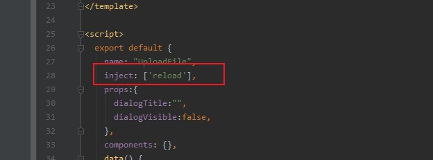

### vue页面刷新方式

1. this.$router.go(0)

   > 这个是利用了 history 中前进和后退的功能，传入 0 刷新当前页面。但是有一个问题就是页面整个刷新过程中会白屏

2. location.reload()

   > 是利用了直接使用刷新当前页面的方法。但是同样存在有一个问题就是页面整个刷新过程中会白屏，

3. provide / inject组合

   > 允许一个祖先组件向其所有子孙后代注入一个依赖，不论组件层次有多深，并在起上下游关系成立的时间里始终生效。
   > provide：选项应该是一个对象或返回一个对象的函数。该对象包含可注入其子孙的属性。
   > inject：一个字符串数组，或一个对象，对象的 key 是本地的绑定名。
   > 注意：provide和inject绑定并不是可响应的。这是刻意为之的。如果你传入了一个可监听的对象，那么其对象的属性还是可响应的。

   实现步骤：

   * App.vue中代码如下：

     ```vue
     <template>
       <div id="app">
         <router-view v-if="isRouterAlive"/>
       </div>
     </template>
     
     <script>
       export default {
         name: 'App',
         provide() {
           return {
             reload: this.reload
           }
         },
         data() {
           return {
             isRouterAlive: true
           }
         },
         methods: {
           reload() {
             this.isRouterAlive = false
             this.$nextTick(function () {
               this.isRouterAlive = true
             })
           }
       }
       }
     </script>
     
     <style>
     
     
     </style>
     
     ```

   * 子组件引入

     ```vue
     inject: ['reload'],
     ```

     

   * 方法调用：

     ```vue
      this.reload();
     ```

     

### v-bind和v-model的区别

> v-bind是单向绑定，一般情况下绑定的是value值
>
> v-model是双向绑定，一般用于表单型组件的值绑定，例如：el-input