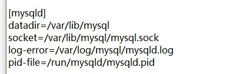

### MySQL账号锁定问题

* 错误信息：

  ```java
  Access denied for user 'root'@'120.48.28.147'. Account is locked.
  ```

* 解决思路：：

  > 账号锁定之后会导致MySQL数据库无法登录，首先需要修改MySQL的配置文件，使得MySQL跳过登录，然后解锁指定账户

  * 修改my.cnf配置文件

    > 在【mysqld】模块添加：skip-grant-tables   保存退出；

    

  * 重启MySQL服务

    ```bash
    systemctl restart mysqld
    ```

  * 登陆时将旧密码置空登录

    ```bash
    mysql -u root -p # 直接回车登录
    ```

  * 执行以下命令

    ```bash
    flush privileges; # 先执行刷新语句，否则会报错： The MySQL server is running with the --skip-grant-tables option so it cannot execute this statement。
    ALTER USER 'root'@'%' ACCOUNT UNLOCK;
    update mysql.user set account_locked='N' where user='root';
    commit;
    ```

  * 重启服务

    ```bash
    systemctl restart mysqld
    ```


### MySQL插入（删除、更新）时，对同一表进行查询的问题

* 错误信息：

  ```
  MySQL出现You can‘t specify target table for update in FROM clause错误的解决方法
  ```

* 原因

  > 意思是说：不能在同一语句中，先select出同一表中的某些值，再update这个表，即不能依据某字段值做判断再来更新某字段的值。
  >
  > 例如下面的sql语句：

  ```sql
  UPDATE test 
  SET content = 'Hello World' 
  WHERE id IN ( 
  			 SELECT min(id) as id FROM test GROUP BY id 
  			);
  ```

* 解决办法:

  > 通过添加一张中间表，就可以避免这种错误：

  ```sql
  UPDATE test 
  SET content = 'Hello World' 
  WHERE id IN ( 
  			SELECT id FROM ( 
  				  SELECT min(id) AS id FROM test GROUP BY id 
  								) AS a );
  
  ```

  

