## ActiveMQ

### 入门

#### 消息中间件有哪些实现？

> Kafka、RabbitMQ、RocketMQ、ActiveMQ。。。。。。。。。

#### MQ作用：

> 异步：调用者无需等待。
>
> 解耦：解决了系统之间耦合调用的问题。
>
> 削峰：抵御洪峰流量，保护了主业务。

#### MQ特点

**(1)**  **采用异步处理模式**

消息发送者可以发送一个消息而无须等待响应。消息发送者将消息发送到一条虚拟的通道（主题或者队列）上；

消息接收者则订阅或者监听该爱通道。一条消息可能最终转发给一个或者多个消息接收者，这些消息接收者都无需对消息发送者做出同步回应。整个过程都是异步的。

案例：

也就是说，一个系统跟另一个系统之间进行通信的时候，假如系统A希望发送一个消息给系统B，让他去处理。但是系统A不关注系统B到底怎么处理或者有没有处理好，所以系统A把消息发送给MQ，然后就不管这条消息的“死活了”，接着系统B从MQ里面消费出来处理即可。至于怎么处理，是否处理完毕，什么时候处理，都是系统B的事儿，与系统A无关。

**(2)**  **应用系统之间解耦合**

发送者和接受者不必了解对方，只需要确认消息。

发送者和接受者不必同时在线。

#### ActiveMQ安装

1. 官网下载： http://activemq.apache.org/

2. 安装步骤：
   * 将下载下的压缩包解压到指定目录，此处以：/opt/java为例，tar -xzvf  apache-activemq-5.16.7-bin.tar.gz
   * 安装mq之前需要确保，服务器上安装的有jdk，并和mq版本对应
   * 启动 进入安装目录的bin目录，./activemq start 启动
   * 图形界面：http:ip:8161 账户admin 密码admin

#### 入门案例（队列）

* JMS编码规范

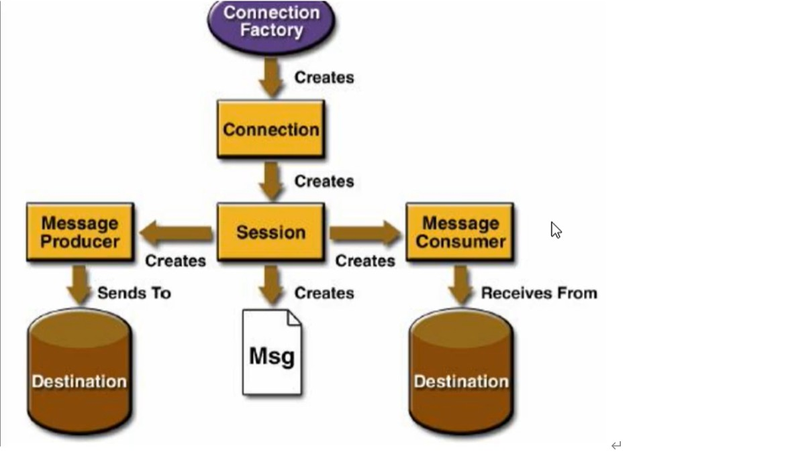

* JMS开发流程

​	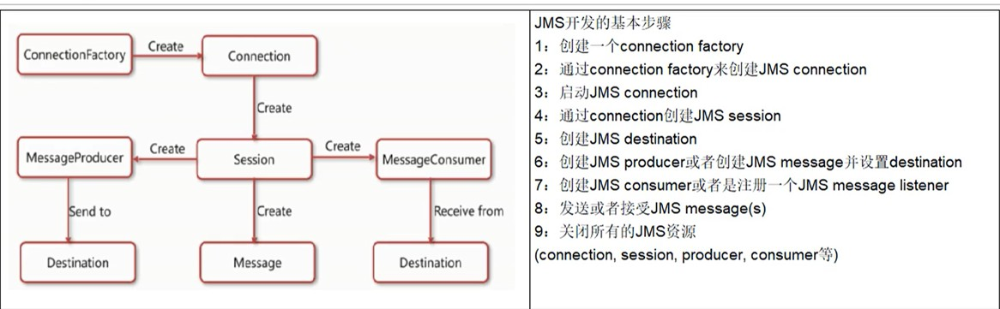

##### 程序展示：

###### 生产者：

```java
/**
 * 生产者
 */
public class Produce {

    //activeMq 连接地址
    public static final String DEFAULT_BROKER_URL = "tcp://192.168.60.101:61616";

    public static final String QUEUE_NAME = "01";

    public static void main(String[] args) throws JMSException {
        //创建消息队列工厂
        ActiveMQConnectionFactory factory = new ActiveMQConnectionFactory(DEFAULT_BROKER_URL);
        //获取连接
        Connection connection = factory.createConnection();
        connection.start();
        //创建session
        Session session = connection.createSession(false, Session.AUTO_ACKNOWLEDGE);
        //创建队列
        Queue queue = session.createQueue(QUEUE_NAME);
        MessageProducer producer = session.createProducer(queue);
        for (int i = 0; i < 6; i++) {
            //发送消息
            TextMessage message = session.createTextMessage("queue-消息01" + (i + 1));
            producer.send(message);
        }
        //关闭资源
        producer.close();
        session.close();
        connection.close();
        System.out.println("  **** 消息发送到MQ完成 ****");
    }
}
```

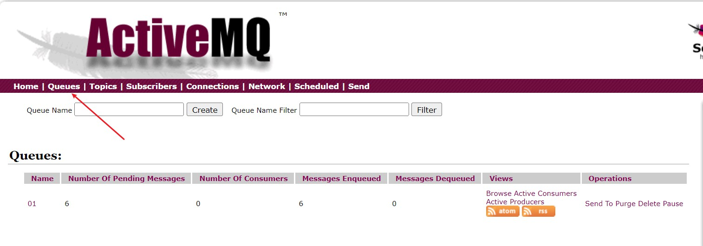

**说明：**

> Number Of Pending Messages：
>
> 等待消费的消息，这个是未出队列的数量，公式=总接收数-总出队列数。
>
> Number Of Consumers：
>
> 消费者数量，消费者端的消费者数量。
>
> Messages Enqueued：
>
> 进队消息数，进队列的总消息量，包括出队列的。这个数只增不减。
>
> Messages Dequeued：
>
> 出队消息数，可以理解为是消费者消费掉的数量。

###### 消费者（同步阻塞方式）：

```java
/**
 * 消费者
 */
public class Conmsumer {

    //activeMq 连接地址
    public static final String DEFAULT_BROKER_URL = "tcp://192.168.60.101:61616";

    public static final String QUEUE_NAME = "01";

    public static void main(String[] args) throws JMSException {
        //创建消息队列工厂
        ActiveMQConnectionFactory factory = new ActiveMQConnectionFactory(DEFAULT_BROKER_URL);
        Connection connection = factory.createConnection();
        connection.start();
        Session session = connection.createSession(false, Session.AUTO_ACKNOWLEDGE);
        Queue queue = session.createQueue(QUEUE_NAME);
        //创建消费者
        MessageConsumer consumer = session.createConsumer(queue);
        while (true) {
            // reveive() 一直等待接收消息，在能够接收到消息之前将一直阻塞。 是同步阻塞方式 。和socket的accept方法类似的。
            // reveive(Long time) : 等待n毫秒之后还没有收到消息，就是结束阻塞。
            // 因为消息发送者是 TextMessage，所以消息接受者也要是TextMessage
            TextMessage message = (TextMessage) consumer.receive();
            if (message == null) {
                break;
            }
            System.out.println(message.getText());
        }
        consumer.close();
        session.close();
        connection.close();
    }
}
```

###### 异步监听的消费者（MessageListener）

```java
/**
 * 消费者
 */
public class ConmsumerListenter {

    //activeMq 连接地址
    public static final String DEFAULT_BROKER_URL = "tcp://192.168.60.101:61616";

    public static final String QUEUE_NAME = "01";

    public static void main(String[] args) throws JMSException, IOException {
        //创建消息队列工厂
        ActiveMQConnectionFactory factory = new ActiveMQConnectionFactory(DEFAULT_BROKER_URL);
        Connection connection = factory.createConnection();
        connection.start();
        Session session = connection.createSession(false, Session.AUTO_ACKNOWLEDGE);
        Queue queue = session.createQueue(QUEUE_NAME);
        //创建消费者
        MessageConsumer consumer = session.createConsumer(queue);
         /* 通过监听的方式来消费消息，是异步非阻塞的方式消费消息。
           通过messageConsumer 的setMessageListener 注册一个监听器，当有消息发送来时，系统自动调用MessageListener 的 onMessage 方法处理消息
         */

        consumer.setMessageListener(new MessageListener() {
            @Override
            public void onMessage(Message message) {
                TextMessage textMessage = (TextMessage) message;
                try {
                    System.out.println(textMessage.getText());
                } catch (JMSException e) {
                    e.printStackTrace();
                }
            }
        });
        // 让主线程不要结束。因为一旦主线程结束了，其他的线程（如此处的监听消息的线程）也都会被迫结束。
        // 实际开发中，我们的程序会一直运行，这句代码都会省略。
        System.in.read();

        consumer.close();
        session.close();
        connection.close();
    }
}
```

###### 队列总结

* **两种消费方式**

  同步阻塞方式(receive)

  订阅者或接收者用MessageConsumer的receive()方法来接收消息，receive方法在能接收到消息之前（或超时之前）将一直阻塞。

   

  异步非阻塞方式（监听器onMessage()）

  订阅者或接收者通过MessageConsumer的setMessageListener(MessageListener listener)注册一个消息监听器，当消息到达之后，系统会自动调用监听器MessageListener的onMessage(Message message)方法。

* **队列的特点：**

  每个消息只能被一个消费者消费

  生产者和消费者没有时间上的关联，无论消费者在生产者发送消息的时候是否在线，只要消费者重新运行都可以消费消息

  消息被消费后，在队列中不会被存储，消费者不会消费到已经被消费过的消息

#### topic 主题 发布/订阅

特点：

（1）生产者将消息发布到topic中，每个消息可以有多个消费者，属于1：N的关系；

（2）生产者和消费者之间有时间上的相关性。订阅某一个主题的消费者只能消费自它订阅之后发布的消息。

（3）生产者生产时，topic不保存消息，假如无人订阅就去生产，那就是一条废消息，所以，一般先启动消费者再启动生产者。

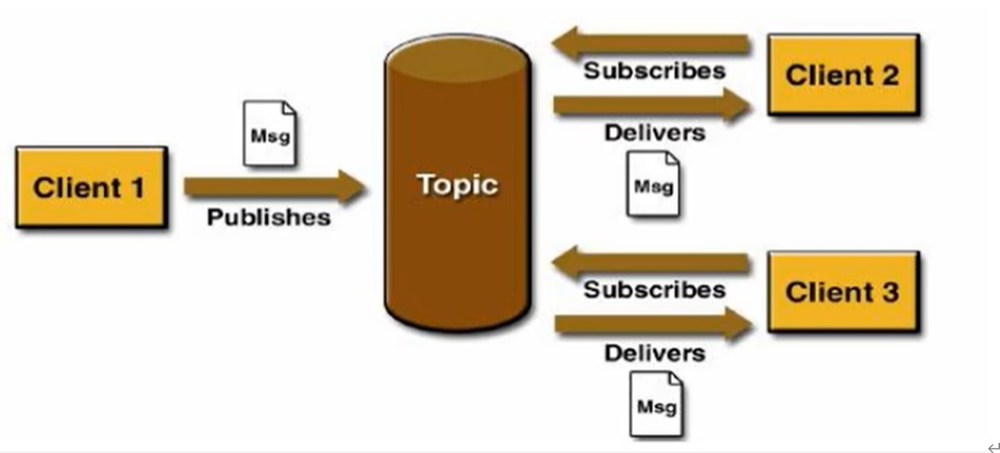

##### 生产者

```java
/**
 * 生产者
 */
public class JmsProduce_topic {

    //activeMq 连接地址
    public static final String DEFAULT_BROKER_URL = "tcp://192.168.60.101:61616";

    public static final String TOPIC_NAME = "01";

    public static void main(String[] args) throws JMSException {
        //创建消息队列工厂
        ActiveMQConnectionFactory factory = new ActiveMQConnectionFactory(DEFAULT_BROKER_URL);
        //获取连接
        Connection connection = factory.createConnection();
        connection.start();
        //创建session
        Session session = connection.createSession(false, Session.AUTO_ACKNOWLEDGE);
        //创建主题
        Topic topic = session.createTopic(TOPIC_NAME);
        MessageProducer producer = session.createProducer(topic);
        for (int i = 0; i < 6; i++) {
            //发送消息
            TextMessage message = session.createTextMessage("queue-消息01" + (i + 1));
            producer.send(message);
        }
        //关闭资源
        producer.close();
        session.close();
        connection.close();
        System.out.println("  **** 消息发送到MQ完成 ****");
    }
}
```

##### 消费者

```java
/**
 * 消费者
 */
public class JmsConsummer_topic {

    //activeMq 连接地址
    public static final String DEFAULT_BROKER_URL = "tcp://192.168.60.101:61616";

    public static final String TOPIC_NAME = "01";

    public static void main(String[] args) throws JMSException {
        //创建消息队列工厂
        ActiveMQConnectionFactory factory = new ActiveMQConnectionFactory(DEFAULT_BROKER_URL);
        Connection connection = factory.createConnection();
        connection.start();
        Session session = connection.createSession(false, Session.AUTO_ACKNOWLEDGE);
        //创建主题
        Topic topic = session.createTopic(TOPIC_NAME);
        //创建消费者
        MessageConsumer consumer = session.createConsumer(topic);
        while (true) {
            // reveive() 一直等待接收消息，在能够接收到消息之前将一直阻塞。 是同步阻塞方式 。和socket的accept方法类似的。
            // reveive(Long time) : 等待n毫秒之后还没有收到消息，就是结束阻塞。
            // 因为消息发送者是 TextMessage，所以消息接受者也要是TextMessage
            TextMessage message = (TextMessage) consumer.receive();
            if (message == null) {
                break;
            }
            System.out.println(message.getText());
        }
        consumer.close();
        session.close();
        connection.close();
    }
}

```

* 控制台展示：

​		topic有多个消费者时，消费消息的数量 ≈ 在线消费者数量*生产消息的数量。下图展示了：我们先启动了3个消费者，再启动一个生产者，并生产了3条消息。


##### 队列和主题对比

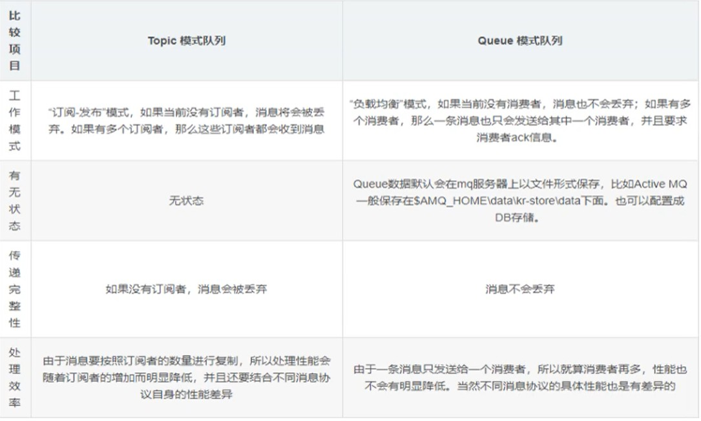

### JMS规范

#### JMS是什么

> 什么是Java消息服务？
>
> Java消息服务指的是两个应用程序之间进行异步通信的API，它为标准协议和消息服务提供了一组通用接口，包括创建、发送、读取消息等，用于支持Java应用程序开发。在JavaEE中，当两个应用程序使用JMS进行通信时，它们之间不是直接相连的，而是通过一个共同的消息收发服务组件关联起来以达到解耦/异步削峰的效果。

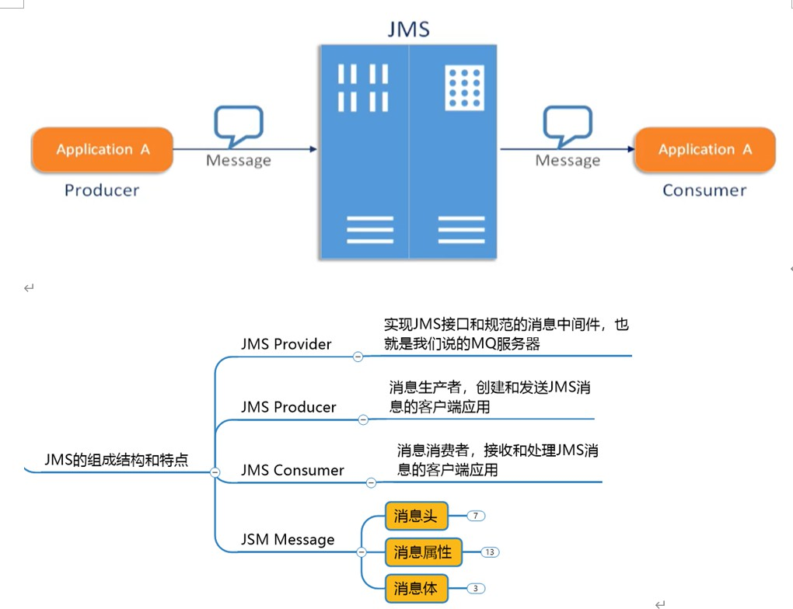

#### 消息头

JMS的消息头有哪些属性：

​	JMSDestination：消息目的地

​	JMSDeliveryMode：消息持久化模式

​	JMSExpiration：消息过期时间

​	JMSPriority：消息的优先级

​	JMSMessageID：消息的唯一标识符。

说明： 消息的生产者可以set这些属性，消息的消费者可以get这些属性。

这些属性在send方法里面也可以设置。

代码展示：

```java
/**
 * 生产者
 */
public class JmsProduce_topic {

    //activeMq 连接地址
    public static final String DEFAULT_BROKER_URL = "tcp://192.168.60.101:61616";

    public static final String TOPIC_NAME = "01";

    public static void main(String[] args) throws JMSException {
        //创建消息队列工厂
        ActiveMQConnectionFactory factory = new ActiveMQConnectionFactory(DEFAULT_BROKER_URL);
        //获取连接
        Connection connection = factory.createConnection();
        connection.start();
        //创建session
        Session session = connection.createSession(false, Session.AUTO_ACKNOWLEDGE);
        //创建主题
        Topic topic = session.createTopic(TOPIC_NAME);
        MessageProducer producer = session.createProducer(topic);
        for (int i = 0; i < 6; i++) {
            //发送消息
            TextMessage message = session.createTextMessage("queue-消息01--" + (i + 1));
            if (i == 2){
                //设置消息目的地
                message.setJMSDestination(topic);
                 /*
                    持久模式和非持久模式。
                    一条持久性的消息：应该被传送“一次仅仅一次”，这就意味着如果JMS提供者出现故障，该消息并不会丢失，它会在服务器恢复之后再次传递。
                    一条非持久的消息：最多会传递一次，这意味着服务器出现故障，该消息将会永远丢失。
             */
                //1:不持久化，2：持久化
                message.setJMSDeliveryMode(DeliveryMode.PERSISTENT);
                  /*
            可以设置消息在一定时间后过期，默认是永不过期。
            消息过期时间，等于Destination的send方法中的timeToLive值加上发送时刻的GMT时间值。
            如果timeToLive值等于0，则JMSExpiration被设为0，表示该消息永不过期。
            如果发送后，在消息过期时间之后还没有被发送到目的地，则该消息被清除。
             */

                //过期时间
                message.setJMSExpiration(3*1000);
                  /*  消息优先级，从0-9十个级别，0-4是普通消息5-9是加急消息。
            JMS不要求MQ严格按照这十个优先级发送消息但必须保证加急消息要先于普通消息到达。默认是4级。
             */

                //优先级
                message.setJMSPriority(8);
                //唯一标识
                message.setJMSMessageID(UUID.randomUUID().toString());
            }
            producer.send(message);
        }
        //关闭资源
        producer.close();
        session.close();
        connection.close();
        System.out.println("  **** 消息发送到MQ完成 ****");
    }
}
```

#### 消息体


代码展示：

```java
package  com.at.activemq.topic;

import org.apache.activemq.ActiveMQConnectionFactory;
import javax.jms.*;

public class JmsProduce_topic {

    public static final String ACTIVEMQ_URL = "tcp://118.24.20.3:61626";
    public static final String TOPIC_NAME = "topic01";

    public static void main(String[] args) throws  Exception{
        ActiveMQConnectionFactory activeMQConnectionFactory = new ActiveMQConnectionFactory(ACTIVEMQ_URL);
         javax.jms.Connection connection = activeMQConnectionFactory.createConnection();
         connection.start();
        Session session = connection.createSession(false, Session.AUTO_ACKNOWLEDGE);
        Topic topic = session.createTopic(TOPIC_NAME);
        MessageProducer messageProducer = session.createProducer(topic);

        for (int i = 1; i < 4 ; i++) {
// 发送TextMessage消息体
            TextMessage textMessage = session.createTextMessage("topic_name--" + i);
            messageProducer.send(textMessage);
            // 发送MapMessage  消息体。set方法: 添加，get方式：获取
            MapMessage  mapMessage = session.createMapMessage();
            mapMessage.setString("name", "张三"+i);
            mapMessage.setInt("age", 18+i);
            messageProducer.send(mapMessage);
        }
        messageProducer.close();
        session.close();
        connection.close();
        System.out.println("  **** TOPIC_NAME消息发送到MQ完成 ****");
    }
}

```

#### 消息属性

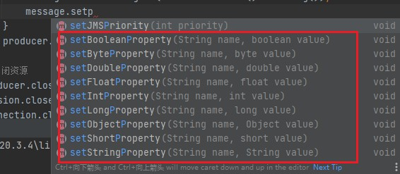

```java
package  com.at.activemq.topic;

import org.apache.activemq.ActiveMQConnectionFactory;
import javax.jms.*;

public class JmsProduce_topic {

    public static final String ACTIVEMQ_URL = "tcp://118.24.20.3:61626";
    public static final String TOPIC_NAME = "topic01";

    public static void main(String[] args) throws  Exception{
        ActiveMQConnectionFactory activeMQConnectionFactory = new ActiveMQConnectionFactory(ACTIVEMQ_URL);
        Connection connection = activeMQConnectionFactory.createConnection();
        connection.start();
        Session session = connection.createSession(false, Session.AUTO_ACKNOWLEDGE);
        Topic topic = session.createTopic(TOPIC_NAME);
        MessageProducer messageProducer = session.createProducer(topic);

        for (int i = 1; i < 4 ; i++) {
            TextMessage textMessage = session.createTextMessage("topic_name--" + i);
            // 调用Message的set*Property()方法，就能设置消息属性。根据value的数据类型的不同，有相应的API。
            textMessage.setStringProperty("From","ZhangSan@qq.com");
            textMessage.setByteProperty("Spec", (byte) 1);
            textMessage.setBooleanProperty("Invalide",true);
            messageProducer.send(textMessage);
        }
        messageProducer.close();
        session.close();
        connection.close();
        System.out.println("  **** TOPIC_NAME消息发送到MQ完成 ****");
    }
}


```

#### 消息持久化

队列消息持久化和主题消息持久化

什么是消息持久化？

> 保证消息只被传送一次和成功使用一次。在持久性消息传送至目标时，消息服务将其放入持久性数据存储。如果消息服务由于某种原因导致失败，它可以恢复此消息并将此消息传送至相应的消费者。虽然这样增加了消息传送的开销，但却增加了可靠性。

##### 队列消息的持久化

queue非持久，当服务器宕机，消息不存在（消息丢失了）。即便是非持久，消费者在不在线的话，消息也不会丢失，等待消费者在线，还是能够收到消息的。

queue持久化，当服务器宕机，消息依然存在。queue消息默认是持久化的。

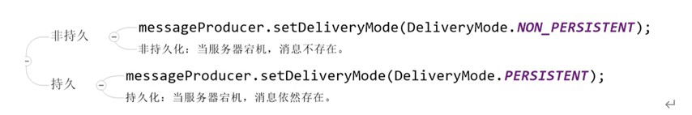

```java
    //创建消息队列工厂
        ActiveMQConnectionFactory factory = new ActiveMQConnectionFactory(DEFAULT_BROKER_URL);
        //获取连接
        Connection connection = factory.createConnection();
        connection.start();
        //创建session
        Session session = connection.createSession(false, Session.AUTO_ACKNOWLEDGE);
        //创建队列
        Queue queue = session.createQueue(QUEUE_NAME);
        MessageProducer producer = session.createProducer(queue);
        //队列不持久化
        producer.setDeliveryMode(DeliveryMode.PERSISTENT);
        for (int i = 0; i < 6; i++) {
            //发送消息
            TextMessage message = session.createTextMessage("queue-消息01" + (i + 1));
            producer.send(message);
        }
        //关闭资源
        producer.close();
        session.close();
        connection.close();
        System.out.println("  **** 消息发送到MQ完成 ****");
```

##### 主题消息的持久化

topic默认就是非持久化的，因为生产者生产消息时，消费者也要在线，这样消费者才能消费到消息。

topic消息持久化，只要消费者向MQ服务器注册过，所有生产者发布成功的消息，该消费者都能收到，不管是MQ服务器宕机还是消费者不在线。

注意：

1. 一定要先运行一次消费者，等于向MQ注册，类似我订阅了这个主题。

2. 然后再运行生产者发送消息。

3. 之后无论消费者是否在线，都会收到消息。如果不在线的话，下次连接的时候，会把没有收过的消息都接收过来。

生产者代码：

```java
/**
 * 生产者
 */
public class JmsProduce_topic {

    //activeMq 连接地址
    public static final String DEFAULT_BROKER_URL = "tcp://192.168.60.101:61616";

    public static final String TOPIC_NAME = "01";

    public static void main(String[] args) throws JMSException {
        //创建消息队列工厂
        ActiveMQConnectionFactory factory = new ActiveMQConnectionFactory(DEFAULT_BROKER_URL);
        //获取连接
        Connection connection = factory.createConnection();
        //创建session
        Session session = connection.createSession(false, Session.AUTO_ACKNOWLEDGE);
        //创建主题
        Topic topic = session.createTopic(TOPIC_NAME);
        MessageProducer producer = session.createProducer(topic);
        producer.setDeliveryMode(DeliveryMode.PERSISTENT);
        //设置持久化之后再开始
        connection.start();
        for (int i = 10; i < 15; i++) {
            //发送消息
            TextMessage message = session.createTextMessage("queue-消息01--" + (i + 1));
            producer.send(message);
        }
        //关闭资源
        producer.close();
        session.close();
        connection.close();
        System.out.println("  **** 消息发送到MQ完成 ****");
    }
}
```

消费者（主题订阅）代码

```java
/**
 * 主题订阅者
 */
public class JmsSubscriber_topic {

    //activeMq 连接地址
    public static final String DEFAULT_BROKER_URL = "tcp://192.168.60.101:61616";

    public static final String TOPIC_NAME = "01";

    public static void main(String[] args) throws JMSException {
        //创建消息队列工厂
        ActiveMQConnectionFactory factory = new ActiveMQConnectionFactory(DEFAULT_BROKER_URL);
        Connection connection = factory.createConnection();
        connection.setClientID("张三");
        connection.start();
        Session session = connection.createSession(false, Session.AUTO_ACKNOWLEDGE);
        //创建主题
        Topic topic = session.createTopic(TOPIC_NAME);
        //创建消费者
        MessageConsumer consumer = session.createDurableSubscriber(topic,"测试主题订阅。。。。。。");
        //订阅之后开启连接
        connection.start();
        while (true) {
            // reveive() 一直等待接收消息，在能够接收到消息之前将一直阻塞。 是同步阻塞方式 。和socket的accept方法类似的。
            // reveive(Long time) : 等待n毫秒之后还没有收到消息，就是结束阻塞。
            // 因为消息发送者是 TextMessage，所以消息接受者也要是TextMessage
            TextMessage message = (TextMessage) consumer.receive();
            if (message == null) {
                break;
            }
            System.out.println(message.getText());
        }
        consumer.close();
        session.close();
        connection.close();
    }
}

```


#### 消息事务

> 消息的事务是针对生产者的

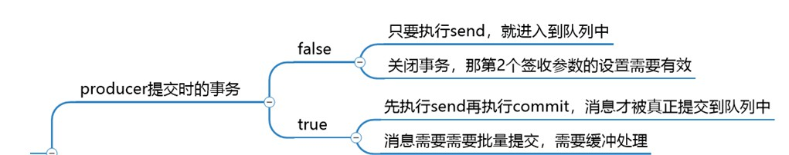

(1) 生产者开启事务后，执行commit方法，这批消息才真正的被提交。不执行commit方法，这批消息不会提交。执行rollback方法，之前的消息会回滚掉。生产者的事务机制，要高于签收机制，当生产者开启事务，签收机制不再重要。

 

(2) 消费者开启事务后，执行commit方法，这批消息才算真正的被消费。不执行commit方法，这些消息不会标记已消费，下次还会被消费。执行rollback方法，是不能回滚之前执行过的业务逻辑，但是能够回滚之前的消息，回滚后的消息，下次还会被消费。消费者利用commit和rollback方法，甚至能够违反一个消费者只能消费一次消息的原理。

 

(3) 问：消费者和生产者需要同时操作事务才行吗？  

答：消费者和生产者的事务，完全没有关联，各自是各自的事务。

生产者：

```java
package com.activemq.demo;

import org.apache.activemq.ActiveMQConnectionFactory;
import javax.jms.*;

public class Jms_TX_Producer {
    private static final String ACTIVEMQ_URL = "tcp://192.168.10.130:61616";
    private static final String ACTIVEMQ_QUEUE_NAME = "Queue-TX";

    public static void main(String[] args) throws JMSException {
        ActiveMQConnectionFactory activeMQConnectionFactory = new ActiveMQConnectionFactory(ACTIVEMQ_URL);
        Connection connection = activeMQConnectionFactory.createConnection();
        connection.start();
        //1.创建会话session，两个参数transacted=事务,acknowledgeMode=确认模式(签收)
        //设置为开启事务
        Session session = connection.createSession(true, Session.AUTO_ACKNOWLEDGE);
        Queue queue = session.createQueue(ACTIVEMQ_QUEUE_NAME);
        MessageProducer producer = session.createProducer(queue);
        try {
            for (int i = 0; i < 3; i++) {
                TextMessage textMessage = session.createTextMessage("tx msg--" + i);
              producer.send(textMessage);
if(i == 2){
                    throw new RuntimeException("GG.....");
                }
            }
            // 2. 开启事务后，使用commit提交事务，这样这批消息才能真正的被提交。
            session.commit();
            System.out.println("消息发送完成");
        } catch (Exception e) {
            System.out.println("出现异常,消息回滚");
            // 3. 工作中一般，当代码出错，我们在catch代码块中回滚。这样这批发送的消息就能回滚。
            session.rollback();
        } finally {
            //4. 关闭资源
            producer.close();
            session.close();
            connection.close();
        }
    }
}

```

消费者：

```java
package com.activemq.demo;

import org.apache.activemq.ActiveMQConnectionFactory;
import javax.jms.*;
import java.io.IOException;

public class Jms_TX_Consumer {
    private static final String ACTIVEMQ_URL = "tcp://118.24.20.3:61626";
    private static final String ACTIVEMQ_QUEUE_NAME = "Queue-TX";

    public static void main(String[] args) throws JMSException, IOException {
        ActiveMQConnectionFactory activeMQConnectionFactory = new ActiveMQConnectionFactory(ACTIVEMQ_URL);
        Connection connection = activeMQConnectionFactory.createConnection();
        connection.start();
        // 创建会话session，两个参数transacted=事务,acknowledgeMode=确认模式(签收)
        // 消费者开启了事务就必须手动提交，不然会重复消费消息
        final Session session = connection.createSession(true, Session.AUTO_ACKNOWLEDGE);
        Queue queue = session.createQueue(ACTIVEMQ_QUEUE_NAME);
        MessageConsumer messageConsumer = session.createConsumer(queue);
        messageConsumer.setMessageListener(new MessageListener() {
            int a = 0;
            @Override
            public void onMessage(Message message) {
                if (message instanceof TextMessage) {
                    try {
                        TextMessage textMessage = (TextMessage) message;
                        System.out.println("***消费者接收到的消息:   " + textMessage.getText());
                        if(a == 0){
                            System.out.println("commit");
                            session.commit();
                        }
                        if (a == 2) {
                            System.out.println("rollback");
                            session.rollback();
                        }
                        a++;
                    } catch (Exception e) {
                        System.out.println("出现异常，消费失败，放弃消费");
                        try {
                            session.rollback();
                        } catch (JMSException ex) {
                            ex.printStackTrace();
                        }
                    }
                }
            }
        });
        //关闭资源
        System.in.read();
        messageConsumer.close();
        session.close();
        connection.close();
    }
}

```


#### 消息签收

> 签收实际针对消费者

* 签收的几种方式：

①　**自动签收（Session.AUTO_ACKNOWLEDGE）：该方式是默认的。该种方式，无需我们程序做任何操作，框架会帮我们自动签收收到的消息。**

**②　手动签收（Session.CLIENT_ACKNOWLEDGE）：手动签收。该种方式，需要我们手动调用Message.acknowledge()，来签收消息。如果不签收消息，该消息会被我们反复消费，只到被签收。**

③　允许重复消息（Session.DUPS_OK_ACKNOWLEDGE）：多线程或多个消费者同时消费到一个消息，因为线程不安全，可能会重复消费。该种方式很少使用到。

④　事务下的签收（Session.SESSION_TRANSACTED）：开始事务的情况下，可以使用该方式。该种方式很少使用到。

* 签收和事务的关系

①　在事务性会话中，当一个事务被成功提交则消息被自动签收。如果事务回滚，则消息会被再次传送。事务优先于签收，开始事务后，签收机制不再起任何作用。

②　非事务性会话中，消息何时被确认取决于创建会话时的应答模式。

③　生产者事务开启，只有commit后才能将全部消息变为已消费。

④　事务偏向生产者，签收偏向消费者。也就是说，生产者使用事务更好点，消费者使用签收机制更好点。

消费者代码

```Java
public class Jms_TX_Consumer {
    private static final String ACTIVEMQ_URL = "tcp://118.24.20.3:61626";
    private static final String ACTIVEMQ_QUEUE_NAME = "Queue-ACK";

    public static void main(String[] args) throws JMSException, IOException {
        ActiveMQConnectionFactory activeMQConnectionFactory = new ActiveMQConnectionFactory(ACTIVEMQ_URL);
        Connection connection = activeMQConnectionFactory.createConnection();
        connection.start();
        Session session = connection.createSession(false, Session.CLIENT_ACKNOWLEDGE);
        Queue queue = session.createQueue(ACTIVEMQ_QUEUE_NAME);
        MessageConsumer messageConsumer = session.createConsumer(queue);
        messageConsumer.setMessageListener(new MessageListener() {
            @Override
            public void onMessage(Message message) {
                if (message instanceof TextMessage) {
                    try {
                        TextMessage textMessage = (TextMessage) message;
                        System.out.println("***消费者接收到的消息:   " + textMessage.getText());
                        /* 设置为Session.CLIENT_ACKNOWLEDGE后，要调用该方法，标志着该消息已被签收（消费）。
                            如果不调用该方法，该消息的标志还是未消费，下次启动消费者或其他消费者还会收到改消息。
                         */
                        textMessage.acknowledge();
                    } catch (Exception e) {
                        System.out.println("出现异常，消费失败，放弃消费");
                    }
                }
            }
        });
        System.in.read();
        messageConsumer.close();
        session.close();
        connection.close();
    }
}

```

#### JMS总结

##### JMS点对点总结

> 点对点模型是基于队列的，生产者发消息到队列，消费者从队列接收消息，队列的存在使得消息的异步传输成为可能。和我们平时给朋友发送短信类似。
>
> 如果在Session关闭时有部分消息己被收到但还没有被签收(acknowledged),那当消费者下次连接到相同的队列时，这些消息还会被再次接收
>
> 队列可以长久地保存消息直到消费者收到消息。消费者不需要因为担心消息会丢失而时刻和队列保持激活的连接状态，充分体现了异步传输模式的优势

##### JMS订阅发布总结

> (1) JMS的发布订阅总结
>
> JMS Pub/Sub 模型定义了如何向一个内容节点发布和订阅消息，这些节点被称作topic。
>
> 主题可以被认为是消息的传输中介，发布者（publisher）发布消息到主题，订阅者（subscribe）从主题订阅消息。
>
> 主题使得消息订阅者和消息发布者保持互相独立不需要解除即可保证消息的传送
>
>  
>
> (2) 非持久订阅
>
> 非持久订阅只有当客户端处于激活状态，也就是和MQ保持连接状态才能收发到某个主题的消息。
>
> 如果消费者处于离线状态，生产者发送的主题消息将会丢失作废，消费者永远不会收到。
>
>   一句话：先订阅注册才能接受到发布，只给订阅者发布消息。
>
>  
>
> (3) 持久订阅
>
> 客户端首先向MQ注册一个自己的身份ID识别号，当这个客户端处于离线时，生产者会为这个ID保存所有发送到主题的消息，当客户再次连接到MQ的时候，会根据消费者的ID得到所有当自己处于离线时发送到主题的消息
>
> 当持久订阅状态下，不能恢复或重新派送一个未签收的消息。
>
> 持久订阅才能恢复或重新派送一个未签收的消息。
>
>  
>
> (4) 非持久和持久化订阅如何选择
>
> 当所有的消息必须被接收，则用持久化订阅。当消息丢失能够被容忍，则用非持久订阅。

### spring boot 整合activeMQ

1. 引入依赖

   ```xml
   <?xml version="1.0" encoding="UTF-8"?>
   <project xmlns="http://maven.apache.org/POM/4.0.0" xmlns:xsi="http://www.w3.org/2001/XMLSchema-instance"
            xsi:schemaLocation="http://maven.apache.org/POM/4.0.0 https://maven.apache.org/xsd/maven-4.0.0.xsd">
       <modelVersion>4.0.0</modelVersion>
       <parent>
           <groupId>org.springframework.boot</groupId>
           <artifactId>spring-boot-starter-parent</artifactId>
           <version>2.1.5.RELEASE</version>
           <relativePath/> <!-- lookup parent from repository -->
       </parent>
       <groupId>cn.hd.activeMQ-springboot</groupId>
       <artifactId>activemq-springboot</artifactId>
       <version>0.0.1-SNAPSHOT</version>
       <name>activemq-springboot</name>
       <description>Demo project for Spring Boot</description>
       <properties>
           <java.version>8</java.version>
       </properties>
       <dependencies>
           <dependency>
               <groupId>org.springframework.boot</groupId>
               <artifactId>spring-boot-starter</artifactId>
           </dependency>
           <dependency>
               <groupId>org.springframework.boot</groupId>
               <artifactId>spring-boot-starter-activemq</artifactId>
           </dependency>
       </dependencies>
   
       <build>
           <plugins>
               <plugin>
                   <groupId>org.springframework.boot</groupId>
                   <artifactId>spring-boot-maven-plugin</artifactId>
               </plugin>
           </plugins>
       </build>
   
   </project>
   
   ```

   

2. 配置文件

   ```yml
   server:
     port: 9090
   spring:
     activemq:
       broker-url: tcp://192.168.60.101:61616
       user: admin
       password: admin
     jms:
       # 目的地是queue还是topic， false（默认） = queue    true =  topic
       pub-sub-domain: true
   myqueue: 01-spring-boot
   ```

   

3. 配置队列/主题

   ```java
   package cn.hd.activeMQ.config;
   
   import org.apache.activemq.command.ActiveMQQueue;
   import org.springframework.beans.factory.annotation.Value;
   import org.springframework.context.annotation.Bean;
   import org.springframework.jms.annotation.EnableJms;
   import org.springframework.stereotype.Component;
   
   @Component
   @EnableJms //开启JMS适配
   public class ActiveMQConfig {
       // 注入配置文件中的 myqueue
       @Value("${myqueue}")
       private String myQueue ;
   
   
       @Bean
       public ActiveMQQueue queue(){
           //队列换成这个 new ActiveMQTopic()
           ActiveMQQueue activeMQQueue = new ActiveMQQueue();
           //设置队列名称
           activeMQQueue.setPhysicalName(myQueue);
           return activeMQQueue;
       }
   }
   ```

   

4. 生产者

   ```java
   package cn.hd.activeMQ.produce;
   
   import org.springframework.beans.factory.annotation.Autowired;
   import org.springframework.jms.core.JmsMessagingTemplate;
   import org.springframework.scheduling.annotation.Scheduled;
   import org.springframework.stereotype.Component;
   
   import javax.jms.Queue;
   import java.util.UUID;
   
   /**
    * 队列生产者
    */
   @Component
   public class QueueProducer {
   
       //消息目的地，队列
       @Autowired
       private Queue queue;
   
       // JMS模板
       @Autowired
       private JmsMessagingTemplate jmsMessagingTemplate;
   
       public void  sendMessage(){
           jmsMessagingTemplate.convertAndSend(queue,"队列消息测试******"+ UUID.randomUUID().toString());
       }
   
       // 定时任务。每3秒执行一次。非必须代码，仅为演示。
       @Scheduled(fixedDelay = 3000)
       public void produceMessageScheduled(){
           sendMessage();
       }
   
   }
   
   ```

   

5. 消费者

   ```java
   package cn.hd.activeMQ.consumer;
   
   
   import org.springframework.beans.factory.annotation.Autowired;
   import org.springframework.jms.core.JmsMessagingTemplate;
   import org.springframework.stereotype.Component;
   
   import javax.jms.*;
   
   @Component
   public class QueueConsumer {
   
       @Autowired
       private JmsMessagingTemplate jmsMessagingTemplate;
   
       @Autowired
       private Queue queue;
   
       // 注册一个监听器。destination指定监听的主题。
   //    @JmsListener(destination = "${myqueue}")
   //    public void receive(TextMessage textMessage) throws  Exception{
   //        System.out.println(" ***  消费者收到消息  ***"+textMessage.getText());
   //    }
   
   
       // 同步阻塞方式接收
       public void receive() throws  Exception{
           Connection connection = jmsMessagingTemplate.getConnectionFactory().createConnection();
           connection.start();
           Session session = connection.createSession(false, Session.AUTO_ACKNOWLEDGE);
           MessageConsumer consumer = session.createConsumer(queue);
           while (true){
               TextMessage message = (TextMessage)consumer.receive(10*1000);
               if (message == null){
                   break;
               }
               System.out.println(" ***  消费者收到消息  ***"+message.getText());
           }
   
       }
   
   }
   
   ```

   

### activeMQ的传输协议

ActiveMQ支持的client-broker通讯协议有：TVP、NIO、UDP、SSL、Http(s)、VM。其中配置Transport Connector的文件在ActiveMQ安装目录的conf/activemq.xml中的**transportConnectors**标签之内。

activemq传输协议的官方文档：http://activemq.apache.org/configuring-version-5-transports.html

配置文件展示：

```xml
<transportConnectors>
<transportConnector name="openwire" uri="tcp://0.0.0.0:61616?maximumConnections=1000&amp;wireFormat.maxFrameSize=104857600"/>
<transportConnector name="amqp" uri="amqp://0.0.0.0:5672?maximumConnections=1000&amp;wireFormat.maxFrameSize=104857600"/>
<transportConnector name="stomp" uri="stomp://0.0.0.0:61613?maximumConnections=1000&amp;wireFormat.maxFrameSize=104857600"/>
      <transportConnector name="mqtt" uri="mqtt://0.0.0.0:1884?maximumConnections=1000&amp;wireFormat.maxFrameSize=104857600"/>
      <transportConnector name="ws" uri="ws://0.0.0.0:61614?maximumConnections=1000&amp;wireFormat.maxFrameSize=104857600"/>
</transportConnectors>

```

在上文给出的配置信息中，URI描述信息的头部都是采用协议名称：例如

描述amqp协议的监听端口时，采用的URI描述格式为“amqp://······”；

描述Stomp协议的监听端口时，采用URI描述格式为“stomp://······”；

唯独在进行openwire协议描述时，URI头却采用的“tcp://······”。这是因为ActiveMQ中默认的消息协议就是openwire

#### 支持的协议

注意：协议不同，我们的代码都会不同。

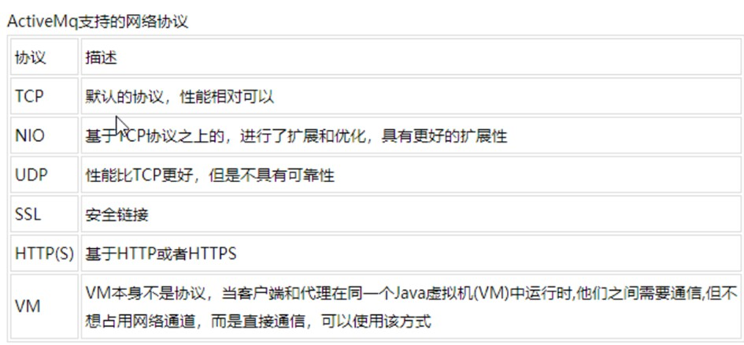

##### TCP协议

(1) Transmission Control Protocol(TCP)是默认的。TCP的Client监听端口61616

(2) 在网络传输数据前，必须要先序列化数据，消息是通过一个叫wire protocol的来序列化成字节流。

(3) TCP连接的URI形式如：tcp://HostName:port?key=value&key=value，后面的参数是可选的。

(4) TCP传输的的优点：

* TCP协议传输可靠性高，稳定性强
* 高效率：字节流方式传递，效率很高
* 有效性、可用性：应用广泛，支持任何平台

##### NIO协议

(1) New I/O API Protocol(NIO)

(2) NIO协议和TCP协议类似，但NIO更侧重于底层的访问操作。它允许开发人员对同一资源可有更多的client调用和服务器端有更多的负载。

(3) 适合使用NIO协议的场景：

可能有大量的Client去连接到Broker上，一般情况下，大量的Client去连接Broker是被操作系统的线程所限制的。因此，NIO的实现比TCP需要更少的线程去运行，所以建议使用NIO协议。

可能对于Broker有一个很迟钝的网络传输，NIO比TCP提供更好的性能。

（4）NIO连接的URI形式：nio://hostname:port?key=value&key=value

##### NIO协议案例

ActiveMQ这些协议传输的底层默认都是使用BIO网络的IO模型。只有当我们指定使用nio才使用NIO的IO模型。

修改配置文件

添加：**transportConnector name="nio" uri="nio://0.0.0.0:61618?trace=true" /**

重启activeMQ

客户端连接时，由原来的tcp://192.168.60.101:61616，变为：**nio://192.168.60.101:61618**

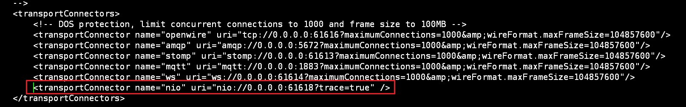

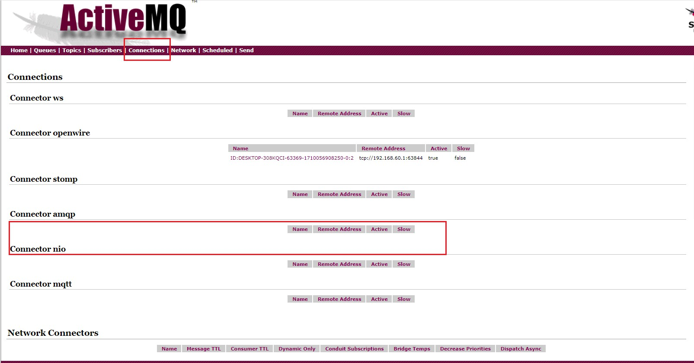

##### NIO协议案例增强

上面是Openwire协议传输底层使用NIO网络IO模型。 如何让其他协议传输底层也使用NIO网络IO模型呢？

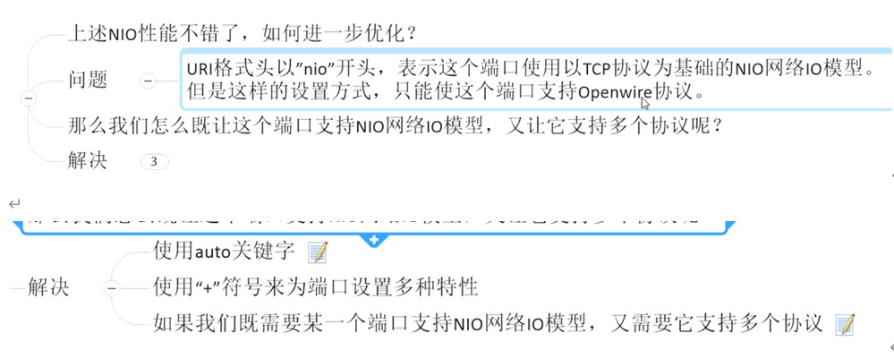

修改配置文件

```xml
  <transportConnector name="auto+nio" uri="auto+nio://0.0.0.0:61608?maximumConnections=1000&amp;wireFormat.maxFrameSize=104857600&amp;org.apache.activemq.transport.nio.SelectorManager.corePoolSize=20&amp;org.apache.activemq.transport.nio.Se1ectorManager.maximumPoo1Size=50"/>
```

auto  : 针对所有的协议，他会识别我们是什么协议。

nio  ：使用NIO网络IO模型

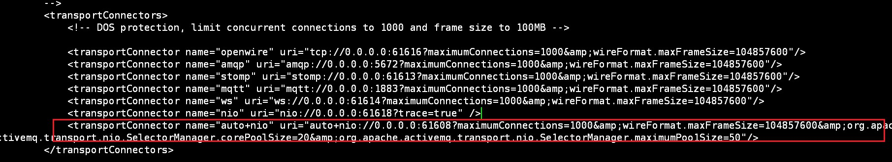

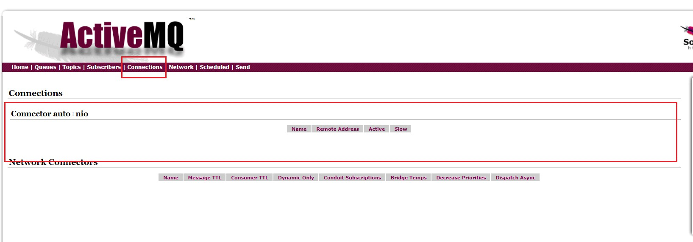

修改配置文件后重启activemq。

连接代码和之前入门案例保持一致

### activeMQ消息存储和持久化

此处持久化和之前持久化对比：

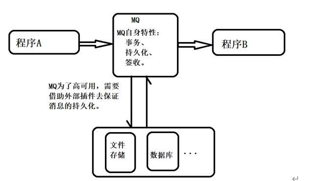

MQ高可用：事务、可持久、签收，是属于MQ自身特性，自带的。这里的持久化是外力，是外部插件。之前讲的持久化是MQ的外在表现，现在讲的的持久是是底层实现。

持久化是什么？一句话：ActiveMQ宕机了，消息不会丢失的机制。

说明：为了避免意外宕机以后丢失信息，需要做到重启后可以恢复消息队列，消息系统一半都会采用持久化机制。ActiveMQ的消息持久化机制有**JDBC，AMQ，KahaDB和LevelDB**，无论使用哪种持久化方式，消息的存储逻辑都是一致的。就是在发送者将消息发送出去后，消息中心首先将消息存储到本地数据文件、内存数据库或者远程数据库等。再试图将消息发给接收者，成功则将消息从存储中删除，失败则继续尝试尝试发送。消息中心启动以后，要先检查指定的存储位置是否有未成功发送的消息，如果有，则会先把存储位置中的消息发出去。

#### activeMQ支持的持久化

##### **AMQ Message Store**

基于文件的存储机制，是以前的默认机制，现在不再使用。

##### **kahaDB**

当前默认的

基于日志文件，从ActiveMQ5.4（含）开始默认的持久化插件。

配置：

```xml
 <persistenceAdapter>
         <kahaDB directory="${activemq.data}/kahadb"/>
   </persistenceAdapter>

```

日志文件的存储目录在：%activemq安装目录%/data/kahadb

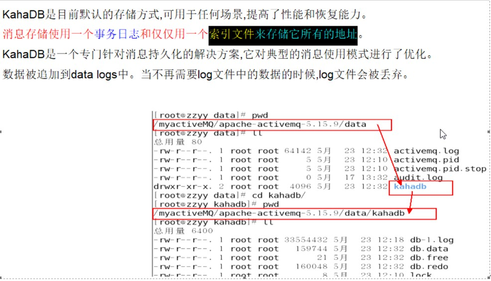

##### **JDBC消息存储**

数据库存储

###### 原理图

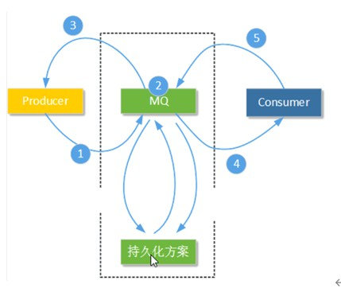

注意：需要添加mysql数据库驱动到activeMQ的lib文件夹下

###### jdbcPersistenceAdapter配置

```xml
<!--  
<persistenceAdapter>
            <kahaDB directory="${activemq.data}/kahadb"/>
      </persistenceAdapter>
-->
<persistenceAdapter>  
      <jdbcPersistenceAdapter dataSource="#mysql-ds" createTableOnStartup="true"/> 
</persistenceAdapter>

```


###### 数据库连接池配置

```xml
    <bean id="mysql-ds" class="org.apache.commons.dbcp2.BasicDataSource" destroy-method="close">
        <property name="driverClassName" value="com.mysql.jdbc.Driver"/>
        <property name="url" value="jdbc:mysql://mysql数据库URL/activemq?relaxAutoCommit=true"/>
        <property name="username" value="mysql数据库用户名"/>
        <property name="password" value="mysql数据库密码"/>
        <property name="poolPreparedStatements" value="true"/>
    </bean>

```

###### 总结：


##### **LevelDB消息存储**

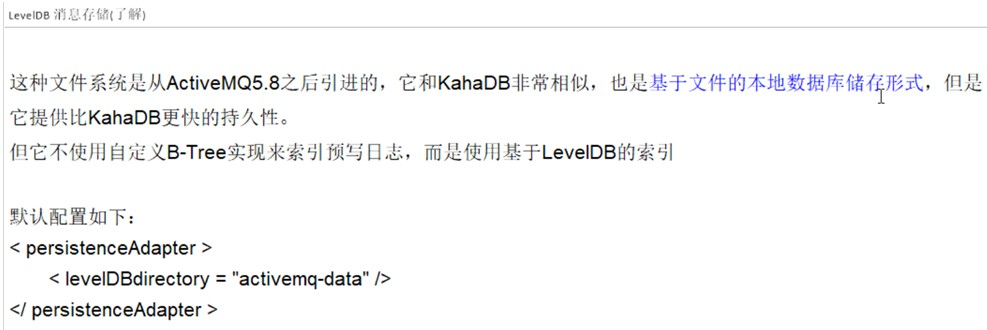

##### **JDBC Message Store with ActiveMQ Journal**

这种方式克服了JDBC Store的不足，JDBC每次消息过来，都需要去写库读库。ActiveMQ Journal，使用高速缓存写入技术，大大提高了性能。当消费者的速度能够及时跟上生产者消息的生产速度时，journal文件能够大大减少需要写入到DB中的消息。

举个例子：生产者生产了1000条消息，这1000条消息会保存到journal文件，如果消费者的消费速度很快的情况下，在journal文件还没有同步到DB之前，消费者已经消费了90%的以上消息，那么这个时候只需要同步剩余的10%的消息到DB。如果消费者的速度很慢，这个时候journal文件可以使消息以批量方式写到DB。

为了高性能，这种方式使用日志文件存储+数据库存储。先将消息持久到日志文件，等待一段时间再将未消费的消息持久到数据库。该方式要比JDBC性能要高。

###### 配置

下面是基于上面JDBC配置，再做一点修改：

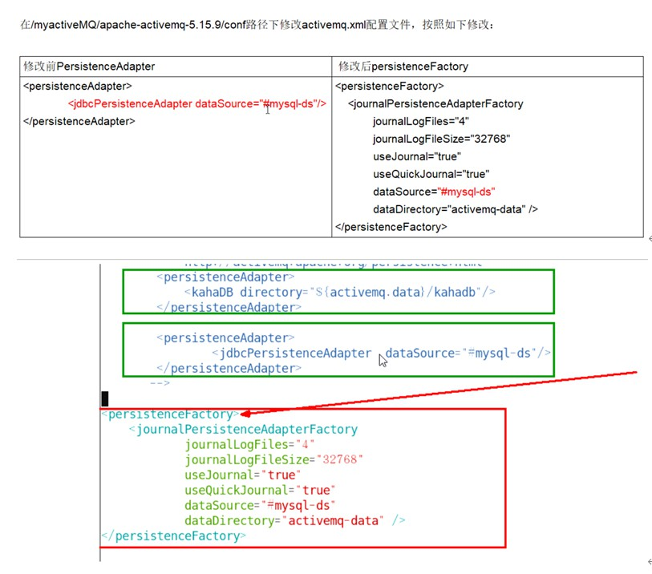

#### 总结

jdbc效率低，kahaDB效率高，jdbc+Journal效率较高。

持久化消息主要指的是：MQ所在服务器宕机了消息不会丢试的机制。

### 高级特性

#### 异步投递、延迟投递、定时投递

##### 异步投递：

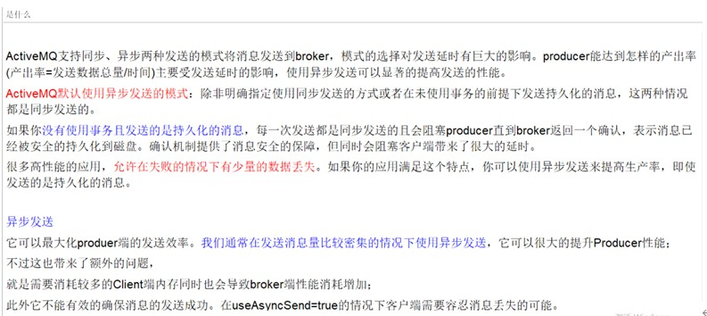

此处的异步是指生产者和broker之间发送消息的异步。不是指生产者和消费者之间异步。

###### 开启异步的方式：

```java
public class Jms_TX_Producer {

    // 方式1。3种方式任选一种
    private static final String ACTIVEMQ_URL = "tcp://118.24.20.3:61626?jms.useAsyncSend=true";
    private static final String ACTIVEMQ_QUEUE_NAME = "Async";

    public static void main(String[] args) throws JMSException {
        ActiveMQConnectionFactory activeMQConnectionFactory = new ActiveMQConnectionFactory(ACTIVEMQ_URL);
        // 方式2
        activeMQConnectionFactory.setUseAsyncSend(true);
        Connection connection = activeMQConnectionFactory.createConnection();
        // 方式3
        ((ActiveMQConnection)connection).setUseAsyncSend(true);
        connection.start();
        Session session = connection.createSession(false, Session.AUTO_ACKNOWLEDGE);
        Queue queue = session.createQueue(ACTIVEMQ_QUEUE_NAME);
        MessageProducer producer = session.createProducer(queue);
        try {
            for (int i = 0; i < 3; i++) {
                TextMessage textMessage = session.createTextMessage("tx msg--" + i);
                producer.send(textMessage);
            }
            System.out.println("消息发送完成");
        } catch (Exception e) {
            e.printStackTrace();
        } finally {
            producer.close();
            session.close();
            connection.close();
        }
    }
}

```

###### 异步发送如何确认发送成功：

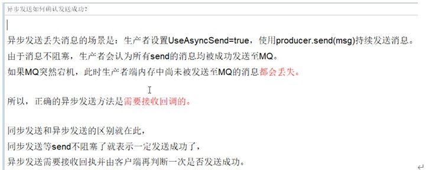

代码展示：

```java
public class Jms_TX_Producer {

    private static final String ACTIVEMQ_URL = "tcp://118.24.20.3:61626";

    private static final String ACTIVEMQ_QUEUE_NAME = "Async";

    public static void main(String[] args) throws JMSException {
        ActiveMQConnectionFactory activeMQConnectionFactory = new ActiveMQConnectionFactory(ACTIVEMQ_URL);
        activeMQConnectionFactory.setUseAsyncSend(true);
        Connection connection = activeMQConnectionFactory.createConnection();
        connection.start();
        Session session = connection.createSession(false, Session.AUTO_ACKNOWLEDGE);
        Queue queue = session.createQueue(ACTIVEMQ_QUEUE_NAME);
        ActiveMQMessageProducer activeMQMessageProducer = (ActiveMQMessageProducer)session.createProducer(queue);
        try {
            for (int i = 0; i < 3; i++) {
                TextMessage textMessage = session.createTextMessage("tx msg--" + i);
                textMessage.setJMSMessageID(UUID.randomUUID().toString()+"orderAtguigu");
                final String  msgId = textMessage.getJMSMessageID();
                activeMQMessageProducer.send(textMessage, new AsyncCallback() {
                    public void onSuccess() {
                        System.out.println("成功发送消息Id:"+msgId);
                    }

                    public void onException(JMSException e) {
                        System.out.println("失败发送消息Id:"+msgId);
                    }
                });
            }
            System.out.println("消息发送完成");
        } catch (Exception e) {
            e.printStackTrace();
        } finally {
            activeMQMessageProducer.close();
            session.close();
            connection.close();
        }
    }
}

```

##### 延迟投递和定时投递

修改配置文件：

schedulerSupport="true

```xml
 <broker xmlns="http://activemq.apache.org/schema/core" brokerName="localhost" dataDirectory="${activemq.data}"  schedulerSupport="true" >
```

代码实现：

```java
package com.activemq.demo;

import org.apache.activemq.*;
import javax.jms.*;
import java.util.UUID;

public class Jms_TX_Producer {

    private static final String ACTIVEMQ_URL = "tcp://118.24.20.3:61626";

    private static final String ACTIVEMQ_QUEUE_NAME = "Schedule01";

    public static void main(String[] args) throws JMSException {
        ActiveMQConnectionFactory activeMQConnectionFactory = new ActiveMQConnectionFactory(ACTIVEMQ_URL);
        Connection connection = activeMQConnectionFactory.createConnection();
        connection.start();
        Session session = connection.createSession(false, Session.AUTO_ACKNOWLEDGE);
        Queue queue = session.createQueue(ACTIVEMQ_QUEUE_NAME);
        MessageProducer messageProducer = session.createProducer(queue);
        long delay =  10*1000;
        long period = 5*1000;
        int repeat = 3 ;
        try {
            for (int i = 0; i < 3; i++) {
                TextMessage textMessage = session.createTextMessage("tx msg--" + i);
                // 延迟的时间
                textMessage.setLongProperty(ScheduledMessage.AMQ_SCHEDULED_DELAY, delay);
                // 重复投递的时间间隔
                textMessage.setLongProperty(ScheduledMessage.AMQ_SCHEDULED_PERIOD, period);
                // 重复投递的次数
                textMessage.setIntProperty(ScheduledMessage.AMQ_SCHEDULED_REPEAT, repeat);
                // 此处的意思：该条消息，等待10秒，之后每5秒发送一次，重复发送3次。
                messageProducer.send(textMessage);
            }
            System.out.println("消息发送完成");
        } catch (Exception e) {
            e.printStackTrace();
        } finally {
            messageProducer.close();
            session.close();
            connection.close();
        }
    }
}

```


#### 消息消费重试机制

是什么： 消费者收到消息，之后出现异常了，没有告诉broker确认收到该消息，broker会尝试再将该消息发送给消费者。尝试n次，如果消费者还是没有确认收到该消息，那么该消息将被放到死信队列重，之后broker不会再将该消息发送给消费者。

具体哪些情况会引发消息重发：

> ①　Client用了transactions且再session中调用了rollback
>
> ②　Client用了transactions且再调用commit之前关闭或者没有commit
>
> ③　Client再CLIENT_ACKNOWLEDGE的传递模式下，session中调用了recover

代码演示：

```java
public class Jms_TX_Consumer {
    private static final String ACTIVEMQ_URL = "tcp://118.24.20.3:61626";
    private static final String ACTIVEMQ_QUEUE_NAME = "dead01";

    public static void main(String[] args) throws JMSException, IOException {
        ActiveMQConnectionFactory activeMQConnectionFactory = new ActiveMQConnectionFactory(ACTIVEMQ_URL);
        // 修改默认参数，设置消息消费重试3次，默认六次
        RedeliveryPolicy redeliveryPolicy = new RedeliveryPolicy();
        redeliveryPolicy.setMaximumRedeliveries(3);
        activeMQConnectionFactory.setRedeliveryPolicy(redeliveryPolicy);
        Connection connection = activeMQConnectionFactory.createConnection();
        connection.start();
        final Session session = connection.createSession(true, Session.AUTO_ACKNOWLEDGE);
        Queue queue = session.createQueue(ACTIVEMQ_QUEUE_NAME);
        MessageConsumer messageConsumer = session.createConsumer(queue);
        messageConsumer.setMessageListener(new MessageListener() {
            public void onMessage(Message message) {
                if (message instanceof TextMessage) {
                    TextMessage textMessage = (TextMessage) message;
                    try {
                        System.out.println("***消费者接收到的消息:   " + textMessage.getText());
                        //session.commit();
                    }catch (Exception e){
                        e.printStackTrace();
                    }
                }
            }
        });
        System.in.read();
        messageConsumer.close();
        session.close();
        connection.close();
    }
}

```


#### 死信队列

死信队列：异常消息规避处理的集合，主要处理失败的消息。

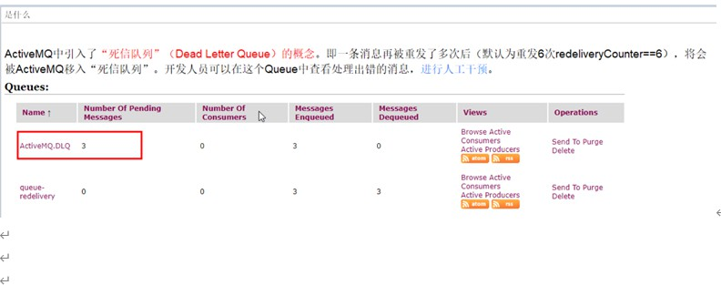

死信队列配置，一般默认：
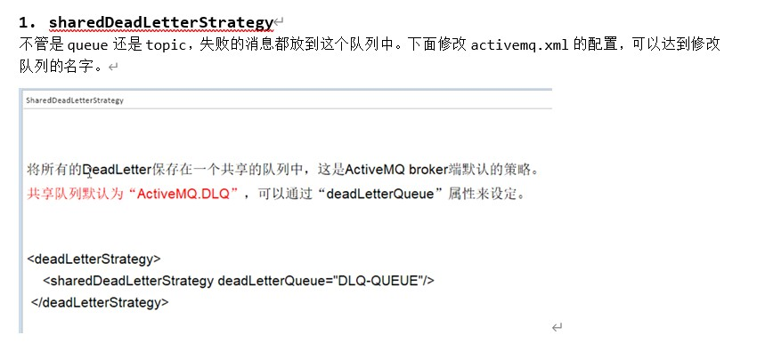

#### activeMQ集群搭建