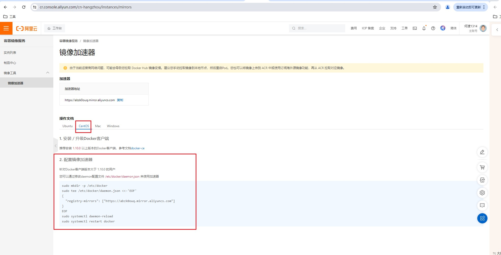
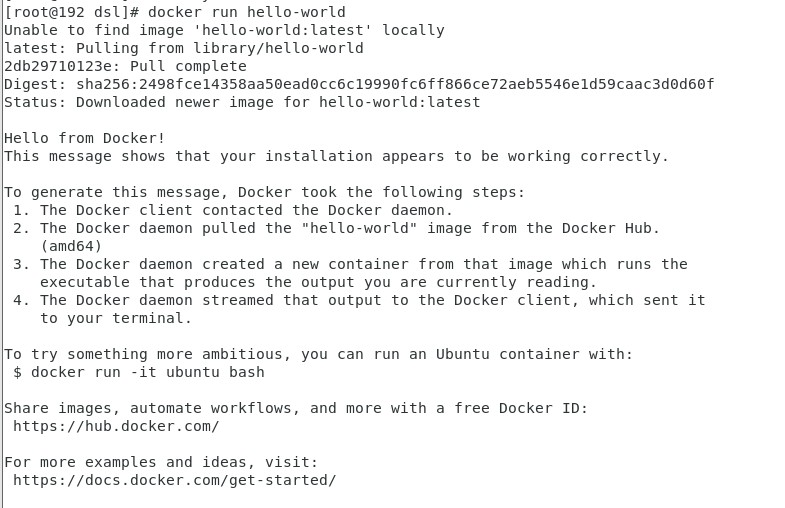
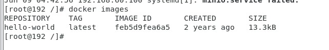
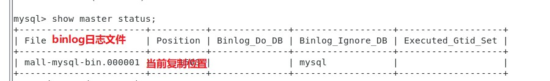
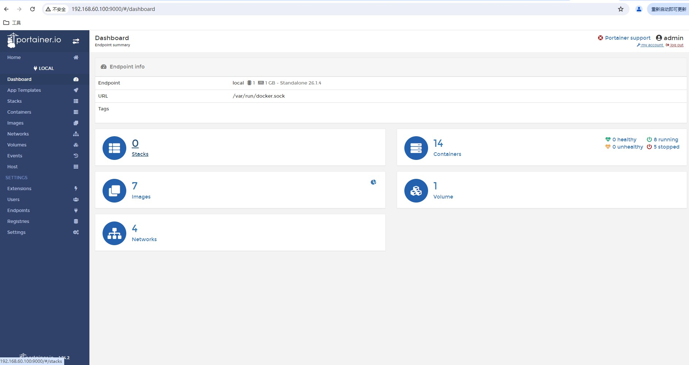

# docker

## docker 安装

* 下载地址：https://docs.docker.com/engine/install/centos/
* 安装步骤：

  ```sh
  yum -y install gcc
  yum -y install gcc-c++
  yum install -y yum-utils
  yum-config-manager --add-repo http://mirrors.aliyun.com/docker-ce/linux/centos/docker-ce.repo
  yum makecache fast
  yum -y install docker-ce docker-ce-cli containerd.io
  ```

注意：以上步骤完成后需要设置镜像加速器：此处**使用阿里云镜像加速器**

 1. 登陆阿里云开发者平台（https://promotion.aliyun.com/ntms/act/kubernetes.html）

 2. 点击控制台

 3. 选择容器镜像服务

 4. 获取加速器地址

    

* 测试：docker run hello-world

  


## docker命令

### 帮助启动类命令

```sh
启动docker： systemctl start docker
停止docker： systemctl stop docker
重启docker： systemctl restart docker
查看docker状态： systemctl status docker
开机启动： systemctl enable docker
查看docker概要信息： docker info
查看docker总体帮助文档： docker --help
```

### 镜像命令

* docker images：列出本地主机上的镜像
  * -a :列出本地所有的镜像（含历史映像层）
  * -q :只显示镜像ID。



> 各个选项说明:
>
> * REPOSITORY：表示镜像的仓库源
> * TAG：镜像的标签版本号
> * IMAGE ID：镜像ID
> * CREATED：镜像创建时间
> * SIZE：镜像大小
>
>  **同一仓库源可以有多个 TAG版本，代表这个仓库源的不同个版本，我们使用 REPOSITORY:TAG 来定义不同的镜像。**
> **如果你不指定一个镜像的版本标签，例如你只使用 ubuntu，docker 将默认使用 ubuntu:latest 镜像**

* docker search 某个XXX镜像名字: 镜像查找
  * --limit : 只列出N个镜像，默认25个
  * 例如-：docker search --limit 5 redis

* docker pull 某个XXX镜像名字：下载镜像

  * docker pull 镜像名字[:TAG]
  * 例如：docker pull ubuntu

* docker system df 查看镜像/容器/数据卷所占的空间

* docker rmi 某个XXX镜像名字ID：删除镜像

  * docker rmi -f 镜像ID

  * docker rmi -f 镜像名1:TAG 镜像名2:TAG，删除多个

  * docker rmi -f $(docker images -qa)：删除所有

    

### 容器命令

* docker run [OPTIONS] IMAGE [COMMAND] [ARG...]：新建启动容器

  * 参数说明：

    > --name="容器新名字"       为容器指定一个名称；
    > -d: 后台运行容器并返回容器ID，也即启动守护式容器(后台运行)；
    >
    > -i：以交互模式运行容器，通常与 -t 同时使用；
    > -t：为容器重新分配一个伪输入终端，通常与 -i 同时使用；
    > 也即启动交互式容器(前台有伪终端，等待交互)；
    >
    > -P: 随机端口映射，大写P...

* docker ps [OPTIONS]：列出当前所有正在运行的容器

  * 参数说明：

    > -a :列出当前所有正在运行的容器+历史上运行过的
    > -l :显示最近创建的容器。
    > -n：显示最近n个创建的容器。
    > -q :静默模式，只显示容器编号。

* 容器退出的方式：

  * exit：run进去容器，exit退出，容器停止
  * ctrl+p+q：run进去容器，ctrl+p+q退出，容器不停止

* docker start 容器ID或者容器名：启动已停止运行的容器

* docker restart 容器ID或者容器名：重启容器

* docker stop 容器ID或者容器名：停止容器

* docker kill 容器ID或容器名：强制停止容器

* docker rm 容器ID：删除已停止的容器

  * docker rm -f $(docker ps -a -q)：删除全部

* docker logs 容器ID：查看容器日志

* docker top 容器ID：查看容器内运行的进程

* docker inspect 容器ID：查看容器内部细节

* 进入正在运行的容器：

  * docker exec -it 容器ID bashShell
  * 重新进入docker attach 容器ID
    * attach 直接进入容器启动命令的终端，不会启动新的进程用exit退出，会导致容器的停止。
    * exec 是在容器中打开新的终端，并且可以启动新的进程用exit退出，不会导致容器的停止。

* docker cp 容器ID:容器内路径 目的主机路径：从容器内拷贝文件到主机上

* 容器的导入和导出：

  * export 导出容器的内容留作为一个tar归档文件[对应import命令]
  * import 从tar包中的内容创建一个新的文件系统再导入为镜像[对应export]
  * docker export 容器ID > 文件名.tar
  * cat 文件名.tar | docker import - 镜像用户/镜像名:镜像版本号

* docker镜像提交：

  * 创建并运行镜像：docker run -it  ubuntu:latest

  * 在创建的镜像里面，安装vim：

    ```sh
    docker容器内执行上述两条命令：
    apt-get update
    apt-get -y install vim
    ```

  * 打包镜像：docker commit -m='ubuntu-vim' -a=dsl 72290d9c94b5 ubuntu:1.1
    * docker commit -m="提交的描述信息" -a="作者" 容器ID 要创建的目标镜像名:[标签名]
  * 运行打包的容器：docker run -it ubuntu:1.1

## 本地镜像发布到阿里云

## 本地镜像发布到私库

## 容器里面的数据卷

将docker容器内的数据保存进宿主机的磁盘中（一句话：有点类似我们Redis里面的rdb和aof文件）

* 运行一个带有容器卷存储功能的容器实例**（命令格式：）：**
  * docker run -it --privileged=true -v /宿主机绝对路径目录:/容器内目录 镜像名

* 能干吗？
  * 将运用与运行的环境打包镜像，run后形成容器实例运行 ，但是我们对数据的要求希望是持久化的
  * Docker容器产生的数据，如果不备份，那么当容器实例删除后，容器内的数据自然也就没有了。
    为了能保存数据在docker中我们使用卷。
  * **数据卷可在容器之间共享或重用数据**
  * **卷中的更改可以直接实时生效**
  * **数据卷中的更改不会包含在镜像的更新中**
  * **数据卷的生命周期一直持续到没有容器使用它为止**
* 案例命令：
  * docker run -it --privileged=true -v /宿主机绝对路径目录:/容器内目录 镜像名（宿主vs容器之间映射添加容器卷）
  * 读写规则映射添加说明
    * docker run -it --privileged=true -v /宿主机绝对路径目录:/容器内目录:rw 镜像名，默认读写
    * docker run -it --privileged=true -v /宿主机绝对路径目录:/容器内目录:ro 镜像名，只读

## docker容器部署案例（MySQL主从复制）

* 新建主服务

  ```sh
  docker run -p 3307:3306 --name mysql-master \
  -v /mydata/mysql-master/log:/var/log/mysql \
  -v /mydata/mysql-master/data:/var/lib/mysql \
  -v /mydata/mysql-master/conf:/etc/mysql \
  -e MYSQL_ROOT_PASSWORD=root  \
  -d mysql:5.7
  ```

* 修改配置文件（进入/mydata/mysql-master/conf目录下新建my.cnf）

  ```sh
  [mysqld]
  ## 设置server_id，同一局域网中需要唯一
  server_id=101 
  ## 指定不需要同步的数据库名称
  binlog-ignore-db=mysql  
  ## 开启二进制日志功能
  log-bin=mall-mysql-bin  
  ## 设置二进制日志使用内存大小（事务）
  binlog_cache_size=1M  
  ```

* 重启主服务：docker restart mysql-master

* 进入主服务

  ```sh
  docker exec -it mysql-master /bin/bash
  mysql -uroot -proot
  ```

* 在主服务创建数据同步用户

  ```sh
  CREATE USER 'slave'@'%' IDENTIFIED BY '123456';
  GRANT REPLICATION SLAVE, REPLICATION CLIENT ON *.* TO 'slave'@'%';
  ```

* 创建从服务

  ```sh
  docker run -p 3308:3306 --name mysql-slave \
  -v /mydata/mysql-slave/log:/var/log/mysql \
  -v /mydata/mysql-slave/data:/var/lib/mysql \
  -v /mydata/mysql-slave/conf:/etc/mysql \
  -e MYSQL_ROOT_PASSWORD=root  \
  -d mysql:5.7
  ```

* 修改从服务配置文件

  ```sh
  [mysqld]
  ## 设置server_id，同一局域网中需要唯一
  server_id=102
  ## 指定不需要同步的数据库名称
  binlog-ignore-db=mysql  
  ## 开启二进制日志功能，以备Slave作为其它数据库实例的Master时使用
  log-bin=mall-mysql-slave1-bin  
  ## 设置二进制日志使用内存大小（事务）
  binlog_cache_size=1M  
  ```

*  重启从服务（docker restart mysql-slave）

* 在主服务查看主从同步状态

  ```sh
  show master status;
  ```

  

* 在从数据库配置主从复制

  ```sh
  # 进入从数据库
  docker exec -it mysql-slave /bin/bash
  mysql -uroot -proot
  # 配置主从复制
  change master to master_host='宿主机ip(192.168.60.100)', master_user='slave', master_password='123456', master_port=3307, master_log_file='mall-mysql-bin.000001', master_log_pos=617, master_connect_retry=30;
  ```

* **重启从服务**（docker restart mysql-slave）

* 在从数据库查看主从状态

  ```sh
  show slave status \G;
  ```

* 主数据库创建库表，从数据库验证

  ```sh
  # 主数据库执行
  create database school;
  create table stu(name char(10),age int(3));
  insert into stu(name,age)values('zhangsan','15');
  # 从数据库执行
  select * from stu;
  ```

## DockerFile解析

Dockerfile是用来构建Docker镜像的文本文件，是由一条条构建镜像所需的指令和参数构成的脚本。

官网参考：https://docs.docker.com/engine/reference/builder/

* dockerFile构建镜像三步：

  * 编写Dockerfile文件
  * docker build命令构建镜像
  * docker run依镜像运行容器实例

* dockerFile文件基础：

  * 每条保留字指令都必须为大写字母且后面要跟随至少一个参数
  * 指令按照从上到下，顺序执行
  * \#表示注释
  * 每条指令都会创建一个新的镜像层并对镜像进行提交

* Docker执行Dockerfile的大致流程

  * docker从基础镜像运行一个容器
  * 执行一条指令并对容器作出修改
  * 执行类似docker commit的操作提交一个新的镜像层
  * docker再基于刚提交的镜像运行一个新容器
  * 执行dockerfile中的下一条指令直到所有指令都执行完成

* 从应用软件的角度来看，Dockerfile、Docker镜像与Docker容器分别代表软件的三个不同阶段，
  *  Dockerfile是软件的原材料
  *  Docker镜像是软件的交付品
  *  Docker容器则可以认为是软件镜像的运行态，也即依照镜像运行的容器实例

* DockerFile的关键字：

  * FROM：基础镜像，当前新镜像是基于哪个镜像的，指定一个已经存在的镜像作为模板，第一条必须是from
  * MAINTAINER：镜像维护者的姓名和邮箱地址
  * RUN：容器构建时需要运行的命令，有两种格式：
    * shell格式：RUN yum -y install vim
    * exec格式
    * RUN是在 docker build时运行
  * EXPOSE：当前容器对外暴露出的端口
  * WORKDIR：指定在创建容器后，终端默认登陆的进来工作目录，一个落脚点
  * USER：指定该镜像以什么样的用户去执行，如果都不指定，默认是root
  * ENV：用来在构建镜像过程中设置环境变量
    * 比如：WORKDIR $MY_PATH
  * ADD：将宿主机目录下的文件拷贝进镜像且会自动处理URL和解压tar压缩包
  * COPY:类似ADD，拷贝文件和目录到镜像中。将从构建上下文目录中 <源路径> 的文件/目录复制到新的一层的镜像内的 <目标路径> 位置
    * COPY src dest
    * <src源路径>：源文件或者源目录
    * <dest目标路径>：容器内的指定路径，该路径不用事先建好，路径不存在的话，会自动创建。
  * VOLUME:容器数据卷，用于数据保存和持久化工作
  * CMD:指定容器启动后的要干的事情
    * Dockerfile 中可以有多个 CMD 指令，但只有最后一个生效，CMD 会被 docker run 之后的参数替换
    * CMD是在docker run 时运行。
  * ENTRYPOINT:也是用来指定一个容器启动时要运行的命令,类似于 CMD 指令，但是ENTRYPOINT不会被docker run后面的命令覆盖，而且这些命令行参数会被当作参数送给 ENTRYPOINT 指令指定的程序
    * 在执行docker run的时候可以指定 ENTRYPOINT 运行所需的参数。
    * 如果 Dockerfile 中如果存在多个 ENTRYPOINT 指令，仅最后一个生效。

* 案例：

  自定义构建带有vim的镜像

  * 编写Dockerfile文件

    ```sh
    FROM ubuntu
    MAINTAINER dsl<1711054839@qq.com>
    
    ENV MYPATH /usr/local
    WORKDIR $MYPATH
    
    #安装vim编辑器
    RUN apt-get update
    RUN apt-get -y install vim
    ```

  * 构建

    ```sh
    docker build -t 新镜像名字:TAG .
    # 注意，上面TAG后面有个空格，有个点
    ```

  * 运行：docker run -it 新镜像名字:TAG

* 虚悬镜像

  * 仓库名、标签都是none的镜像，俗称dangling image
  * 查看所有的虚悬镜像：
    * docker image ls -f dangling=true
  * 删除所有的虚悬镜像：
    * docker image prune

## Docker网络

* docker网络常用命令

  * docker network ls：查看网络
  * docker network inspect XXX网络名字：查看网络源数据
  * docker network rm XXX网络名字：删除网络
  * docker network create 网络名字：创建网络

* 能做什么？

  * 容器间的互联和通信以及端口映射
  * 容器IP变动时候可以通过服务名直接网络通信而不受到影响

* 网络类型

  * 网桥（bridge模式）

    * Docker 服务默认会创建一个 docker0 网桥（其上有一个 docker0 内部接口），该桥接网络的名称为docker0，它在内核层连通了其他的物理或虚拟网卡，这就将所有容器和本地主机都放到同一个物理网络。Docker 默认指定了 docker0 接口 的 IP 地址和子网掩码，让主机和容器之间可以通过网桥相互通信。
    * 案例，启动两个tomcat服务，并互相ping
      * docker run -d -p 8081:8080 --name tomcat81 billygoo/tomcat8-jdk8
      * docker run -d -p 8082:8080 --name tomcat82 billygoo/tomcat8-jdk8

  * 主机（host模式）

    * 直接使用宿主机的 IP 地址与外界进行通信，不再需要额外进行NAT 转换。
    * 案例：docker run -d --network host --name tomcat83 billygoo/tomcat8-jdk8

  * none（none模式）

    * 禁用网络功能，只有lo标识(就是127.0.0.1表示本地回环)
    * 案例：docker run -d -p 8084:8080 --network none --name tomcat84 billygoo/tomcat8-jdk8

  * 容器（container模式）

    * 新建的容器和已经存在的一个容器共享一个网络ip配置而不是和宿主机共享。新创建的容器不会创建自己的网卡，配置自己的IP，而是和一个指定的容器共享IP、端口范围等。同样，两个容器除了网络方面，其他的如文件系统、进程列表等还是隔离的。
    * 案例：
      * docker run -it --name alpine1 alpine /bin/sh
      * docker run -it --network container:alpine1 --name alpine2 alpine /bin/sh

  * 自定义

    采用上述方式网络，启动的容器，只能通过ip访问，不能通过服务名访问

    * 自定义桥接网络,自定义网络默认使用的是桥接网络bridge
    * 创建网络：docker network create dsl
    * docker run -d -p 8081:8080 --network dsl--name tomcat81 billygoo/tomcat8-jdk8
    * docker run -d -p 8082:8080 --network dsl--name tomcat82 billygoo/tomcat8-jdk8

## Docker-compose容器编排

Docker-Compose是Docker官方的开源项目，负责实现对Docker容器集群的快速编排。**一次性部署很多容器**

下载：https://docs.docker.com/compose/install/

安装：

```sh
curl -L "https://github.com/docker/compose/releases/download/1.29.2/docker-compose-$(uname -s)-$(uname -m)" -o /usr/local/bin/docker-compose
chmod +x /usr/local/bin/docker-compose
docker-compose --version
```

* 使用步骤：

  * 编写Dockerfile定义各个微服务应用并构建出对应的镜像文件
  * 使用 docker-compose.yml 定义一个完整业务单元，安排好整体应用中的各个容器服务。
  * 最后，执行docker-compose up命令 来启动并运行整个应用程序，完成一键部署上线

* 常用命令：

  ```sh
  Compose常用命令
  docker-compose -h                           # 查看帮助
  docker-compose up                           # 启动所有docker-compose服务
  docker-compose up -d                        # 启动所有docker-compose服务并后台运行
  docker-compose down                         # 停止并删除容器、网络、卷、镜像。
  docker-compose exec  yml里面的服务id                 # 进入容器实例内部  docker-compose exec docker-compose.yml文件中写的服务id /bin/bash
  docker-compose ps                      # 展示当前docker-compose编排过的运行的所有容器
  docker-compose top                     # 展示当前docker-compose编排过的容器进程
  ```

## docker 轻量级可视化工具 Portainer

Portainer 是一款轻量级的应用，它提供了图形化界面，用于方便地管理Docker环境，包括单机环境和集群环境。

下载：https://docs.portainer.io/v/ce-2.9/start/install/server/docker/linux

* docker安装：

  * docker run -d -p 8000:8000 -p 9000:9000 --name portainer     --restart=always     -v /var/run/docker.sock:/var/run/docker.sock     -v portainer_data:/data     portainer/portainer
  * 第一次登录需创建admin，访问地址：xxx.xxx.xxx.xxx:9000

  


