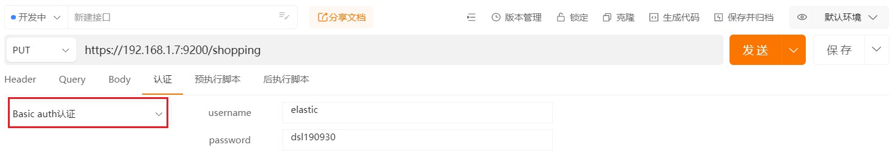

### 索引操作

#### 创建索引

对比关系型数据库，创建索引就等同于创建数据库。

向es服务器发送put请求：https://192.168.1.7:9200/shopping

返回：

```json
{
	"acknowledged": true,//响应结果
	"shards_acknowledged": true,//分片结果
	"index": "shopping"//索引名称
}
```

需要注意：若es开启了密码认证，则在发送请求前需要配置认证信息：



#### 查看索引

向es发送get请求：https://192.168.1.7:9200/shopping，查看单个索引

```json
{
	"shopping": {
		"aliases": {},
		"mappings": {},
		"settings": {
			"index": {
				"routing": {
					"allocation": {
						"include": {
							"_tier_preference": "data_content"
						}
					}
				},
				"number_of_shards": "1",
				"provided_name": "shopping",
				"creation_date": "1687588619339",
				"number_of_replicas": "1",
				"uuid": "ZGGycL3AQleTX5rcxn_xIg",
				"version": {
					"created": "8020399"
				}
			}
		}
	}
}
```

向es发送get请求，查看所有索引：https://192.168.1.7:9200/_cat/indices?v

```json
health status index    uuid                   pri rep docs.count docs.deleted store.size pri.store.size
yellow open   shopping ZGGycL3AQleTX5rcxn_xIg   1   1          0            0       225b           225b
```

| 表头           | 含义                                                         |
| -------------- | ------------------------------------------------------------ |
| health         | 当前服务器健康状态： green(集群完整) yellow(单点正常、集群不完整) red(单点不正常) |
| status         | 索引打开、关闭状态                                           |
| index          | 索引名                                                       |
| uuid           | 索引统一编号                                                 |
| pri            | 主分片数量                                                   |
| rep            | 副本数量                                                     |
| docs.count     | 可用文档数量                                                 |
| docs.deleted   | 文档删除状态（逻辑删除）                                     |
| store.size     | 主分片和副分片整体占空间大小                                 |
| pri.store.size | 主分片占空间大小                                             |

#### 删除索引

向es发送delete请求删除索引：https://192.168.1.7:9200/story

### 文档操作

#### 创建

索引已经创建好了，创建文档，并添加数据。这里的文档可以类比为关系型数据库中的表数据，添加的数据格式为 JSON 格式。

向 ES 服务器发 POST 请求 ：https://192.168.1.7:9200/shopping/_doc，请求json格式如下：

```json
{
    "title":"小米手机",
    "category":"小米",
    "images":"http://www.gulixueyuan.com/xm.jpg",
    "price":3999.00
}
```

返回结果：数据创建后，由于没有指定数据唯一性标识（ID），默认情况下， ES 服务器会随机生成一个。

```json
{
    "_index": "shopping",//索引
    "_type": "_doc",//类型-文档
    "_id": "ANQqsHgBaKNfVnMbhZYU",//唯一标识，可以类比为 MySQL 中的主键，随机生成
    "_version": 1,//版本
    "result": "created",//结果，这里的 create 表示创建成功
    "_shards": {//
        "total": 2,//分片 - 总数
        "successful": 1,//分片 - 总数
        "failed": 0//分片 - 总数
    },
    "_seq_no": 0,
    "_primary_term": 1
}
```

如果想要自定义唯一性标识，需要在创建时指定：https://192.168.1.7:9200/shopping/_doc/1001，请求体不变，“1001”为指定的主键

需要注意的是：**如果增加数据时明确数据主键，那么请求方式也可以为 PUT。**

#### 修改和删除

##### 全量修改

和新增文档一样，输入相同的 URL 地址请求，如果请求体变化，会将原有的数据内容覆盖

向es发送post或put请求：https://192.168.1.7:9200/shopping/_doc/1001，请求体内容：

```json
{
    "title":"华为手机",
    "category":"华为",
    "images":"http://www.gulixueyuan.com/xm.jpg",
    "price":399.00
}

```

##### 局部修改

修改数据时，也可以只修改某一给条数据的局部信息

向es发送post请求，https://192.168.1.7:9200/shopping/_update/1001

```json
{
	"doc": {
		"title":"小米手机",
		"category":"小米"
	}
}
```

通过get请求：https://192.168.1.7:9200/shopping/_doc/1001查看，修改后的数据：

```json
{
	"_index": "shopping",
	"_id": "1001",
	"_version": 6,
	"_seq_no": 7,
	"_primary_term": 1,
	"found": true,
	"_source": {
		"title": "小米手机",
		"category": "米家",
		"images": "http://www.gulixueyuan.com/xm.jpg",
		"price": 399
	}
}
```

##### 删除

删除一个文档不会立即从磁盘上移除，它只是被标记成已删除（逻辑删除）。

向es发送delete请求：https://192.168.1.7:9200/shopping/_doc/1001

返回结果：

```json
{
	"_index": "shopping",
	"_id": "1001",
	"_version": 7,
	"result": "deleted",
	"_shards": {
		"total": 2,
		"successful": 1,
		"failed": 0
	},
	"_seq_no": 8,
	"_primary_term": 1
}
```

#### 查询

##### 主键查询

查看文档时，需要指明文档的唯一性标识，类似于 MySQL 中数据的主键查询

向es发送get请求：https://192.168.1.7:9200/shopping/_doc/1001

```
{
	"_index": "shopping",
	"_id": "1001",
	"_version": 6,
	"_seq_no": 7,
	"_primary_term": 1,
	"found": true,
	"_source": {
		"title": "小米手机",
		"category": "米家",
		"images": "http://www.gulixueyuan.com/xm.jpg",
		"price": 399
	}
}
```

##### 全量查询

查看索引下所有数据，向 ES 服务器发 GET 请求：https://192.168.1.7:9200/shopping/_search

```json
{
	"took": 559,
	"timed_out": false,
	"_shards": {
		"total": 1,
		"successful": 1,
		"skipped": 0,
		"failed": 0
	},
	"hits": {
		"total": {
			"value": 2,
			"relation": "eq"
		},
		"max_score": 1,
		"hits": [
			{
				"_index": "shopping",
				"_id": "C2mu7IgBJwROQdoMkO-P",
				"_score": 1,
				"_source": {
					"title": "小米手机",
					"category": "小米",
					"images": "http://www.gulixueyuan.com/xm.jpg",
					"price": 3999
				}
			},
			{
				"_index": "shopping",
				"_id": "DGmu7IgBJwROQdoMpe9v",
				"_score": 1,
				"_source": {
					"title": "小米手机",
					"category": "小米",
					"images": "http://www.gulixueyuan.com/xm.jpg",
					"price": 3999
				}
			}
		]
	}
}
```

##### URL带参查询

**查找category为小米的文档**，向 ES 服务器发 GET请求 ：https://192.168.1.7:9200/shopping/_search?q=category:小米

查找的结果如下：

```
{
	"took": 35,
	"timed_out": false,
	"_shards": {
		"total": 1,
		"successful": 1,
		"skipped": 0,
		"failed": 0
	},
	"hits": {
		"total": {
			"value": 2,
			"relation": "eq"
		},
		"max_score": 0.36464313,
		"hits": [
			{
				"_index": "shopping",
				"_id": "C2mu7IgBJwROQdoMkO-P",
				"_score": 0.36464313,
				"_source": {
					"title": "小米手机",
					"category": "小米",
					"images": "http://www.gulixueyuan.com/xm.jpg",
					"price": 3999
				}
			},
			{
				"_index": "shopping",
				"_id": "DGmu7IgBJwROQdoMpe9v",
				"_score": 0.36464313,
				"_source": {
					"title": "小米手机",
					"category": "小米",
					"images": "http://www.gulixueyuan.com/xm.jpg",
					"price": 3999
				}
			}
		]
	}
}
```

##### 请求体带参查询

向es发送get请求：https://192.168.1.7:9200/shopping/_search

json请求体：

```json
{
	"query":{
		"match":{
			"category":"小米"
		}
	}
}

```

返回结果同上

##### 带请求体方式查找所有内容

**查找所有文档内容**，也可以这样，向 ES 服务器发 GET请求 ：https://192.168.1.7:9200/shopping/_search

请求json为：

```json
{
	"query":{
		"match_all":{}
	}
}

```

返回结果：

```
{
	"took": 622,
	"timed_out": false,
	"_shards": {
		"total": 1,
		"successful": 1,
		"skipped": 0,
		"failed": 0
	},
	"hits": {
		"total": {
			"value": 3,
			"relation": "eq"
		},
		"max_score": 1,
		"hits": [
			{
				"_index": "shopping",
				"_id": "C2mu7IgBJwROQdoMkO-P",
				"_score": 1,
				"_source": {
					"title": "小米手机",
					"category": "小米",
					"images": "http://www.gulixueyuan.com/xm.jpg",
					"price": 3999
				}
			},
			{
				"_index": "shopping",
				"_id": "DGmu7IgBJwROQdoMpe9v",
				"_score": 1,
				"_source": {
					"title": "小米手机",
					"category": "小米",
					"images": "http://www.gulixueyuan.com/xm.jpg",
					"price": 3999
				}
			},
			{
				"_index": "shopping",
				"_id": "1002",
				"_score": 1,
				"_source": {
					"title": "华为手机",
					"category": "荣耀"
				}
			}
		]
	}
}
```

##### 查询指定字段

查询文档中的指定字段，向 ES 服务器发 GET请求 ：https://192.168.1.7:9200/shopping/_search

json请求体为：

```json
{
	"query":{
		"match_all":{}
	},
	"_source":["title"]
}
```

返回结果为：

```json
{
	"took": 9,
	"timed_out": false,
	"_shards": {
		"total": 1,
		"successful": 1,
		"skipped": 0,
		"failed": 0
	},
	"hits": {
		"total": {
			"value": 3,
			"relation": "eq"
		},
		"max_score": 1,
		"hits": [
			{
				"_index": "shopping",
				"_id": "C2mu7IgBJwROQdoMkO-P",
				"_score": 1,
				"_source": {
					"title": "小米手机"
				}
			},
			{
				"_index": "shopping",
				"_id": "DGmu7IgBJwROQdoMpe9v",
				"_score": 1,
				"_source": {
					"title": "小米手机"
				}
			},
			{
				"_index": "shopping",
				"_id": "1002",
				"_score": 1,
				"_source": {
					"title": "华为手机"
				}
			}
		]
	}
}
```

##### 分页查询

向 ES 服务器发 GET请求 ：https://192.168.1.7:9200/shopping/_search

json请求体为：

```json
{
	"query":{
		"match_all":{}
	},
    "from":0,
    "size":1
}

```

返回结果为：

```
{
	"took": 3,
	"timed_out": false,
	"_shards": {
		"total": 1,
		"successful": 1,
		"skipped": 0,
		"failed": 0
	},
	"hits": {
		"total": {
			"value": 3,
			"relation": "eq"
		},
		"max_score": 1,
		"hits": [
			{
				"_index": "shopping",
				"_id": "C2mu7IgBJwROQdoMkO-P",
				"_score": 1,
				"_source": {
					"price": 3999,
					"title": "小米手机"
				}
			}
		]
	}
}
```

##### 查询排序

向 ES 服务器发 GET请求 ：https://192.168.1.7:9200/shopping/_search

json请求体为：

```json
{
	"query":{
		"match_all":{}
	},
	"sort":{
		"price":{
			"order":"desc"
		}
	}
}

```

返回结果：

```json
{
	"took": 11,
	"timed_out": false,
	"_shards": {
		"total": 1,
		"successful": 1,
		"skipped": 0,
		"failed": 0
	},
	"hits": {
		"total": {
			"value": 3,
			"relation": "eq"
		},
		"max_score": null,
		"hits": [
			{
				"_index": "shopping",
				"_id": "C2mu7IgBJwROQdoMkO-P",
				"_score": null,
				"_source": {
					"title": "小米手机",
					"category": "小米",
					"images": "http://www.gulixueyuan.com/xm.jpg",
					"price": 3999
				},
				"sort": [
					3999
				]
			},
			{
				"_index": "shopping",
				"_id": "DGmu7IgBJwROQdoMpe9v",
				"_score": null,
				"_source": {
					"title": "小米手机",
					"category": "小米",
					"images": "http://www.gulixueyuan.com/xm.jpg",
					"price": 3999
				},
				"sort": [
					3999
				]
			},
			{
				"_index": "shopping",
				"_id": "1002",
				"_score": null,
				"_source": {
					"title": "华为手机",
					"category": "荣耀"
				},
				"sort": [
					"-Infinity"
				]
			}
		]
	}
}
```

##### 多条件查询

假设想找出小米牌子，价格为3999元的。（must相当于数据库的&&，should相当于数据库中的||）

向 ES 服务器发 GET请求 ：https://192.168.1.7:9200/shopping/_search

json请求体为：

```json
{
	"query":{
		"bool":{
			"must":[{// must是并且，should是或
				"match":{
					"category":"小米"
				}
			},{
				"match":{
					"price":3999.00
				}
			}]
		}
	}
}

```

返回结果：

```json
{
	"took": 7,
	"timed_out": false,
	"_shards": {
		"total": 1,
		"successful": 1,
		"skipped": 0,
		"failed": 0
	},
	"hits": {
		"total": {
			"value": 2,
			"relation": "eq"
		},
		"max_score": 1.9400072,
		"hits": [
			{
				"_index": "shopping",
				"_id": "C2mu7IgBJwROQdoMkO-P",
				"_score": 1.9400072,
				"_source": {
					"title": "小米手机",
					"category": "小米",
					"images": "http://www.gulixueyuan.com/xm.jpg",
					"price": 3999
				}
			},
			{
				"_index": "shopping",
				"_id": "DGmu7IgBJwROQdoMpe9v",
				"_score": 1.9400072,
				"_source": {
					"title": "小米手机",
					"category": "小米",
					"images": "http://www.gulixueyuan.com/xm.jpg",
					"price": 3999
				}
			}
		]
	}
}
```

##### 范围查询

假设想找出小米和华为的牌子，价格大于2000元的手机。

向 ES 服务器发 GET请求 ：https://192.168.1.7:9200/shopping/_search

json请求体：

```json
{
	"query":{
		"bool":{
			"should":[{
				"match":{
					"category":"小米"
				}
			},{
				"match":{
					"category":"华为"
				}
			}],
            "filter":{
            	"range":{
                	"price":{
                    	"gt":2000
                	}
	            }
    	    }
		}
	}
}

```

返回的结果：

```json
{
	"took": 7,
	"timed_out": false,
	"_shards": {
		"total": 1,
		"successful": 1,
		"skipped": 0,
		"failed": 0
	},
	"hits": {
		"total": {
			"value": 2,
			"relation": "eq"
		},
		"max_score": 1.3862942,
		"hits": [
			{
				"_index": "shopping",
				"_id": "C2mu7IgBJwROQdoMkO-P",
				"_score": 1.3862942,
				"_source": {
					"title": "小米手机",
					"category": "小米",
					"images": "http://www.gulixueyuan.com/xm.jpg",
					"price": 3999
				}
			},
			{
				"_index": "shopping",
				"_id": "DGmu7IgBJwROQdoMpe9v",
				"_score": 1.3862942,
				"_source": {
					"title": "小米手机",
					"category": "小米",
					"images": "http://www.gulixueyuan.com/xm.jpg",
					"price": 3999
				}
			}
		]
	}
}
```

##### 聚合查询

聚合允许使用者对 es 文档进行统计分析，类似与关系型数据库中的 group by，当然还有很多其他的聚合，例如取最大值max、平均值avg等等。

接下来按price字段进行分组：

向 ES 服务器发 GET请求 ：https://192.168.1.7:9200/shopping/_search

json请求体：

```json
{
	"aggs":{//聚合操作
		"price_group":{//名称，随意起名
			"terms":{//分组
				"field":"price"//分组字段
			}
		}
	},
     "size":0 //若不想要不附带原始数据的结果,可加入size属性
}
```

返回结果：

```json
{
	"took": 85,
	"timed_out": false,
	"_shards": {
		"total": 1,
		"successful": 1,
		"skipped": 0,
		"failed": 0
	},
	"hits": {
		"total": {
			"value": 4,
			"relation": "eq"
		},
		"max_score": 1,
		"hits": [
			{
				"_index": "shopping",
				"_id": "C2mu7IgBJwROQdoMkO-P",
				"_score": 1,
				"_source": {
					"title": "小米手机",
					"category": "小米",
					"images": "http://www.gulixueyuan.com/xm.jpg",
					"price": 3999
				}
			},
			{
				"_index": "shopping",
				"_id": "DGmu7IgBJwROQdoMpe9v",
				"_score": 1,
				"_source": {
					"title": "小米手机",
					"category": "小米",
					"images": "http://www.gulixueyuan.com/xm.jpg",
					"price": 3999
				}
			},
			{
				"_index": "shopping",
				"_id": "1002",
				"_score": 1,
				"_source": {
					"title": "华为手机",
					"category": "荣耀"
				}
			},
			{
				"_index": "shopping",
				"_id": "1005",
				"_score": 1,
				"_source": {
					"title": "小米手机",
					"category": "荣耀",
					"price": 900
				}
			}
		]
	},
	"aggregations": {
		"price_group": {
			"doc_count_error_upper_bound": 0,
			"sum_other_doc_count": 0,
			"buckets": [
				{
					"key": 3999,
					"doc_count": 2
				},
				{
					"key": 900,
					"doc_count": 1
				}
			]
		}
	}
}
```


#### 检索

##### 全文检索

这功能像搜索引擎那样，如品牌输入“小荣”，返回结果带回品牌有“小米”和华为的。

向 ES 服务器发 GET请求 ：https://192.168.1.7:9200/shopping/_search

json请求体：

```json
{
	"query":{
		"match":{
			"category" : "小荣"
		}
	}
}

```

返回的结果：

```json
{
	"took": 12,
	"timed_out": false,
	"_shards": {
		"total": 1,
		"successful": 1,
		"skipped": 0,
		"failed": 0
	},
	"hits": {
		"total": {
			"value": 4,
			"relation": "eq"
		},
		"max_score": 0.6931471,
		"hits": [
			{
				"_index": "shopping",
				"_id": "C2mu7IgBJwROQdoMkO-P",
				"_score": 0.6931471,
				"_source": {
					"title": "小米手机",
					"category": "小米",
					"images": "http://www.gulixueyuan.com/xm.jpg",
					"price": 3999
				}
			},
			{
				"_index": "shopping",
				"_id": "DGmu7IgBJwROQdoMpe9v",
				"_score": 0.6931471,
				"_source": {
					"title": "小米手机",
					"category": "小米",
					"images": "http://www.gulixueyuan.com/xm.jpg",
					"price": 3999
				}
			},
			{
				"_index": "shopping",
				"_id": "1002",
				"_score": 0.6931471,
				"_source": {
					"title": "华为手机",
					"category": "荣耀"
				}
			},
			{
				"_index": "shopping",
				"_id": "1005",
				"_score": 0.6931471,
				"_source": {
					"title": "小米手机",
					"category": "荣耀",
					"price": 900
				}
			}
		]
	}
}
```

匹配了所有的数据

##### 完全匹配

关键字的完全匹配，向 ES 服务器发 GET请求 ：https://192.168.1.7:9200/shopping/_search

json请求体：

```
{
	"query":{
		"match_phrase":{
			"category" : "小米"
		}
	}
}

```

返回的结果：

```json
{
	"took": 5,
	"timed_out": false,
	"_shards": {
		"total": 1,
		"successful": 1,
		"skipped": 0,
		"failed": 0
	},
	"hits": {
		"total": {
			"value": 2,
			"relation": "eq"
		},
		"max_score": 1.3862942,
		"hits": [
			{
				"_index": "shopping",
				"_id": "C2mu7IgBJwROQdoMkO-P",
				"_score": 1.3862942,
				"_source": {
					"title": "小米手机",
					"category": "小米",
					"images": "http://www.gulixueyuan.com/xm.jpg",
					"price": 3999
				}
			},
			{
				"_index": "shopping",
				"_id": "DGmu7IgBJwROQdoMpe9v",
				"_score": 1.3862942,
				"_source": {
					"title": "小米手机",
					"category": "小米",
					"images": "http://www.gulixueyuan.com/xm.jpg",
					"price": 3999
				}
			}
		]
	}
}
```

##### 高亮查询

高亮查询品牌字段，向 ES 服务器发 GET请求 ：https://192.168.1.7:9200/shopping/_search

json请求体：

```json
{
	"query":{
		"match_phrase":{
			"category" : "小米"
		}
	},
    "highlight":{
        "fields":{
            "category":{}//<----高亮这字段
        }
    }
}
```

返回的结果：

```json
{
	"took": 75,
	"timed_out": false,
	"_shards": {
		"total": 1,
		"successful": 1,
		"skipped": 0,
		"failed": 0
	},
	"hits": {
		"total": {
			"value": 2,
			"relation": "eq"
		},
		"max_score": 1.3862942,
		"hits": [
			{
				"_index": "shopping",
				"_id": "C2mu7IgBJwROQdoMkO-P",
				"_score": 1.3862942,
				"_source": {
					"title": "小米手机",
					"category": "小米",
					"images": "http://www.gulixueyuan.com/xm.jpg",
					"price": 3999
				},
				"highlight": {
					"category": [
						"<em>小</em><em>米</em>"
					]
				}
			},
			{
				"_index": "shopping",
				"_id": "DGmu7IgBJwROQdoMpe9v",
				"_score": 1.3862942,
				"_source": {
					"title": "小米手机",
					"category": "小米",
					"images": "http://www.gulixueyuan.com/xm.jpg",
					"price": 3999
				},
				"highlight": {
					"category": [
						"<em>小</em><em>米</em>"
					]
				}
			}
		]
	}
}
```

#### 映射关系

有了索引库，等于有了数据库中的 database。

接下来就需要建索引库(index)中的映射了，类似于数据库(database)中的表结构(table)。

创建数据库表需要设置字段名称，类型，长度，约束等；索引库也一样，需要知道这个类型下有哪些字段，每个字段有哪些约束信息，这就叫做映射(mapping)。

先创建一个索引：

```url
PUT https://192.168.1.7:9200/user
```

##### 创建映射

创建映射，向es发送put请求，https://192.168.1.7:9200/user/_mapping

json请求体：

```json
{
    "properties": {
        "name":{
        	"type": "text",
        	"index": true
        },
        "sex":{
        	"type": "keyword",
        	"index": true
        },
        "tel":{
        	"type": "keyword",
        	"index": false
        }
    }
}
```

返回结果：

```json
{
    "acknowledged": true
}
```

##### 查询映射

向es发送get情求，https://192.168.1.7:9200/user/_mapping

返回的结果：

```json
{
	"user": {
		"mappings": {
			"properties": {
				"name": {
					"type": "text"
				},
				"sex": {
					"type": "keyword"
				},
				"tel": {
					"type": "keyword",
					"index": false
				}
			}
		}
	}
}
```