## Jenkins部署

### 前置准备

> 1. 服务器安装的有git
> 2. jenkins已经安装成功,[参考](../serEnvDep/其他环境.html#jenkins)
> 3. 服务器安装的有maven，并且，已做好相关的配置（环境变量和仓库）
> 4. 服务器安装的有jdk

### jenkins插件安装

> 系统管理--》插件管理

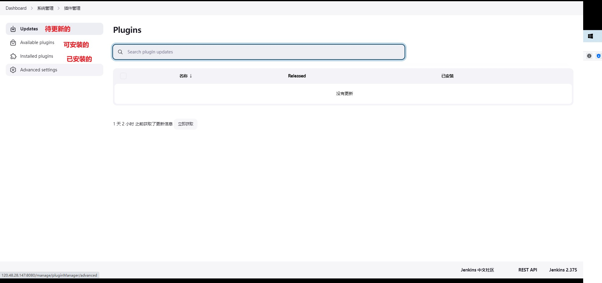

#### nodeJs插件

> 构建前端项目时，需要用到

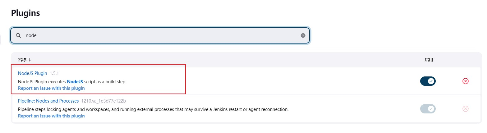

#### maven插件

> 构建maven后端项目时，需要用到

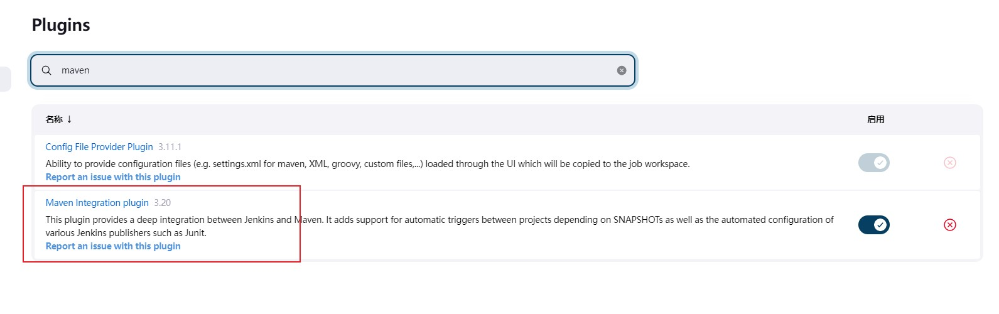


### jenkins配置

> jenkins登录之后，主页面展示如下：

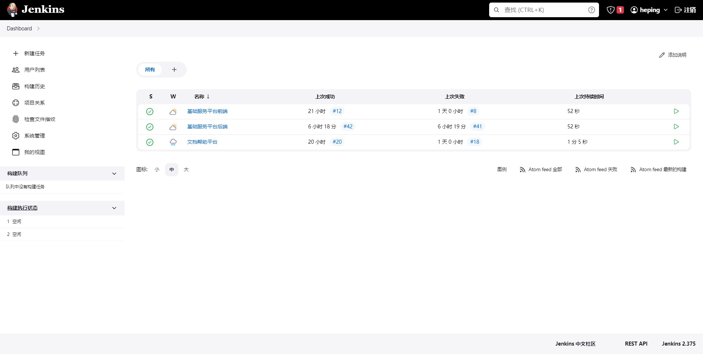

#### maven配置

> 系统管理--》全局工具配置，进去之后，找到maven选项

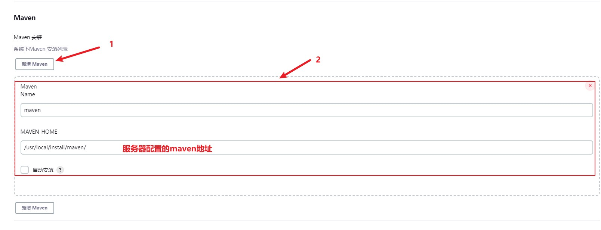

#### node配置

> 系统管理--》全局工具配置，进去之后，找到node选项

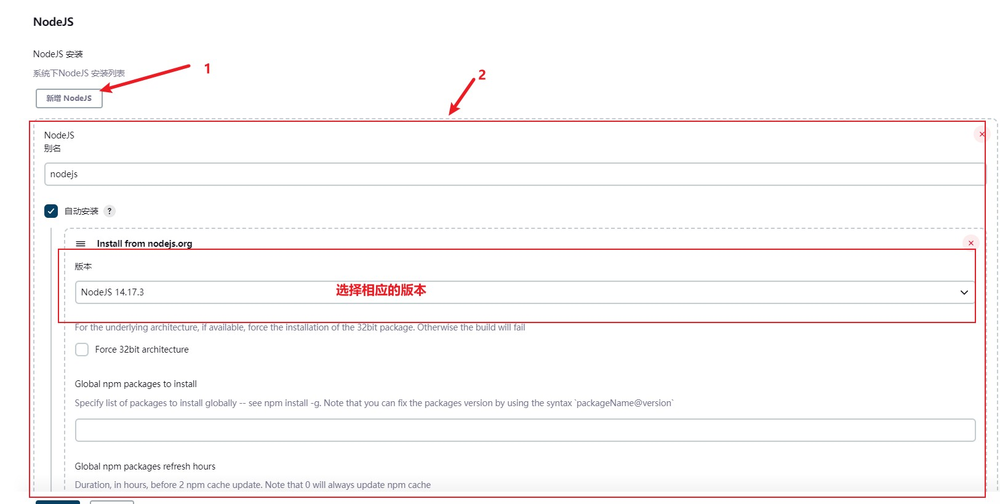

#### 凭证配置

> 系统管理--》manageCredentials，选择系统用户，全局凭证


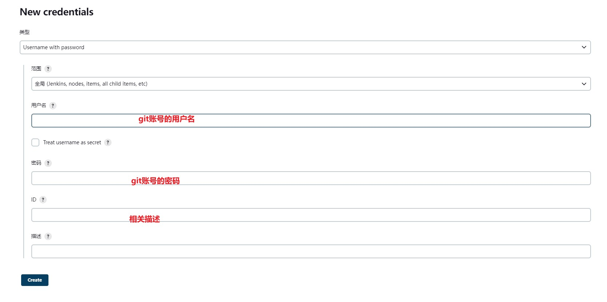

### jenkins部署前端项目

> 主页点击新建任务菜单,出现如下页面，输入任务名称并选择相应的风格（前端项目一般选择自由风格）

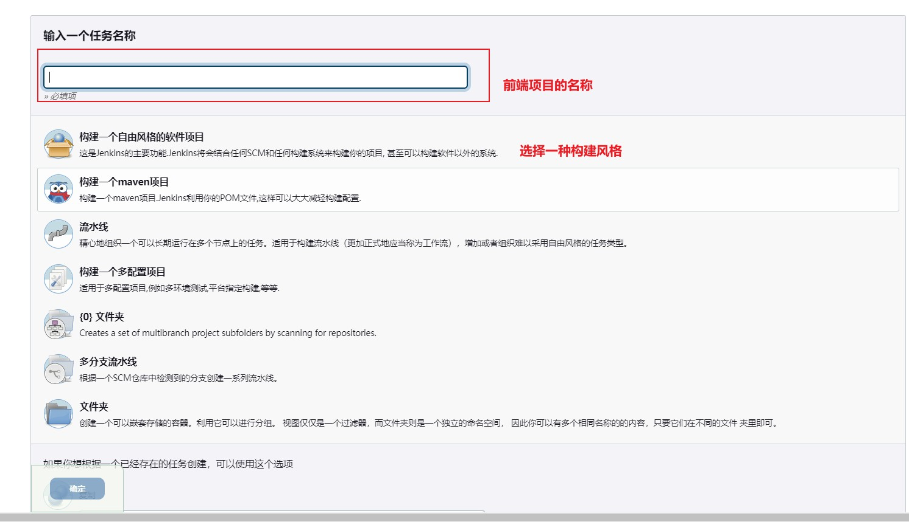

> 源码管理下，配置代码托管的仓库地址，以及选择相应的凭证，这里需要注意的是，项目需要设置开源，否则会有：“code：128的报错”

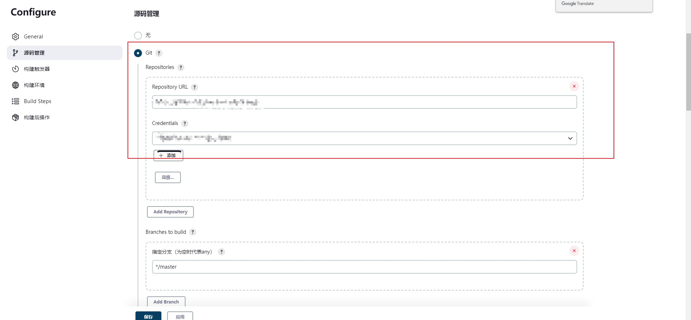

> 构建触发器，选择轮询的方式，H/5 * * * *：每隔5分钟去仓库看是否有新的代码提交

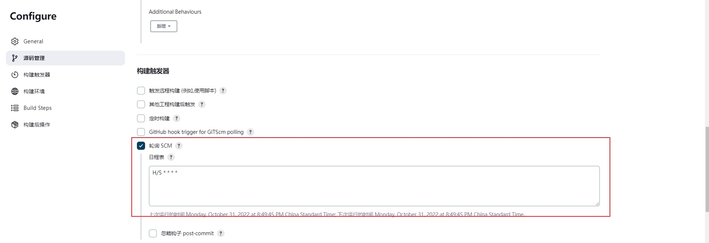

> 构建环境中勾选，所需要的node环境

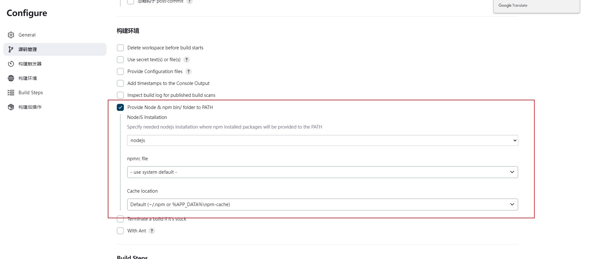

> 构建步骤中，选择执行shell，并填入如下脚本：
>
> ```bash
> # 有的项目可能需要执行以下两条命令用于清除缓存
> # rm -rf node_modules   //强制删除包
> # rm -rf package-lock.json  //删除这个文件
> npm  install # 下载依赖
> npm run build # 构建打包
> rm -rf /usr/local/nginx/html/baseFront # 删除原有nginx下的项目文件
> cp -rf  baseFront /usr/local/nginx/html # 将打包好的文件复制到nginx的html路径下
> ```
>
> 

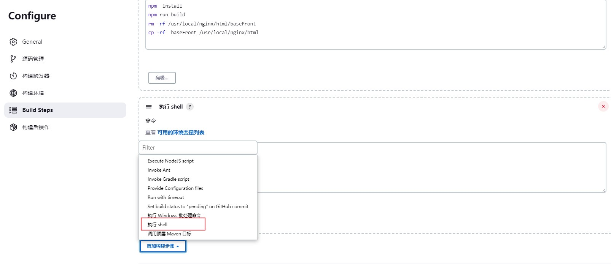

### Jenkins 部署后端项目

> 这里主要列举，与前端项目构建的不同点，构建风格，选择maven项目

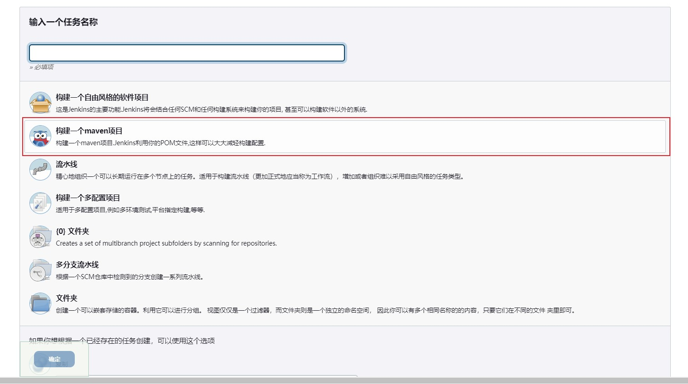

> 构建触发器，选择此项：

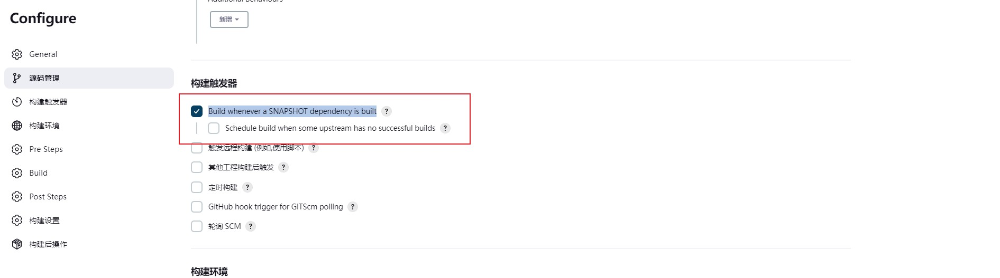

> 构建前需要，将正在使用当前项目端口号的进程给停掉，避免出现内存不足的而情况

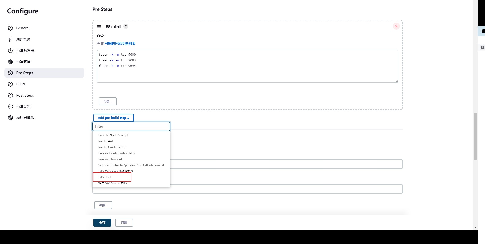

> 需要将构建好的jar，放到指定目录进行启动,代码如下：
>
> ```bash
> pwd
> # 创建存放jar的目录
> rm -rf /usr/local/application/baseService
> mkdir /usr/local/application/baseService
> # 拷贝jar到指定目录
> cp -rf /var/lib/jenkins/workspace/基础服务平台后端/author-service/target/author-service-1.0-exec.jar /usr/local/application/baseService
> cp -rf /var/lib/jenkins/workspace/基础服务平台后端/author-service/target/author-service-1.0.jar /usr/local/application/baseService
> cp -rf /var/lib/jenkins/workspace/基础服务平台后端/user-service/target/user-service-1.0.jar /usr/local/application/baseService
> cp -rf /var/lib/jenkins/workspace/基础服务平台后端/gateway-service/target/gateway-service-1.0.jar /usr/local/application/baseService
> # 创建执行文件，并写入执行命令
> rm -rf start.sh
> echo "nohup java -jar /usr/local/application/baseService/author-service-1.0-exec.jar &  nohup java -jar /usr/local/application/baseService/user-service-1.0.jar &  nohup java -jar /usr/local/application/baseService/gateway-service-1.0.jar &">> start.sh
> # 修改执行文件的权限
> chmod 777 start.sh
> # 启动执行文件，BUILD_ID=dontKillMe前缀的目的是，避免，在启动成功后，jenkins将构建过程中衍生的子进程结束掉
> cp -rf start.sh /usr/local/application/baseService
> cd /usr/local/application/baseService
> BUILD_ID=dontKillMe nohup ./start.sh
> ```
>
> 

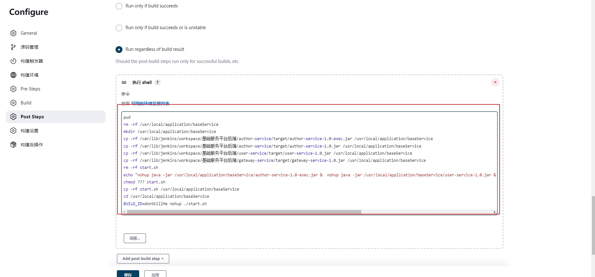

### 注意事项

#### 构建过程中，对文件操作所需要的权限问题

> jenkins安装好后，会自动创建一个 jenkins 用户。jenkins 在构建工程时，默认的权限是不够写入文件的。这时就需要把它的权限提升为root。

1. 将 jenkins 账号加入到 root 组中。

   ```bash
   gpasswd -a jenkins root
   ```

2. 修改`/etc/sysconfig/jenkins`文件，添加如下配置。

   ```bash
   JENKINS_USER="root"
   JENKINS_GROUP="root"
   ```

3. 验证

   ```bash
   groups jenkins
   ```

   

4. 重启jenkins

   ```
   systemctl restart jenkins
   ```

   

