# rabbitmq

四大核心

* 生产者

  产生数据发送消息的程序是生产者

* 交换机

  交换机是 RabbitMQ 非常重要的一个部件，一方面它接收来自生产者的消息，另一方面它将消息 推送到队列中。交换机必须确切知道如何处理它接收到的消息，是将这些消息推送到特定队列还是推 送到多个队列，亦或者是把消息丢弃，这个得有交换机类型决定

* 队列

  队列是 RabbitMQ 内部使用的一种数据结构，尽管消息流经 RabbitMQ 和应用程序，但它们只能存 储在队列中。队列仅受主机的内存和磁盘限制的约束，本质上是一个大的消息缓冲区。许多生产者可 以将消息发送到一个队列，许多消费者可以尝试从一个队列接收数据。这就是我们使用队列的方式

* 消费者

  消费与接收具有相似的含义。消费者大多时候是一个等待接收消息的程序。请注意生产者，消费者和消息中间件很多时候并不在同一机器上。同一个应用程序既可以是生产者又是可以是消费者。

RabbitMQ的核心部分

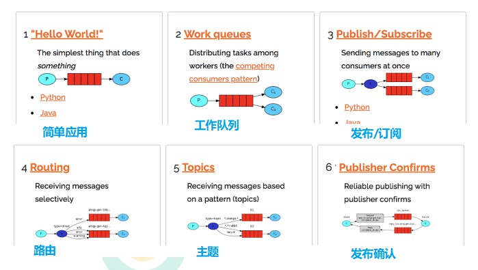

各个名词介绍

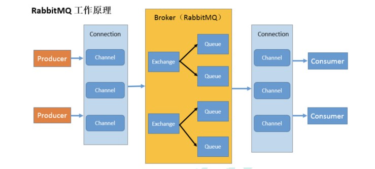

* Broker：接收和分发消息的应用，RabbitMQ Server 就是 Message Broker
* Virtual host：出于多租户和安全因素设计的，把 AMQP 的基本组件划分到一个虚拟的分组中，类似 于网络中的 namespace 概念。当多个不同的用户使用同一个 RabbitMQ server 提供的服务时，可以划分出 多个 vhost，每个用户在自己的 vhost 创建 exchange／queue 等
* Connection：publisher／consumer 和 broker 之间的 TCP 连接
* Channel：如果每一次访问 RabbitMQ 都建立一个 Connection，在消息量大的时候建立 TCP  Connection 的开销将是巨大的，效率也较低。Channel 是在 connection 内部建立的逻辑连接，如果应用程 序支持多线程，通常每个 thread 创建单独的 channel 进行通讯，AMQP method 包含了 channel id 帮助客 户端和 message broker 识别 channel，所以 channel 之间是完全隔离的。Channel 作为轻量级的 Connection 极大减少了操作系统建立 TCP connection 的开销
* Exchange：message 到达 broker 的第一站，根据分发规则，匹配查询表中的 routing key，分发 消息到 queue 中去。常用的类型有：direct (point-to-point), topic (publish-subscribe) and fanout  (multicast)
* Queue：消息最终被送到这里等待 consumer 取走
* Binding：exchange 和 queue 之间的虚拟连接，binding 中可以包含 routing key，Binding 信息被保 存到 exchange 中的查询表中，用于 message 的分发依据

## 安装

官网：https://www.rabbitmq.com/download.html

按照命令依次执行：

```sh
rpm -ivh erlang-21.3-1.el7.x86_64.rpm
yum install socat -y
rpm -ivh rabbitmq-server-3.8.8-1.el7.noarch.rpm
systemctl enable rabbitmq-server.service # 开机启动
systemctl status rabbitmq-server # 查看状态
rabbitmq-plugins enable rabbitmq_management # 安装web管理插件，需要在rabbitMq关闭状态下
# 用默认账号密码(guest)访问地址 http://47.115.185.244:15672/出现权限问题
# 添加账号
rabbitmqctl add_user admin admin
添加角色
rabbitmqctl set_user_tags admin administrator
# 设置权限 set_permissions [-p <vhostpath>] <user> <conf> <write> <read>
# 用户 user_admin 具有/vhost1 这个 virtual host 中所有资源的配置、写、读权限
当前用户和角色
rabbitmqctl set_permissions -p "/" admin ".*" ".*" ".*"
# 查询当前用户和角色
rabbitmqctl list_users
# rabbitMQ关闭命令
rabbitmqctl stop_app
# 清除命令
rabbitmqctl reset
# 启动命令
rabbitmqctl start_app
```

## 入门

生产者，发送消息，消费者消费消息


* 依赖

  ```xml
    		<!--rabbitmq 依赖客户端-->
          <dependency>
              <groupId>com.rabbitmq</groupId>
              <artifactId>amqp-client</artifactId>
              <version>5.8.0</version>
          </dependency>
  ```

  

* 生产者

  ```java
  package cn.hd.rabbitMq.producer;
  
  import cn.hd.rabbitMq.utils.RabbitMqUtils;
  import com.rabbitmq.client.Channel;
  
  public class Producer {
  
      private final static String QUEUE_NAME = "hello01";
      public static void main(String[] args) throws Exception {
          Channel channel = RabbitMqUtils.getChannel();
          /**
           * 生成一个队列
           * 1.队列名称
           * 2.队列里面的消息是否持久化 默认消息存储在内存中
           * 3.该队列是否只供一个连接（factory.newConnection()）使用，如果为true，则是排他的，只能针对当前连接进行使用
           * 4.是否自动删除 最后一个消费者端开连接以后 该队列是否自动删除 true 自动删除
           * 5.其他参数
           */
          channel.queueDeclare(QUEUE_NAME,false,false,false,null);
          String message="hello world";
          /**
           * 发送一个消息
           * 1.发送到那个交换机
           * 2.路由的 key 是哪个
           * 3.其他的参数信息
           * 4.发送消息的消息体
           */
          channel.basicPublish("",QUEUE_NAME,null,message.getBytes());
          System.out.println("消息发送完毕");
      }
  }
  
  
  ```

* 消费者

  ```java
  package cn.hd.rabbitMq.consumer;
  
  import cn.hd.rabbitMq.utils.RabbitMqUtils;
  import com.rabbitmq.client.CancelCallback;
  import com.rabbitmq.client.Channel;
  import com.rabbitmq.client.DeliverCallback;
  
  public class Consumer {
      private final static String QUEUE_NAME = "hello01";
      public static void main(String[] args) throws Exception {
          Channel channel = RabbitMqUtils.getChannel();
          System.out.println("等待接收消息....");
          //推送的消息如何进行消费的接口回调
          DeliverCallback deliverCallback=(consumerTag, delivery)->{
              String message= new String(delivery.getBody());
              System.out.println(message);
          };
          //取消消费的一个回调接口 如在消费的时候队列被删除掉了
          CancelCallback cancelCallback=(consumerTag)->{
              System.out.println("消息消费被中断");
          };
          /**
           * 消费者消费消息
           * 1.消费哪个队列
           * 2.消费成功之后是否要自动应答 true 代表自动应答 false 手动应答
           * 3.消费者未成功消费的回调
           */
          channel.basicConsume(QUEUE_NAME,true,deliverCallback,cancelCallback);
      }
  }
  ```

* 工具类

  ```java
  package cn.hd.rabbitMq.utils;
  
  import com.rabbitmq.client.Channel;
  import com.rabbitmq.client.Connection;
  import com.rabbitmq.client.ConnectionFactory;
  
  public class RabbitMqUtils {
      private static String HOST_URL = "192.168.60.101";
      //得到一个连接的 channel
      public static Channel getChannel() throws Exception{
          //创建一个连接工厂
          ConnectionFactory factory = new ConnectionFactory();
          //如果采用ssl，则默认端口为5671，否则5672
          factory.setHost(HOST_URL);
          factory.setUsername("admin");
          factory.setPassword("admin");
          Connection connection = factory.newConnection();
          Channel channel = connection.createChannel();
          return channel;
      }
  
  }
  
  ```

* 效果图

  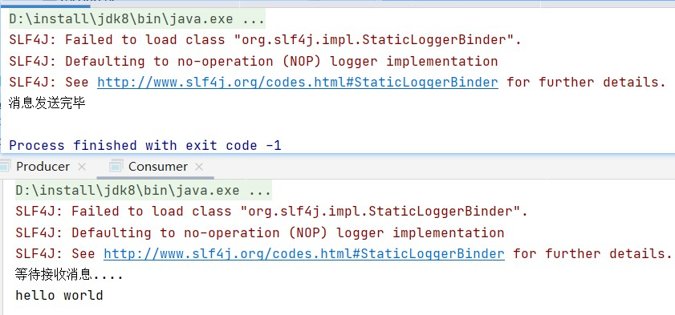

## 队列

工作队列(又称任务队列)的主要思想是避免立即执行资源密集型任务，而不得不等待它完成。 相反我们安排任务在之后执行。我们把任务封装为消息并将其发送到队列。在后台运行的工作进 程将弹出任务并最终执行作业。当有多个工作线程时，这些工作线程将一起处理这些任务。

* 队列的特点，每条消息，只能被一个消费者消费-**轮询分发**
  * 代码展示和上面入门案例基本类似，只是对于消费者，启动了两个


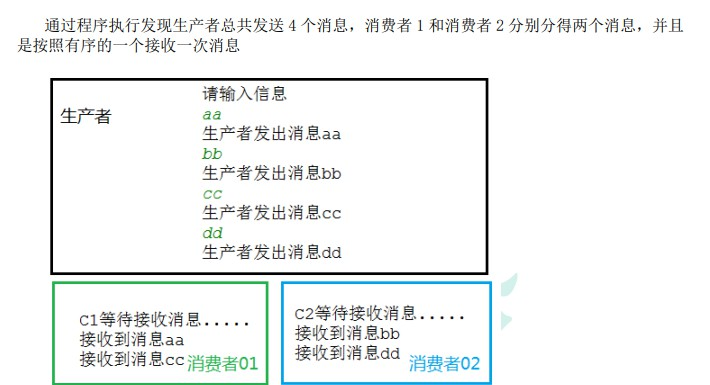


### 消息应答

消费者完成一个任务可能需要一段时间，如果其中一个消费者处理一个长的任务并仅只完成 了部分突然它挂掉了，会发生什么情况。RabbitMQ 一旦向消费者传递了一条消息，便立即将该消 息标记为删除。在这种情况下，突然有个消费者挂掉了，我们将丢失正在处理的消息。以及后续 发送给该消费这的消息，因为它无法接收到。 

为了保证消息在发送过程中不丢失，rabbitmq 引入消息应答机制，消息应答就是:**消费者在接 收到消息并且处理该消息之后，告诉 rabbitmq 它已经处理了，rabbitmq 可以把该消息删除了。**

#### 自动应答

> 消息发送后立即被认为已经传送成功，**这种模式需要在高吞吐量和数据传输安全性方面做权 衡**,因为这种模式如果消息在接收到之前，消费者那边出现连接或者 channel 关闭，那么消息就丢 失了,当然另一方面这种模式消费者那边可以传递过载的消息，没有对传递的消息数量进行限制， 当然这样有可能使得消费者这边由于接收太多还来不及处理的消息，导致这些消息的积压，最终 使得内存耗尽，最终这些消费者线程被操作系统杀死，**所以这种模式仅适用在消费者可以高效并 以某种速率能够处理这些消息的情况下使用。**

```java
// 消费者接收消息时，将第二个参数设置为true
channel.basicConsume(QUEUE_NAME,true,deliverCallback,cancelCallback);
```

#### 手动应答

* 应答的方法有：

  * Channel.basicAck(用于肯定确认)
    * RabbitMQ 已知道该消息并且成功的处理消息，可以将其丢弃了

  * Channel.basicNack(用于否定确认)

  * Channel.basicReject(用于否定确认)
    * 与 Channel.basicNack 相比少一个参数 不处理该消息了直接拒绝，可以将其丢弃

* 关于批量应答的解释

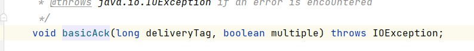

> multiple 为true，表示批量应答信道中的所有消息，为false，则信道中的消息，根据先进先出原则，依次应答
>
> 信道中此时停留5、6、7、8，四条消息
>
> 批量应答时，当先入队的8号消息被应答后，信道中的5、6、7，即使此时并没有被处理，也会被应答了
>
> 不批量时，则先处理8号消息，根据入队顺序，依次应答后续消息

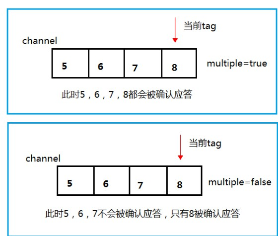

##### 消息手动应答以及消息的重新入队演示

* 消息重新入队

  > 如果消费者由于某些原因失去连接(其通道已关闭，连接已关闭或 TCP 连接丢失)，导致消息 未发送 ACK 确认，RabbitMQ 将了解到消息未完全处理，并将对其重新排队。如果此时其他消费者 可以处理，它将很快将其重新分发给另一个消费者。这样，即使某个消费者偶尔死亡，也可以确 保不会丢失任何消息

* 案例说明

  > 一个生产者两个消费者
  >
  > 生产者持续发送消息
  >
  > 消费者Consumer01（处理比较快）和Consumer02（处理较慢）

  * 生产者代码

    ```java
    		channel.queueDeclare(QUEUE_NAME,false,false,false,null);
            Scanner sc = new Scanner(System.in);
            System.out.println("请输入信息");
            while (sc.hasNext()) {
                String message = sc.nextLine();
                channel.basicPublish("", QUEUE_NAME, null, message.getBytes("UTF-8"));
                System.out.println("生产者发出消息" + message);
            }
    ```

    

  * 消费者代码

    ```java
    // Consumer01
    public class Consumer01 {
        private final static String QUEUE_NAME = "hello01";
        public static void main(String[] args) throws Exception {
            Channel channel = RabbitMqUtils.getChannel();
            System.out.println("Consumer01等待接收消息....");
            //推送的消息如何进行消费的接口回调
            DeliverCallback deliverCallback=(consumerTag, delivery)->{
                try {
                    Thread.sleep(1000);
                } catch (InterruptedException e) {
                    e.printStackTrace();
                }
                //手动确认
                channel.basicAck(delivery.getEnvelope().getDeliveryTag(),false);
                String message= new String(delivery.getBody());
                System.out.println(message);
            };
            //取消消费的一个回调接口 如在消费的时候队列被删除掉了
            CancelCallback cancelCallback=(consumerTag)->{
                System.out.println("消息消费被中断");
            };
            /**
             * 消费者消费消息
             * 1.消费哪个队列
             * 2.消费成功之后是否要自动应答 true 代表自动应答 false 手动应答
             * 3.消费者未成功消费的回调
             */
            channel.basicConsume(QUEUE_NAME,false,deliverCallback,cancelCallback);
        }
    }
    //消费者Consumer02
    public class Consumer02 {
        private final static String QUEUE_NAME = "hello01";
        public static void main(String[] args) throws Exception {
            Channel channel = RabbitMqUtils.getChannel();
            System.out.println("Consumer02等待接收消息....");
            //推送的消息如何进行消费的接口回调
            DeliverCallback deliverCallback=(consumerTag, delivery)->{
                try {
                    Thread.sleep(30*1000);
                } catch (InterruptedException e) {
                    e.printStackTrace();
                }
                channel.basicAck(delivery.getEnvelope().getDeliveryTag(),false);
                String message= new String(delivery.getBody());
                System.out.println(message);
            };
            //取消消费的一个回调接口 如在消费的时候队列被删除掉了
            CancelCallback cancelCallback=(consumerTag)->{
                System.out.println("消息消费被中断");
            };
            /**
             * 消费者消费消息
             * 1.消费哪个队列
             * 2.消费成功之后是否要自动应答 true 代表自动应答 false 手动应答
             * 3.消费者未成功消费的回调
             */
            channel.basicConsume(QUEUE_NAME,false,deliverCallback,cancelCallback);
        }
    }
    
    ```

* 效果展示

  > 按照队列的轮询分发原则，生产者发送两条消息，应该被01和02分别处理，可由于02，处理过程中，在应答前，被断开，消息被01重新接收处理

  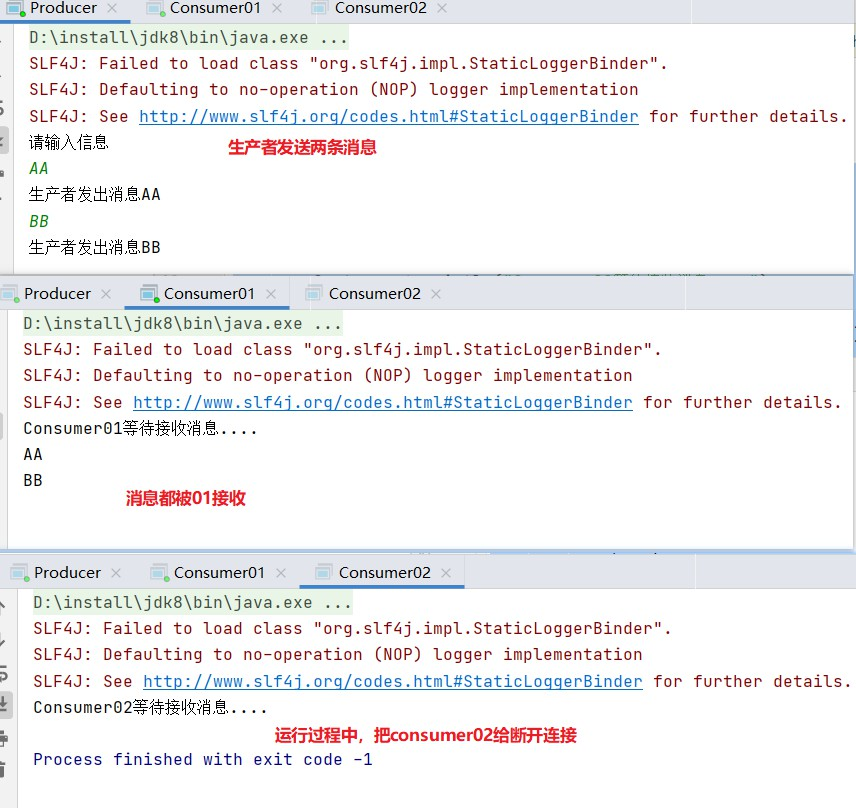

### RabbitMQ持久化

默认情况下 RabbitMQ 退出或由于某种原因崩溃时，它忽视队列 和消息，除非告知它不要这样做。确保消息不会丢失需要做两件事：我们需要将队列和消息都标 记为持久化。

* 队列持久化

  这个时候即使重启 rabbitmq 队列也依然存在

  ```java
  // 第二个参数设置为true，声明队列时
  channel.queueDeclare(QUEUE_NAME,true,false,false,null);
  ```

  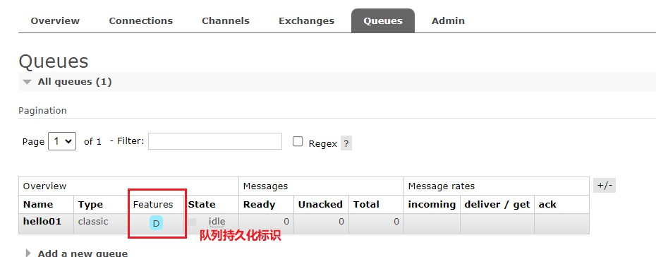

* 消息持久化

  ```java
  // 发送消息时，MessageProperties.PERSISTENT_TEXT_PLAIN 添加这个属性。
  channel.basicPublish("", QUEUE_NAME, MessageProperties.PERSISTENT_TEXT_PLAIN, message.getBytes("UTF-8"));
  ```

### 不公平分发

> 正常我们的队列是采用的是，轮询分发的方式，让消费者处理消息
>
> 但是有时会存在，不同的消费者处理消息的速度不一样，这个时候我们还是采用轮训分发的化就会到这处理速度快的这个消费者很大一部分时间 处于空闲状态，而处理慢的那个消费者一直在干活，这种分配方式在这种情况下其实就不太好，但是 RabbitMQ 并不知道这种情况它依然很公平的进行分发

* 设置不公平分发

  ```java
  //在处理消息慢的消费者处，设置参数为1
  channel.basicQos(1);
  ```

  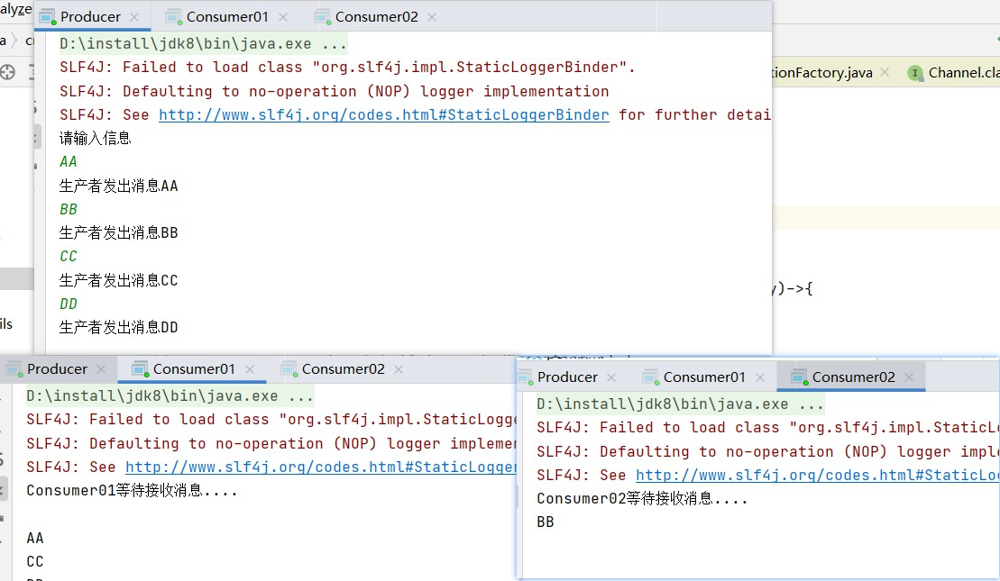

> 上面的案例中设置02 的参数为1，，生产者发送4条消息，01接收到三条，02接收到1条
>
> 对于02来说，就是如果这个任务我还没有处理完或者我还没有应答你，你先别分配给我，我目前只能处理一个 任务，然后 rabbitmq 就会把该任务分配给没有那么忙的那个空闲消费者，当然如果所有的消费者都没有完 成手上任务，队列还在不停的添加新任务，队列有可能就会遇到队列被撑满的情况，这个时候就只能添加 新的 worker 或者改变其他存储任务的策略。

### 预取值

本身消息的发送就是异步发送的，所以在任何时候，channel 上肯定不止只有一个消息，另外来自消费 者的手动确认本质上也是异步的。因此这里就存在一个未确认的消息缓冲区，因此希望开发人员能**限制此 缓冲区的大小，以避免缓冲区里面无限制的未确认消息问题**。

**这个时候就可以通过使用 basicqos 方法设 置“预取计数”值来完成的。该值定义通道上允许的未确认消息的最大数量。一旦数量达到配置的数量， RabbitMQ 将停止在通道上传递更多消息，除非至少有一个未处理的消息被确认。**

例如，假设在通道上有 未确认的消息 5、6、7，8，并且通道的预取计数设置为 4，此时 RabbitMQ 将不会在该通道上再传递任何 消息，除非至少有一个未应答的消息被 ack。比方说 tag=6 这个消息刚刚被确认 ACK，RabbitMQ 将会感知 这个情况到并再发送一条消息。

**参数作用在消费者代码中**

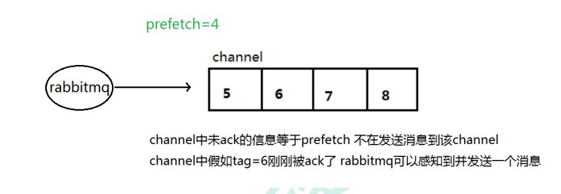

## 发布确认

生产者将信道设置成 confirm 模式，一旦信道进入 confirm 模式，所有在该信道上面发布的 消息都将会被指派一个唯一的 ID(从 1 开始)，**一旦消息被投递到所有匹配的队列之后，broker 就会发送一个确认给生产者(包含消息的唯一 ID)，这就使得生产者知道消息已经正确到达目的队 列了**

如果消息和队列是可持久化的，那么确认消息会在将消息写入磁盘之后发出，broker 回传 给生产者的确认消息中 delivery-tag 域包含了确认消息的序列号，此外 broker 也可以设置 basic.ack 的 multiple 域，表示到这个序列号之前的所有消息都已经得到了处理。

 confirm 模式最大的好处**在于他是异步的，一旦发布一条消息，生产者应用程序就可以在等信 道返回确认的同时继续发送下一条消息，当消息最终得到确认之后，生产者应用便可以通过回调 方法来处理该确认消息，如果 RabbitMQ 因为自身内部错误导致消息丢失，就会发送一条 nack 消 息，生产者应用程序同样可以在回调方法中处理该 nack 消息**

### 发布确认策略

* 生产者开启发布确认的方法：

  ```java
  channel.confirmSelect();
  ```

#### 单个确认发布

这是一种简单的确认方式，它是一种同步确认发布的方式，**也就是发布一个消息之后只有它 被确认发布，后续的消息才能继续发布**,**waitForConfirmsOrDie(long)这个方法只有在消息被确认 的时候才返回**，如果在指定时间范围内这个消息没有被确认那么它将抛出异常。 

这种确认方式有一个最大的缺点就是:发布速度特别的慢，因为如果没有确认发布的消息就会 阻塞所有后续消息的发布，这种方式最多提供每秒不超过数百条发布消息的吞吐量。当然对于某 些应用程序来说这可能已经足够了。

```Java
public static void publishMessageIndividually() throws Exception {
        try (Channel channel = RabbitMqUtils.getChannel()) {
            String queueName = UUID.randomUUID().toString();
            channel.queueDeclare(queueName, false, false, false, null);
            //开启发布确认
            channel.confirmSelect();
            long begin = System.currentTimeMillis();
            for (int i = 0; i < MESSAGE_COUNT; i++) {
                String message = i + "";
                channel.basicPublish("", queueName, null, message.getBytes());
                //服务端返回 false 或超时时间内未返回，生产者可以消息重发
                boolean flag = channel.waitForConfirms();
                if(flag){
                    System.out.println("消息发送成功");
                }
            }
            long end = System.currentTimeMillis();
            System.out.println("发布" + MESSAGE_COUNT + "个单独确认消息,耗时" + (end - begin) +
                    "ms");
        }
    }

```

#### 批量发布确认

先发布一批消息然后一起确认可以极大地 提高吞吐量。

当然这种方式的缺点就是:**当发生故障导致发布出现问题时，不知道是哪个消息出现 问题了，我们必须将整个批处理保存在内存中，以记录重要的信息而后重新发布消息**。当然这种 方案仍然是同步的，也一样阻塞消息的发布

```java
 public static void publishMessageBatch() throws Exception {
        try (Channel channel = RabbitMqUtils.getChannel()) {
            String queueName = UUID.randomUUID().toString();
            channel.queueDeclare(queueName, false, false, false, null);
            //开启发布确认
            channel.confirmSelect();
            //批量确认消息大小
            int batchSize = 100;
            //未确认消息个数
            int outstandingMessageCount = 0;
            long begin = System.currentTimeMillis();
            for (int i = 0; i < MESSAGE_COUNT; i++) {
                String message = i + "";
                channel.basicPublish("", queueName, null, message.getBytes());
                outstandingMessageCount++;
                if (outstandingMessageCount == batchSize) {
                    channel.waitForConfirms();
                    outstandingMessageCount = 0;
                }
            }
            //为了确保还有剩余没有确认消息 再次确认
            if (outstandingMessageCount > 0) {
                channel.waitForConfirms();
            }
            long end = System.currentTimeMillis();
            System.out.println("发布" + MESSAGE_COUNT + "个批量确认消息,耗时" + (end - begin) +
                    "ms");
        }
    }
```

#### 异步发布确认

异步确认虽然编程逻辑比上两个要复杂，但是性价比最高，无论是可靠性还是效率都没得说， 他是利用回调函数来达到消息可靠性传递的，这个中间件也是通过函数回调来保证是否投递成功

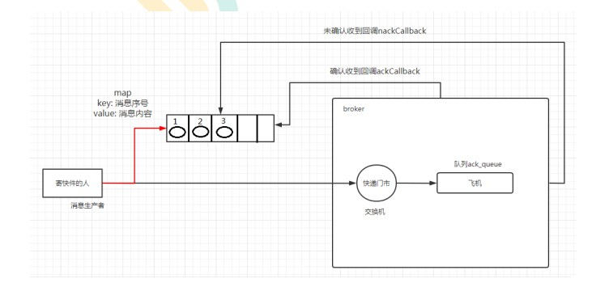

```java
 public static void publishMessageAsync() throws Exception {
        try (Channel channel = RabbitMqUtils.getChannel()) {
            String queueName = UUID.randomUUID().toString();
            channel.queueDeclare(queueName, false, false, false, null);
            //开启发布确认
            channel.confirmSelect();
            /**
             * 线程安全有序的一个哈希表，适用于高并发的情况
             * 1.轻松的将序号与消息进行关联
             * 2.轻松批量删除条目 只要给到序列号
             * 3.支持并发访问
             */
            ConcurrentSkipListMap<Long, String> outstandingConfirms = new
                    ConcurrentSkipListMap<>();
            /**
             * 确认收到消息的一个回调
             * 1.消息序列号
             * 2.true 可以确认小于等于当前序列号的消息
             * false 确认当前序列号消息
             */
            ConfirmCallback ackCallback = (sequenceNumber, multiple) -> {
                if (multiple) {
                    //返回的是小于等于当前序列号的未确认消息 是一个 map
                    ConcurrentNavigableMap<Long, String> confirmed =
                            outstandingConfirms.headMap(sequenceNumber, true);
                    //清除该部分未确认消息
                    confirmed.clear();
                } else {
                    //只清除当前序列号的消息
                    outstandingConfirms.remove(sequenceNumber);
                }
            };
            ConfirmCallback nackCallback = (sequenceNumber, multiple) -> {
                String message = outstandingConfirms.get(sequenceNumber);
                System.out.println("发布的消息" + message + "未被确认，序列号" + sequenceNumber);
            };
            /**
             * 添加一个异步确认的监听器
             * 1.确认收到消息的回调
             * 2.未收到消息的回调
             */
            channel.addConfirmListener(ackCallback, nackCallback);
            long begin = System.currentTimeMillis();
            for (int i = 0; i < MESSAGE_COUNT; i++) {
                String message = "消息" + i;
                /**
                 * channel.getNextPublishSeqNo()获取下一个消息的序列号
                 * 通过序列号与消息体进行一个关联
                 * 全部都是未确认的消息体
                 */
                outstandingConfirms.put(channel.getNextPublishSeqNo(), message);
                channel.basicPublish("", queueName, null, message.getBytes());
            }
            long end = System.currentTimeMillis();
            System.out.println("发布" + MESSAGE_COUNT + "个异步确认消息,耗时" + (end - begin) +
                    "ms");
        }
    }
```

### 三种确认方式对比

单独发布消息 同步等待确认，简单，但吞吐量非常有限。

 批量发布消息 批量同步等待确认，简单，合理的吞吐量，一旦出现问题但很难推断出是那条 消息出现了问题。 

异步处理： 最佳性能和资源使用，在出现错误的情况下可以很好地控制，但是实现起来稍微难些

## 交换机

RabbitMQ 消息传递模型的核心思想是: **生产者生产的消息从不会直接发送到队列。**实际上，通常生产 者甚至都不知道这些消息传递传递到了哪些队列中。 

相反，**生产者只能将消息发送到交换机(exchange)（没有指定交换机时，走的是rabbitMQ的默认交换机）**，交换机工作的内容非常简单，**一方面它接收来 自生产者的消息，另一方面将它们推入队列**。交换机必须确切知道如何处理收到的消息。是应该把这些消 息放到特定队列还是说把他们到许多队列中还是说应该丢弃它们。这就的由交换机的类型来决定。

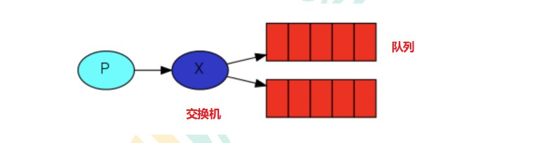

* 交换机的类型：直接（direct）、主题（topic）、标题（headers）和扇出（fanout）

* 前置知识：

  * 无名交换机

    * 之前之所有，在没有指定交换机的情况下能将消息发送到队列，是因为使用的是默认交换机，用空字符串标识

      ```java
      // 第一个参数是交换机的名称
      channel.basicPublish("", QUEUE_NAME, MessageProperties.PERSISTENT_TEXT_PLAIN, message.getBytes("UTF-8"));
      ```

  * 临时队列

    * 队列的名称我们 来说至关重要-**我们需要指定我们的消费者去消费哪个队列的消息。**

    * 每当我们连接到 Rabbit 时，我们都需要一个全新的空队列，为此我们可以创建一个具有随机名称 的队列，或者能让服务器为我们选择一个随机队列名称那就更好了。**其次一旦我们断开了消费者的连 接，队列将被自动删除。**

      ```java
      //获取队列的名称
      String queue = channel.queueDeclare().getQueue();
      ```

      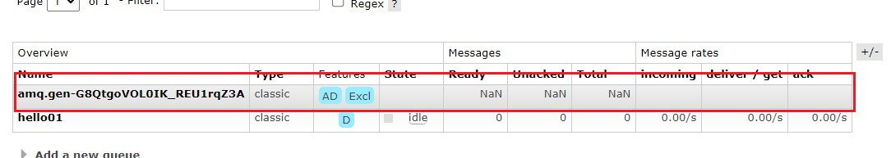

  * 绑定

    * 什么是 bingding 呢，**binding 其实是 exchange 和 queue 之间的桥梁，它告诉我们 exchange 和那个队 列进行了绑定关系**。比如说下面这张图告诉我们的就是 X 与 Q1 和 Q2 进行了绑定

      

### 扇出交换机（fanout）

Fanout 这种类型非常简单。正如从名称中猜到的那样，它是将接收到的所有消息广播到它知道的 所有队列中。

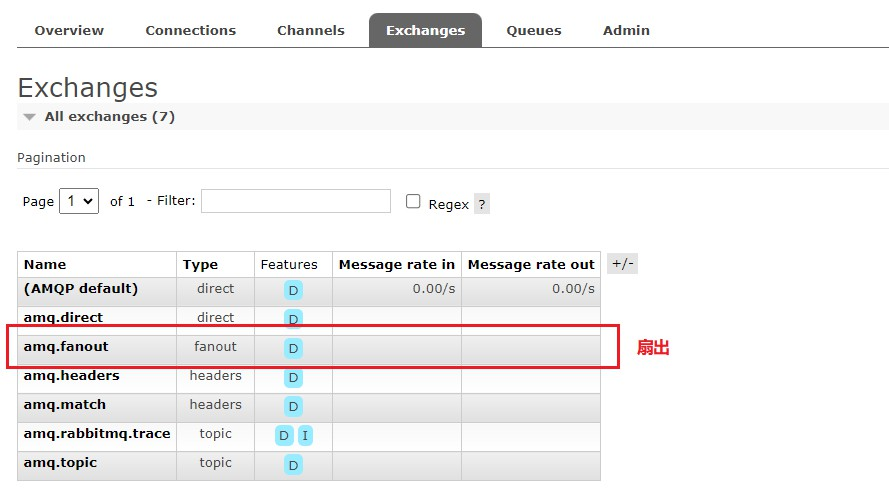

#### 实战

* 案例介绍

  > 将系统产生的日志，通过交换机，发送给消费者，两个消费者，一个将日志，记录到磁盘里面，一个输出到控制台

  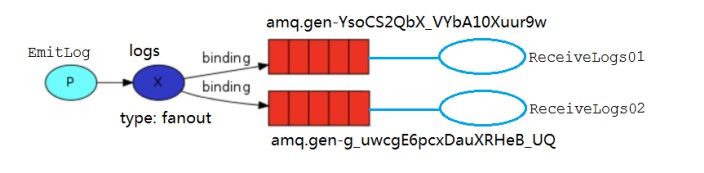

* 代码展示：

  * 消费者

    ```java
    //输出到控制台
    public class ReceiveLogs01 {
        private static final String EXCHANGE_NAME = "logs";
        public static void main(String[] argv) throws Exception {
            Channel channel = RabbitMqUtils.getChannel();
            channel.exchangeDeclare(EXCHANGE_NAME, "fanout");
            /**
             * 生成一个临时的队列 队列的名称是随机的
             * 当消费者断开和该队列的连接时 队列自动删除
             */
            String queueName = channel.queueDeclare().getQueue();
            //把该临时队列绑定我们的 exchange 其中 routingkey(也称之为 binding key)为空字符串
            channel.queueBind(queueName, EXCHANGE_NAME, "88");
            System.out.println("等待接收消息,把接收到的消息打印在屏幕.....");
            DeliverCallback deliverCallback = (consumerTag, delivery) -> {
                String message = new String(delivery.getBody(), "UTF-8");
                System.out.println("控制台打印接收到的消息"+message);
            };
            channel.basicConsume(queueName, true, deliverCallback, consumerTag -> { });
        }
    
    }
    //记录到文件
    public class ReceiveLogs02 {
        private static final String EXCHANGE_NAME = "logs";
        public static void main(String[] argv) throws Exception {
            Channel channel = RabbitMqUtils.getChannel();
            channel.exchangeDeclare(EXCHANGE_NAME, "fanout");
            /**
             * 生成一个临时的队列 队列的名称是随机的
             * 当消费者断开和该队列的连接时 队列自动删除
             */
            String queueName = channel.queueDeclare().getQueue();
            //把该临时队列绑定我们的 exchange 其中 routingkey(也称之为 binding key)为空字符串
            channel.queueBind(queueName, EXCHANGE_NAME, "88");
            System.out.println("等待接收消息,把接收到的消息存储到磁盘.....");
            DeliverCallback deliverCallback = (consumerTag, delivery) -> {
                String message = new String(delivery.getBody(), "UTF-8");
                System.out.println("控制台打印接收到的消息"+message);
            };
            channel.basicConsume(queueName, true, deliverCallback, consumerTag -> { });
        }
    
    }
    
    ```

  * 生产者

    ```java
    public class EmitLog {
        private static final String EXCHANGE_NAME = "logs";
        public static void main(String[] argv) throws Exception {
            Channel channel = RabbitMqUtils.getChannel();
            /**
             * 声明一个 exchange
             * 1.exchange 的名称
             * 2.exchange 的类型
             */
            channel.exchangeDeclare(EXCHANGE_NAME, BuiltinExchangeType.FANOUT);
            Scanner sc = new Scanner(System.in);
            System.out.println("请输入信息");
            while (sc.hasNext()) {
                String message = sc.nextLine();
                channel.basicPublish(EXCHANGE_NAME, "", null, message.getBytes("UTF-8"));
                System.out.println("生产者发出消息" + message);
            }
    
        }
    }
    ```

* 说明

  > 对于生产者来说，只需要把消息发送到交换机即可
  >
  > 对于消费者，只要建立了与交换机的绑定关系，就能消费到消息

### 直接交换机

直接交换机是将消息推送到binding key与该消息的routing key相同的队列。

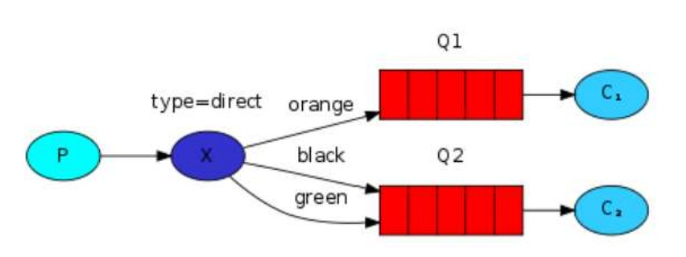

> 在上面这张图中，我们可以看到 X 绑定了两个队列，绑定类型是 direct。队列 Q1 绑定键为 orange， 队列 Q2 绑定键有两个:一个绑定键为 black，另一个绑定键为 green. 
>
> 在这种绑定情况下，生产者发布消息到 exchange 上，绑定键为 orange 的消息会被发布到队列 Q1。绑定键为 blackgreen 和的消息会被发布到队列 Q2，其他消息类型的消息将被丢弃。

#### 多重绑定

当然如果 exchange 的绑定类型是 direct，但是它绑定的多个队列的 key 如果都相同，在这种情 况下虽然绑定类型是 direct 但是它表现的就和 fanout 有点类似了，就跟广播差不多

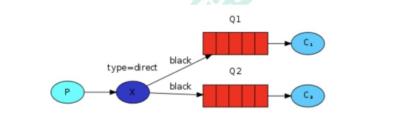

#### 实战

> 日志记录案例，对于系统中产生的日志error将被C2消费，info和warning将被C2打印在控制台

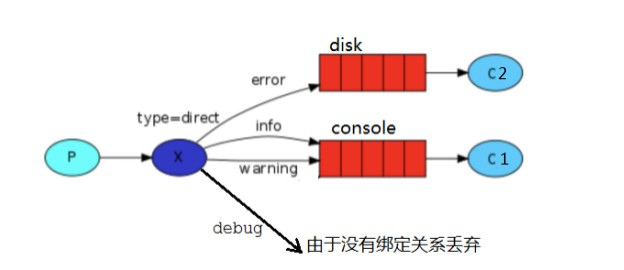

* 生产者

  ```java
  public class EmitLog {
      private static final String EXCHANGE_NAME = "direct_logs";
      public static void main(String[] argv) throws Exception {
          Channel channel = RabbitMqUtils.getChannel();
          channel.exchangeDeclare(EXCHANGE_NAME, BuiltinExchangeType.DIRECT);
          //创建多个 bindingKey
          Map<String, String> bindingKeyMap = new HashMap<>();
          bindingKeyMap.put("info","普通 info 信息");
          bindingKeyMap.put("warning","警告 warning 信息");
          bindingKeyMap.put("error","错误 error 信息");
          //debug 没有消费这接收这个消息 所有就丢失了
          bindingKeyMap.put("debug","调试 debug 信息");
          for (Map.Entry<String, String> bindingKeyEntry: bindingKeyMap.entrySet()){
              String bindingKey = bindingKeyEntry.getKey();
              String message = bindingKeyEntry.getValue();
              channel.basicPublish(EXCHANGE_NAME,bindingKey, null,
                      message.getBytes("UTF-8"));
              System.out.println("生产者发出消息:" + message);
          }
  
      }
  }
  ```

* 消费者

  ```java
  //输出
  public class ReceiveLogs01 {
      private static final String EXCHANGE_NAME = "direct_logs";
      public static void main(String[] argv) throws Exception {
          Channel channel = RabbitMqUtils.getChannel();
          channel.exchangeDeclare(EXCHANGE_NAME, BuiltinExchangeType.DIRECT);
          String queueName = "disk";
          channel.queueDeclare(queueName, false, false, false, null);
          channel.queueBind(queueName, EXCHANGE_NAME, "error");
          System.out.println("等待接收消息.....");
          DeliverCallback deliverCallback = (consumerTag, delivery) -> {
              String message = new String(delivery.getBody(), "UTF-8");
              message="接收绑定键:"+delivery.getEnvelope().getRoutingKey()+",消息:"+message;
              System.out.println("错误日志已经接收--并记录到文件"+message);
          };
          channel.basicConsume(queueName, true, deliverCallback, consumerTag -> {
          });
      }
  }
  //记录到磁盘
  public class ReceiveLogs02 {
      private static final String EXCHANGE_NAME = "direct_logs";
      public static void main(String[] argv) throws Exception {
          Channel channel = RabbitMqUtils.getChannel();
          channel.exchangeDeclare(EXCHANGE_NAME, BuiltinExchangeType.DIRECT);
          String queueName = "console";
          channel.queueDeclare(queueName, false, false, false, null);
          //建立两个绑定关系
          channel.queueBind(queueName, EXCHANGE_NAME, "info");
          channel.queueBind(queueName, EXCHANGE_NAME, "warning");
          System.out.println("等待接收消息.....");
          DeliverCallback deliverCallback = (consumerTag, delivery) -> {
              String message = new String(delivery.getBody(), "UTF-8");
              System.out.println(" 接收绑定键 :"+delivery.getEnvelope().getRoutingKey()+", 消息:"+message);
          };
          channel.basicConsume(queueName, true, deliverCallback, consumerTag -> {});
      }
  }
  
  ```

> 直接交换机，是通过交换机将消息发送给指定routeKey的队列，扇出交换机是只要队列和交换机存在绑定关系，就会发

### 主题交换机

通过匹配规则，能使得，队列能够接收，交换机发来的多条不同routeKey的消息

> 发送到类型是 topic 交换机的消息的 routing_key 不能随意写，必须满足一定的要求，**它必须是一个单 词列表，以点号分隔开**。这些单词可以是任意单词，比如说："stock.usd.nyse", "nyse.vmw",  "quick.orange.rabbit".这种类型的。**当然这个单词列表最多不能超过 255 个字节。**

在这个规则列表中，其中有两个替换符：

* *(星号)可以代替一个单词 
* #(井号)可以替代零个或多个单词

#### 主题交换机匹配案例

Q1-->绑定的是 中间带 orange 带 3 个单词的字符串(*.orange.*) 

Q2-->绑定的是 最后一个单词是 rabbit 的 3 个单词(*.*.rabbit) 第一个单词是 lazy 的多个单词(lazy.#)

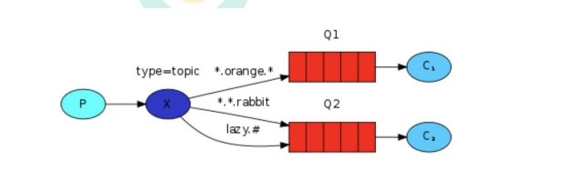

> 注意：
>
> 当一个队列绑定键是#,那么这个队列将接收所有数据，就有点像 fanout 了 如果队列绑定键当中没有#和*出现（**不进行模糊匹配**），那么该队列绑定类型就是 direct 了

* 生产者和消费者代码：

```java
public class EmitLogTopic {
    private static final String EXCHANGE_NAME = "topic_logs";
    public static void main(String[] argv) throws Exception {
        try (Channel channel = RabbitUtils.getChannel()) {
            channel.exchangeDeclare(EXCHANGE_NAME, "topic");
            /**
             * Q1-->绑定的是
             * 中间带 orange 带 3 个单词的字符串(*.orange.*)
             * Q2-->绑定的是
             * 最后一个单词是 rabbit 的 3 个单词(*.*.rabbit)
             * 第一个单词是 lazy 的多个单词(lazy.#)
             *
             */
            Map<String, String> bindingKeyMap = new HashMap<>();
            bindingKeyMap.put("quick.orange.rabbit","被队列 Q1Q2 接收到");
            bindingKeyMap.put("lazy.orange.elephant","被队列 Q1Q2 接收到");
            bindingKeyMap.put("quick.orange.fox","被队列 Q1 接收到");
            bindingKeyMap.put("lazy.brown.fox","被队列 Q2 接收到");
            bindingKeyMap.put("lazy.pink.rabbit","虽然满足两个绑定但只被队列 Q2 接收一次");
            bindingKeyMap.put("quick.brown.fox","不匹配任何绑定不会被任何队列接收到会被丢弃");
            bindingKeyMap.put("quick.orange.male.rabbit","是四个单词不匹配任何绑定会被丢弃");
            bindingKeyMap.put("lazy.orange.male.rabbit","是四个单词但匹配 Q2");
            for (Map.Entry<String, String> bindingKeyEntry: bindingKeyMap.entrySet()){
                String bindingKey = bindingKeyEntry.getKey();
                String message = bindingKeyEntry.getValue();
                channel.basicPublish(EXCHANGE_NAME,bindingKey, null,
                        message.getBytes("UTF-8"));
                System.out.println("生产者发出消息" + message);
            }
        }
    }
}
public class ReceiveLogsTopic01 {
    private static final String EXCHANGE_NAME = "topic_logs";
    public static void main(String[] argv) throws Exception {
        Channel channel = RabbitUtils.getChannel();
        channel.exchangeDeclare(EXCHANGE_NAME, "topic");
        //声明 Q1 队列与绑定关系
        String queueName="Q1";
        channel.queueDeclare(queueName, false, false, false, null);
        channel.queueBind(queueName, EXCHANGE_NAME, "*.orange.*");
        System.out.println("等待接收消息.....");
        DeliverCallback deliverCallback = (consumerTag, delivery) -> {
            String message = new String(delivery.getBody(), "UTF-8");
            System.out.println(" 接收队列 :"+queueName+" 绑 定 键:"+delivery.getEnvelope().getRoutingKey()+",消息:"+message);
        };
        channel.basicConsume(queueName, true, deliverCallback, consumerTag -> {
        });
    }
}
public class ReceiveLogsTopic02 {
    private static final String EXCHANGE_NAME = "topic_logs";
    public static void main(String[] argv) throws Exception {
        Channel channel = RabbitUtils.getChannel();
        channel.exchangeDeclare(EXCHANGE_NAME, "topic");
        //声明 Q2 队列与绑定关系
        String queueName="Q2";
        channel.queueDeclare(queueName, false, false, false, null);
        channel.queueBind(queueName, EXCHANGE_NAME, "*.*.rabbit");
        channel.queueBind(queueName, EXCHANGE_NAME, "lazy.#");
        System.out.println("等待接收消息.....");
        DeliverCallback deliverCallback = (consumerTag, delivery) -> {
            String message = new String(delivery.getBody(), "UTF-8");
            System.out.println(" 接收队列 :"+queueName+" 绑 定 键:"+delivery.getEnvelope().getRoutingKey()+",消息:"+message);
        };
        channel.basicConsume(queueName, true, deliverCallback, consumerTag -> {
        });
    }
```


## 死信队列

死信，顾名思义就是无法被消费的消息，字面意思可以这样理 解，一般来说，producer 将消息投递到 broker 或者直接到 queue 里了，consumer 从 queue 取出消息 进行消费，但某些时候由于特定的原因导致 queue 中的某些消息无法被消费，这样的消息如果没有 后续的处理，就变成了死信，有死信自然就有了死信队列。

应用场景:为了保证订单业务的消息数据不丢失，需要使用到 RabbitMQ 的死信队列机制，

当消息 消费发生异常时，将消息投入死信队列中.

还有比如说: 用户在商城下单成功并点击去支付后在指定时 间未支付时自动失效

#### 死信队列数据的来源

* 消息TTL过期
* 队列达到最大长度，无法向队列添加消息
* 消息被拒绝，并且requeue=false（不再重复投递）

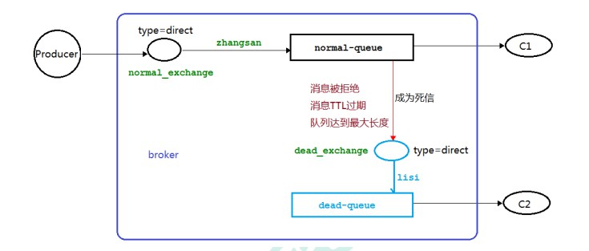

#### 消息过期案例

##### 生产者代码

```java
public class Producer {
    private static final String NORMAL_EXCHANGE = "normal_exchange";
    public static void main(String[] argv) throws Exception {
        Channel channel = RabbitMqUtils.getChannel();
        channel.exchangeDeclare(NORMAL_EXCHANGE, BuiltinExchangeType.DIRECT);
        //设置消息的 TTL 时间
        AMQP.BasicProperties properties = new
                AMQP.BasicProperties().builder().expiration("10000").build();
        //该信息是用作演示队列个数限制
        for (int i = 1; i <11 ; i++) {
            String message="info"+i;
            channel.basicPublish(NORMAL_EXCHANGE, "zhangsan", properties,
                    message.getBytes());
            System.out.println("生产者发送消息:"+message);
        }
    }
}
```

##### 消费者代码（启动之后关闭该消费者 模拟其接收不到消息，让消息没有被消费而过期）

```java
public class Consumer01 {
    //普通交换机名称
    private static final String NORMAL_EXCHANGE = "normal_exchange";
    //死信交换机名称
    private static final String DEAD_EXCHANGE = "dead_exchange";
    public static void main(String[] argv) throws Exception {
        Channel channel = RabbitMqUtils.getChannel();
        //声明死信和普通交换机 类型为 direct
        channel.exchangeDeclare(NORMAL_EXCHANGE, BuiltinExchangeType.DIRECT);
        channel.exchangeDeclare(DEAD_EXCHANGE, BuiltinExchangeType.DIRECT);
        //声明死信队列
        String deadQueue = "dead-queue";
        channel.queueDeclare(deadQueue, false, false, false, null);
        //死信队列绑定死信交换机与 routingkey
        channel.queueBind(deadQueue, DEAD_EXCHANGE, "lisi");
        //正常队列绑定死信队列信息
        Map<String, Object> params = new HashMap<>();
        //正常队列设置死信交换机 参数 key 是固定值
        params.put("x-dead-letter-exchange", DEAD_EXCHANGE);
        //正常队列设置死信 routing-key 参数 key 是固定值
        params.put("x-dead-letter-routing-key", "lisi");

        String normalQueue = "normal-queue";
        channel.queueDeclare(normalQueue, false, false, false, params);
        channel.queueBind(normalQueue, NORMAL_EXCHANGE, "zhangsan");
        System.out.println("等待接收消息.....");
        DeliverCallback deliverCallback = (consumerTag, delivery) -> {
            String message = new String(delivery.getBody(), "UTF-8");
            System.out.println("Consumer01 接收到消息"+message);
        };
        channel.basicConsume(normalQueue, true, deliverCallback, consumerTag -> {
        });
    }
}
```

##### 死信队列消费者代码

```java
public class Consumer02 {
    private static final String DEAD_EXCHANGE = "dead_exchange";
    public static void main(String[] argv) throws Exception {
        Channel channel = RabbitMqUtils.getChannel();
        channel.exchangeDeclare(DEAD_EXCHANGE, BuiltinExchangeType.DIRECT);
        String deadQueue = "dead-queue";
        channel.queueDeclare(deadQueue, false, false, false, null);
        channel.queueBind(deadQueue, DEAD_EXCHANGE, "lisi");
        System.out.println("等待接收死信队列消息.....");
        DeliverCallback deliverCallback = (consumerTag, delivery) -> {
            String message = new String(delivery.getBody(), "UTF-8");
            System.out.println("Consumer02 接收死信队列的消息" + message);
        };
        channel.basicConsume(deadQueue, true, deliverCallback, consumerTag -> {
        });
    }
}
```

##### 效果展示

> 由于，生产者发送的消息，因没被及时接收，而过期，被死信队列消费


#### 队列达到最大长度案例

生产者代码基本和上面的保持一致（去掉消息过过期时间即可）

死信队列代码和上面也是一致的

消费者代码

```java
public class Consumer01 {
    //普通交换机名称
    private static final String NORMAL_EXCHANGE = "normal_exchange";
    //死信交换机名称
    private static final String DEAD_EXCHANGE = "dead_exchange";
    public static void main(String[] argv) throws Exception {
        Channel channel = RabbitMqUtils.getChannel();
        //声明死信和普通交换机 类型为 direct
        channel.exchangeDeclare(NORMAL_EXCHANGE, BuiltinExchangeType.DIRECT);
        channel.exchangeDeclare(DEAD_EXCHANGE, BuiltinExchangeType.DIRECT);
        //声明死信队列
        String deadQueue = "dead-queue";
        channel.queueDeclare(deadQueue, false, false, false, null);
        //死信队列绑定死信交换机与 routingkey
        channel.queueBind(deadQueue, DEAD_EXCHANGE, "lisi");
        //正常队列绑定死信队列信息
        Map<String, Object> params = new HashMap<>();
        //正常队列设置死信交换机 参数 key 是固定值
        params.put("x-dead-letter-exchange", DEAD_EXCHANGE);
        //正常队列设置死信 routing-key 参数 key 是固定值
        params.put("x-dead-letter-routing-key", "lisi");

        String normalQueue = "normal-queue";
        //设置当前队列，最大缓存消息数量
        params.put("x-max-length",6);
        channel.queueDeclare(normalQueue, false, false, false, params);
        channel.queueBind(normalQueue, NORMAL_EXCHANGE, "zhangsan");
        System.out.println("等待接收消息.....");
        DeliverCallback deliverCallback = (consumerTag, delivery) -> {
            String message = new String(delivery.getBody(), "UTF-8");
            System.out.println("Consumer01 接收到消息"+message);
        };
        channel.basicConsume(normalQueue, true, deliverCallback, consumerTag -> {
        });
    }
}
```

> 此时，生产者虽然也是发送了10条消息，但由于，消费者，最大只能接收6条消息，所以死信队列会接受到4条消息
>
> **疑问？为啥是，先发送的四条消息，被送到死信队列**

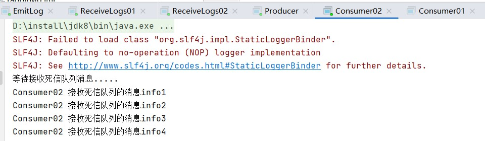

#### 消息被拒

> channel.basicReject(delivery.getEnvelope().getDeliveryTag(), false);
>
> 被消费者拒绝掉的消息，一样会到死信队列

## 延迟队列

延时队列就是用来存放需要在指定时间被处理元素的队列。

* 使用场景：
  * 订单在十分钟之内未支付则自动取消
  * 用户注册成功后，如果三天内没有登陆则进行短信提醒。
  * 用户发起退款，如果三天内没有得到处理则通知相关运营人员。
  * ……………………………………

#### RabbitMQ中的TTL

TTL 是 RabbitMQ 中一个消息或者队列的属性，表明一条消息或者该队列中的所有 消息的最大存活时间，单位是毫秒。

换句话说，如果一条消息设置了 TTL 属性或者进入了设置 TTL 属性的队列，那么这 条消息如果在 TTL 设置的时间内没有被消费，则会成为"死信"。如果同时配置了队列的 TTL 和消息的 TTL，那么较小的那个值将会被使用

* ttl设置的两种方式

  * 发送消息的时候声明
  * 创建队列的时候声明

* ttl说明

  > 消息在队列里到达过期时长并不是马上去删除，如果马上删除需要服务器去无时不刻的扫描或者去做其他算法来检测，导致服务器性能变低，RabbitMQ的做法是当消息到达队顶时判断消息是否过期，如果过期则删除，没过期则给消费者

#### 延迟队列案例

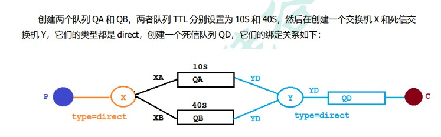

##### 整合springboot来实现延迟队列

* 依赖

  ```xml
  <?xml version="1.0" encoding="UTF-8"?>
  <project xmlns="http://maven.apache.org/POM/4.0.0"
           xmlns:xsi="http://www.w3.org/2001/XMLSchema-instance"
           xsi:schemaLocation="http://maven.apache.org/POM/4.0.0 http://maven.apache.org/xsd/maven-4.0.0.xsd">
      <modelVersion>4.0.0</modelVersion>
      <parent>
          <groupId>org.springframework.boot</groupId>
          <artifactId>spring-boot-starter-parent</artifactId>
          <version>2.7.9</version>
          <relativePath/>
      </parent>
      <groupId>cn.hd.rabbitMQ</groupId>
      <artifactId>01</artifactId>
      <version>1.0-SNAPSHOT</version>
  
      <properties>
          <maven.compiler.source>8</maven.compiler.source>
          <maven.compiler.target>8</maven.compiler.target>
      </properties>
      <dependencies>
          <dependency>
              <groupId>org.springframework.boot</groupId>
              <artifactId>spring-boot-starter-amqp</artifactId>
          </dependency>
          <dependency>
              <groupId>org.springframework.boot</groupId>
              <artifactId>spring-boot-starter-web</artifactId>
          </dependency>
          <!--swagger-->
          <dependency>
              <groupId>io.springfox</groupId>
              <artifactId>springfox-swagger2</artifactId>
              <version>2.9.2</version>
          </dependency>
          <dependency>
              <groupId>io.springfox</groupId>
              <artifactId>springfox-swagger-ui</artifactId>
              <version>2.9.2</version>
          </dependency>
          <!--RabbitMQ 测试依赖-->
          <dependency>
              <groupId>org.springframework.amqp</groupId>
              <artifactId>spring-rabbit-test</artifactId>
              <scope>test</scope>
          </dependency>
          <dependency>
              <groupId>org.projectlombok</groupId>
              <artifactId>lombok</artifactId>
              <version>RELEASE</version>
              <scope>compile</scope>
          </dependency>
  
      </dependencies>
  </project>
  ```

* 配置文件和swagger配置

  ```properties
  spring.rabbitmq.host=192.168.60.101
  spring.rabbitmq.port=5672
  spring.rabbitmq.username=admin
  spring.rabbitmq.password=admin
  # swagger和spring boot兼容
  spring.mvc.pathmatch.matching-strategy=ANT_PATH_MATCHER
  ```

  ```java
  package cn.bdsoft.rabbitMQ.config;
  
  import org.springframework.context.annotation.Bean;
  import org.springframework.context.annotation.Configuration;
  import springfox.documentation.builders.ApiInfoBuilder;
  import springfox.documentation.service.ApiInfo;
  import springfox.documentation.service.Contact;
  import springfox.documentation.spi.DocumentationType;
  import springfox.documentation.spring.web.plugins.Docket;
  import springfox.documentation.swagger2.annotations.EnableSwagger2;
  
  @Configuration
  @EnableSwagger2
  public class SwaggerConfig {
      @Bean
      public Docket webApiConfig(){
          return new Docket(DocumentationType.SWAGGER_2)
                  .groupName("webApi")
                  .apiInfo(webApiInfo())
                  .select()
                  .build();
      }
      private ApiInfo webApiInfo(){
          return new ApiInfoBuilder()
                  .title("rabbitmq 接口文档")
                  .description("本文档描述了 rabbitmq 微服务接口定义")
                  .version("1.0")
                  .contact(new Contact("enjoy6288", "http://atguigu.com",
                          "1551388580@qq.com"))
                  .build();
      }
  }
  
  
  ```

* RabbitMQ配置类

  ```java
  package cn.bdsoft.rabbitMQ.config;
  
  
  import org.springframework.amqp.core.*;
  import org.springframework.beans.factory.annotation.Qualifier;
  import org.springframework.context.annotation.Bean;
  import org.springframework.context.annotation.Configuration;
  
  import java.util.HashMap;
  import java.util.Map;
  
  @Configuration
  public class TtlQueueConfig {
      public static final String X_EXCHANGE = "X";
      public static final String QUEUE_A = "QA";
      public static final String QUEUE_B = "QB";
      public static final String Y_DEAD_LETTER_EXCHANGE = "Y";
      public static final String DEAD_LETTER_QUEUE = "QD";
      // 声明 xExchange
      @Bean("xExchange")
      public DirectExchange xExchange(){
          return new DirectExchange(X_EXCHANGE);
      }
      // 声明 xExchange
      @Bean("yExchange")
      public DirectExchange yExchange(){
          return new DirectExchange(Y_DEAD_LETTER_EXCHANGE);
      }
      //声明队列 A ttl 为 10s 并绑定到对应的死信交换机
      @Bean("queueA")
      public Queue queueA(){
          Map<String, Object> args = new HashMap<>(3);
          //声明当前队列绑定的死信交换机
          args.put("x-dead-letter-exchange", Y_DEAD_LETTER_EXCHANGE);
          //声明当前队列的死信路由 key
          args.put("x-dead-letter-routing-key", "YD");
          //声明队列的 TTL
          args.put("x-message-ttl", 10000);
          return QueueBuilder.durable(QUEUE_A).withArguments(args).build();
      }
      // 声明队列 A 绑定 X 交换机
      @Bean
      public Binding queueaBindingX(@Qualifier("queueA") Queue queueA,
                                    @Qualifier("xExchange") DirectExchange xExchange){
          return BindingBuilder.bind(queueA).to(xExchange).with("XA");
      }
      //声明队列 B ttl 为 40s 并绑定到对应的死信交换机
      @Bean("queueB")
      public Queue queueB(){
          Map<String, Object> args = new HashMap<>(3);
          //声明当前队列绑定的死信交换机
          args.put("x-dead-letter-exchange", Y_DEAD_LETTER_EXCHANGE);
          //声明当前队列的死信路由 key
          args.put("x-dead-letter-routing-key", "YD");
          //声明队列的 TTL
          args.put("x-message-ttl", 40000);
          return QueueBuilder.durable(QUEUE_B).withArguments(args).build();
      }
      //声明队列 B 绑定 X 交换机
      @Bean
      public Binding queuebBindingX(@Qualifier("queueB") Queue queue1B,
                                    @Qualifier("xExchange") DirectExchange xExchange){
          return BindingBuilder.bind(queue1B).to(xExchange).with("XB");
      }
      //声明死信队列 QD
      @Bean("queueD")
      public Queue queueD(){
          return new Queue(DEAD_LETTER_QUEUE);
      }
      //声明死信队列 QD 绑定关系
      @Bean
      public Binding deadLetterBindingQAD(@Qualifier("queueD") Queue queueD,
                                          @Qualifier("yExchange") DirectExchange yExchange){
          return BindingBuilder.bind(queueD).to(yExchange).with("YD");
      }
  }
  
  ```

  

* 生产者

  ```java
  package cn.bdsoft.rabbitMQ.controller;
  
  import lombok.extern.slf4j.Slf4j;
  import org.springframework.amqp.rabbit.core.RabbitTemplate;
  import org.springframework.beans.factory.annotation.Autowired;
  import org.springframework.web.bind.annotation.GetMapping;
  import org.springframework.web.bind.annotation.PathVariable;
  import org.springframework.web.bind.annotation.RequestMapping;
  import org.springframework.web.bind.annotation.RestController;
  
  import java.util.Date;
  
  @Slf4j
  @RequestMapping("ttl")
  @RestController
  public class SendMsgController {
      @Autowired
      private RabbitTemplate rabbitTemplate;
  
      @GetMapping("sendMsg/{message}")
      public void sendMsg(@PathVariable String message) {
          log.info("当前时间：{},发送一条信息给两个 TTL 队列:{}", new Date(), message);
          rabbitTemplate.convertAndSend("X", "XA", "消息来自 ttl 为 10S 的队列: " + message);
          rabbitTemplate.convertAndSend("X", "XB", "消息来自 ttl 为 40S 的队列: " + message);
      }
  }
  
  ```

* 消费者（死信队列）

  ```java
  package cn.bdsoft.rabbitMQ.listener;
  
  import com.rabbitmq.client.Channel;
  import lombok.extern.slf4j.Slf4j;
  import org.springframework.amqp.core.Message;
  import org.springframework.amqp.rabbit.annotation.RabbitListener;
  import org.springframework.stereotype.Component;
  
  import java.io.IOException;
  import java.util.Date;
  
  /**
   * 死信队列消费者
   */
  @Slf4j
  @Component
  public class DeadLetterQueueConsumer {
      @RabbitListener(queues = "QD")
      public void receiveD(Message message, Channel channel) throws IOException {
          String msg = new String(message.getBody());
          log.info("当前时间：{},收到死信队列信息{}", new Date().toString(), msg);
      }
  }
  ```

* 结果说明

  > 生产者，分别给两个延迟队列，发送了两条消息，时间过期，消息自动被死信队列处理

  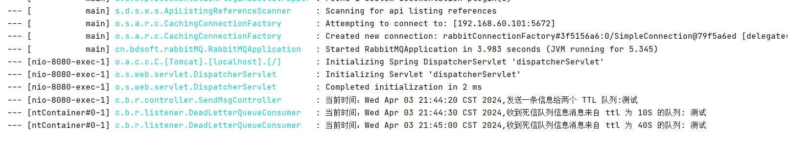

* 问题发现

  >  RabbitMQ 只会检查第一个消息是否过期，如果过期则丢到死信队列， 如果第一个消息的延时时长很长，而第二个消息的延时时长很短，第二个消息并不会优先得到执行。
  >
  > 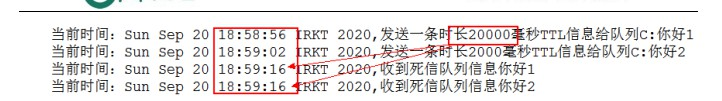

#### 插件实现延迟队列，优化上面 的问题

* 延迟队列插件安装

  > 在官网上下载 https://www.rabbitmq.com/community-plugins.html，下载 rabbitmq_delayed_message_exchange 插件
  >
  > 然后解压放置到 RabbitMQ 的插件目录。 
  >
  > 进入 RabbitMQ 的安装目录下的 plgins 目录，执行下面命令让该插件生效，然后重启 RabbitMQ /usr/lib/rabbitmq/lib/rabbitmq_server-3.8.8/plugins 
  >
  > rabbitmq-plugins enable rabbitmq_delayed_message_exchange

  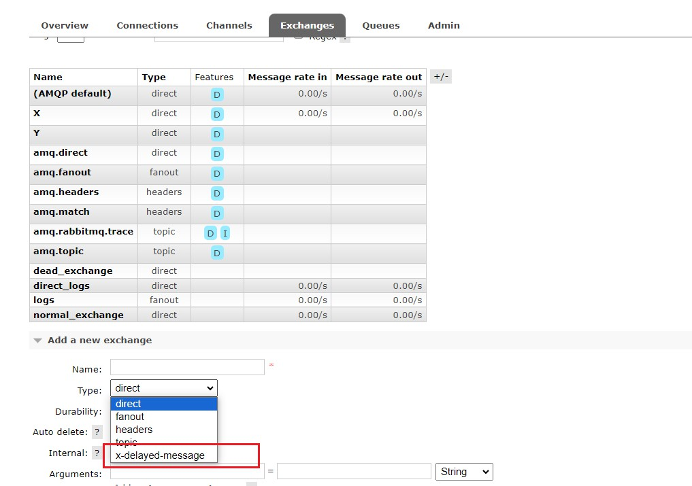

##### 插件实现的延迟队列案例

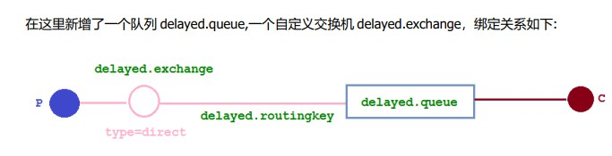

* rabbitMQ配置

  ```java
  package cn.bdsoft.rabbitMQ.config;
  
  import org.springframework.amqp.core.Binding;
  import org.springframework.amqp.core.BindingBuilder;
  import org.springframework.amqp.core.CustomExchange;
  import org.springframework.amqp.core.Queue;
  import org.springframework.beans.factory.annotation.Qualifier;
  import org.springframework.context.annotation.Bean;
  import org.springframework.context.annotation.Configuration;
  
  import java.util.HashMap;
  import java.util.Map;
  
  @Configuration
  public class DelayedQueueConfig {
      public static final String DELAYED_QUEUE_NAME = "delayed.queue";
      public static final String DELAYED_EXCHANGE_NAME = "delayed.exchange";
      public static final String DELAYED_ROUTING_KEY = "delayed.routingkey";
      @Bean
      public Queue delayedQueue() {
          return new Queue(DELAYED_QUEUE_NAME);
      }
      //自定义交换机 我们在这里定义的是一个延迟交换机
      @Bean
      public CustomExchange delayedExchange() {
          Map<String, Object> args = new HashMap<>();
          //自定义交换机的类型
          args.put("x-delayed-type", "direct");
          return new CustomExchange(DELAYED_EXCHANGE_NAME, "x-delayed-message", true, false,
                  args);
      }
      @Bean
      public Binding bindingDelayedQueue(@Qualifier("delayedQueue") Queue queue,
                                         @Qualifier("delayedExchange") CustomExchange
                                                 delayedExchange) {
          return BindingBuilder.bind(queue).to(delayedExchange).with(DELAYED_ROUTING_KEY).noargs();
      }
  }
  
  ```

* 生产者

  ```java
  package cn.bdsoft.rabbitMQ.controller;
  
  import lombok.extern.slf4j.Slf4j;
  import org.springframework.amqp.rabbit.core.RabbitTemplate;
  import org.springframework.beans.factory.annotation.Autowired;
  import org.springframework.web.bind.annotation.GetMapping;
  import org.springframework.web.bind.annotation.PathVariable;
  import org.springframework.web.bind.annotation.RequestMapping;
  import org.springframework.web.bind.annotation.RestController;
  
  import java.util.Date;
  
  @Slf4j
  @RequestMapping("ttl")
  @RestController
  public class SendMsgController {
      public static final String DELAYED_EXCHANGE_NAME = "delayed.exchange";
      public static final String DELAYED_ROUTING_KEY = "delayed.routingkey";
      @Autowired
      private RabbitTemplate rabbitTemplate;
  
      @GetMapping("sendDelayMsg/{message}/{delayTime}")
      public void sendMsg(@PathVariable String message,@PathVariable Integer delayTime) {
          rabbitTemplate.convertAndSend(DELAYED_EXCHANGE_NAME, DELAYED_ROUTING_KEY, message,
                  correlationData -> {
                      //指定队列的延迟时间
                      correlationData.getMessageProperties().setDelay(delayTime);
                      return correlationData;
                  });
          log.info(" 当 前 时 间 ： {}, 发送一条延迟 {} 毫秒的信息给队列 delayed.queue:{}", new Date());
      }
  }
  ```

* 效果展示

  第二个消息被先消费掉了，符合预期

  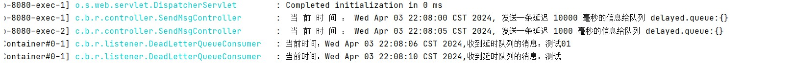

## 发布确认(高级)

虽然前面存在，在生产者，发送消息给rabbitMQ之后，会有接收rabbitMQ接收到投递消息的确认机制，但是，**如果rabbitMQ宕机了，此机制也就没法使用了rabbitMQ宕机意味着，交换机或是队列不可用，所以需要有种机制，允许，未投递到rabbitMQ的消息，能够被生产者识别，进行重新投递**

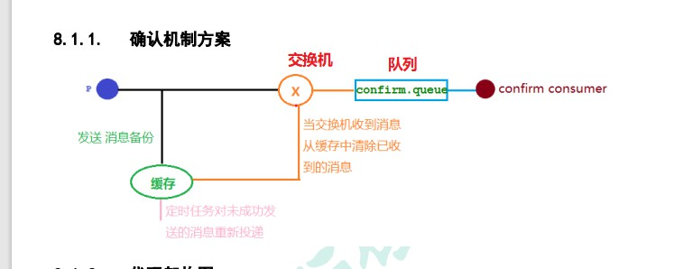

#### 交换机回调机制和队列回退机制解决，因rabbitMQ宕机导致的消息无法投递的问题

* 案例演示：

  * 配置文件修改

    ```properties
    spring.rabbitmq.host=192.168.60.101
    spring.rabbitmq.port=5672
    spring.rabbitmq.username=admin
    spring.rabbitmq.password=admin
    # NONE
    #禁用发布确认模式，是默认值
    #CORRELATED
    #发布消息成功到交换器后会触发回调方法
    #SIMPLE
    #经测试有两种效果，其一效果和 CORRELATED 值一样会触发回调方法，
    #其二在发布消息成功后使用 rabbitTemplate 调用 waitForConfirms 或 waitForConfirmsOrDie 方法
    #等待 broker 节点返回发送结果，根据返回结果来判定下一步的逻辑，要注意的点是
    #waitForConfirmsOrDie 方法如果返回 false 则会关闭 channel，则接下来无法发送消息到 broker
    spring.rabbitmq.publisher-confirm-type=correlated
    ```

  * 配置类

    ```java
    package cn.bdsoft.rabbitMQ.config;
    
    import org.springframework.amqp.core.*;
    import org.springframework.beans.factory.annotation.Qualifier;
    import org.springframework.context.annotation.Bean;
    import org.springframework.context.annotation.Configuration;
    
    @Configuration
    public class ConfirmConfig {
        public static final String CONFIRM_EXCHANGE_NAME = "confirm.exchange";
        public static final String CONFIRM_QUEUE_NAME = "confirm.queue";
        //声明业务 Exchange
        @Bean("confirmExchange")
        public DirectExchange confirmExchange(){
            return new DirectExchange(CONFIRM_EXCHANGE_NAME);
        }
        // 声明确认队列
        @Bean("confirmQueue")
        public Queue confirmQueue(){
            return QueueBuilder.durable(CONFIRM_QUEUE_NAME).build();
        }
        // 声明确认队列绑定关系
        @Bean
        public Binding queueBinding(@Qualifier("confirmQueue") Queue queue,
                                    @Qualifier("confirmExchange") DirectExchange exchange){
            return BindingBuilder.bind(queue).to(exchange).with("key1");
        }
    }
    
    ```

  * 生产者

    ```java
    package cn.bdsoft.rabbitMQ.controller;
    
    import cn.bdsoft.rabbitMQ.back.MyCallBack;
    import lombok.extern.slf4j.Slf4j;
    import org.springframework.amqp.rabbit.connection.CorrelationData;
    import org.springframework.amqp.rabbit.core.RabbitTemplate;
    import org.springframework.beans.factory.annotation.Autowired;
    import org.springframework.web.bind.annotation.GetMapping;
    import org.springframework.web.bind.annotation.PathVariable;
    import org.springframework.web.bind.annotation.RequestMapping;
    import org.springframework.web.bind.annotation.RestController;
    
    import javax.annotation.PostConstruct;
    
    @RestController
    @RequestMapping("/confirm")
    @Slf4j
    public class Producer {
        public static final String CONFIRM_EXCHANGE_NAME = "confirm.exchange";
        @Autowired
        private RabbitTemplate rabbitTemplate;
        @Autowired
        private MyCallBack myCallBack;
        //依赖注入 rabbitTemplate 之后再设置它的回调对象
        @PostConstruct
        public void init(){
            //无法把消息发送到交换机的回调
            rabbitTemplate.setConfirmCallback(myCallBack);
            /**
             * true：
             * 交换机无法将消息进行路由时，会将该消息返回给生产者
             * false：
             * 如果发现消息无法进行路由，则直接丢弃
             */
            rabbitTemplate.setMandatory(true);
            rabbitTemplate.setReturnCallback(myCallBack);
        }
        @GetMapping("sendMessage/{message}")
        public void sendMessage(@PathVariable String message){
            //指定消息 id 为 1
            CorrelationData correlationData1=new CorrelationData("1");
            String routingKey="key1";
    
            rabbitTemplate.convertAndSend(CONFIRM_EXCHANGE_NAME,routingKey,message+routingKey,correlationData1);
            CorrelationData correlationData2=new CorrelationData("2");
            //此消息，无法路由到队列
            routingKey="key2";
            rabbitTemplate.convertAndSend(CONFIRM_EXCHANGE_NAME,routingKey,message+routingKey,correlationData2);
            log.info("发送消息内容:{}",message);
        }
    }
    ```

  * 回调接口和回退接口

    ```java
    package cn.bdsoft.rabbitMQ.back;
    
    import lombok.extern.slf4j.Slf4j;
    import org.springframework.amqp.core.Message;
    import org.springframework.amqp.rabbit.connection.CorrelationData;
    import org.springframework.amqp.rabbit.core.RabbitTemplate;
    import org.springframework.stereotype.Component;
    
    @Component
    @Slf4j
    public class MyCallBack implements
            RabbitTemplate.ConfirmCallback, //交换机回调
            RabbitTemplate.ReturnCallback {//队列回退
        /**
         * 交换机不管是否收到消息的一个回调方法
         * CorrelationData
         * 消息相关数据
         * ack
         * 交换机是否收到消息
         */
        @Override
        public void confirm(CorrelationData correlationData, boolean ack, String cause) {
            String id=correlationData!=null?correlationData.getId():"";
            if(ack){
                log.info("交换机已经收到 id 为:{}的消息",id);
            }else{
                log.info("交换机还未收到 id 为:{}消息,由于原因:{}",id,cause);
            }
        }
    
        //当消息无法路由的时候的回调方法
        @Override
        public void returnedMessage(Message message, int replyCode, String replyText, String
                exchange, String routingKey) {
            log.error(" 消 息 {}, 被交换机 {} 退回，退回原因 :{}, 路 由 key:{}",new
                    String(message.getBody()),exchange,replyText,routingKey);
        }
    }
    ```

* 效果展示

  * 消息无法发到交换机时的回调

    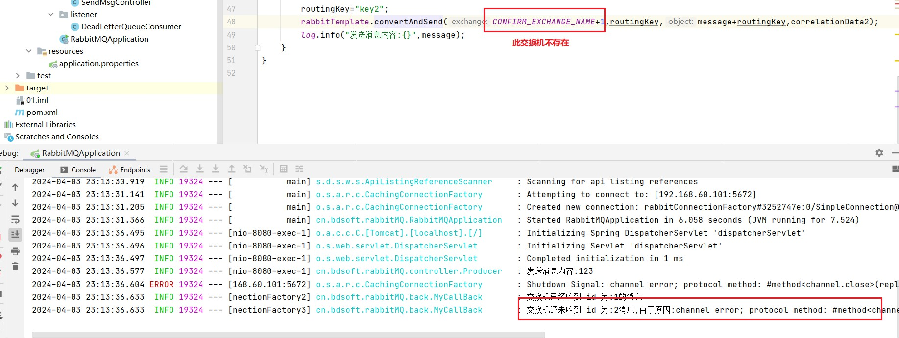

  * 消息无法路由到队列时的退回

    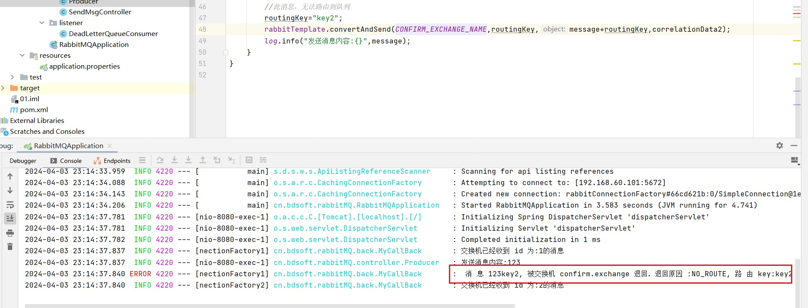

#### 备份交换机

什么是备份交换机呢？备份 交换机可以理解为 RabbitMQ 中交换机的“备胎”，当我们为某一个交换机声明一个对应的备份交换机时， 就是为它创建一个备胎，**当交换机接收到一条不可路由消息时，将会把这条消息转发到备份交换机中，由 备份交换机来进行转发和处理**，**通常备份交换机的类型为 Fanout** ，这样就能把所有消息都投递到与其绑 定的队列中，然后我们在备份交换机下绑定一个队列，这样所有那些原交换机无法被路由的消息，就会都 进入这个队列了。当然，我们还可以建立一个报警队列，用独立的消费者来进行监测和报警。

* 案例演示

  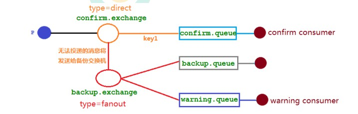

* 备份交换机的配置类

```java
@Configuration
public class ConfirmConfig {
    public static final String CONFIRM_EXCHANGE_NAME = "confirm.exchange";
    public static final String CONFIRM_QUEUE_NAME = "confirm.queue";
    public static final String BACKUP_EXCHANGE_NAME = "backup.exchange";
    public static final String BACKUP_QUEUE_NAME = "backup.queue";
    public static final String WARNING_QUEUE_NAME = "warning.queue";
    // 声明确认队列
    @Bean("confirmQueue")
    public Queue confirmQueue(){
        return QueueBuilder.durable(CONFIRM_QUEUE_NAME).build();
    }
    //声明确认队列绑定关系
    @Bean
    public Binding queueBinding(@Qualifier("confirmQueue") Queue queue,
                                @Qualifier("confirmExchange") DirectExchange exchange){
        return BindingBuilder.bind(queue).to(exchange).with("key1");
    }
    //声明备份 Exchange
    @Bean("backupExchange")
    public FanoutExchange backupExchange(){
        return new FanoutExchange(BACKUP_EXCHANGE_NAME);
    }
    //声明确认 Exchange 交换机的备份交换机
    @Bean("confirmExchange")
    public DirectExchange confirmExchange(){
        ExchangeBuilder exchangeBuilder =
                ExchangeBuilder.directExchange(CONFIRM_EXCHANGE_NAME)
                        .durable(true)
//设置该交换机的备份交换机
                        .withArgument("alternate-exchange", BACKUP_EXCHANGE_NAME);
        return (DirectExchange)exchangeBuilder.build();
    }
    // 声明警告队列
    @Bean("warningQueue")
    public Queue warningQueue(){
        return QueueBuilder.durable(WARNING_QUEUE_NAME).build();
    }
    // 声明报警队列绑定关系
    @Bean
    public Binding warningBinding(@Qualifier("warningQueue") Queue queue,
                                  @Qualifier("backupExchange") FanoutExchange
                                          backupExchange){
        return BindingBuilder.bind(queue).to(backupExchange);
    }
    // 声明备份队列
    @Bean("backQueue")
    public Queue backQueue(){
        return QueueBuilder.durable(BACKUP_QUEUE_NAME).build();
    }
    // 声明备份队列绑定关系
    @Bean
    public Binding backupBinding(@Qualifier("backQueue") Queue queue,
                                 @Qualifier("backupExchange") FanoutExchange backupExchange){
        return BindingBuilder.bind(queue).to(backupExchange);
    }
}
```


## 其他

### 惰性队列

abbitMQ 设置了一个内存预警值（内存存储的上限，默认是 40%），如果在消息堆积（**生产者生产消息的速度大于消费者消费的速度**）的情况下，很容易就到达这个预警值，此时，RabbitMQ 就会处于一个暂停状态，会阻止生产者投递消息进来，然后把内存中的一部分消息清理出来，刷出到磁盘中，这动作也叫 “page out” .  进而导致 mq 的并发能力，忽高忽低，性能不稳定（每次page out 都会比较耗时，停顿一段时间）.

* 而惰性队列就是为解决消息堆积问题的
  * 收到的消息会直接写入磁盘，而非内存，也因此很难触发 mq 的内存预警，几乎不会出现 page out 的情况.

  * 消费者消费惰性队列的消息，也需要先从磁盘中读取并加载到内存中.  实际上这也会使延迟稍微高一点，毕竟磁盘的性能和内存还是有很大差距的，但是也在可以接收到范围内.

  * 支持数百万的消息存储，这也是因为他是磁盘存储（空间非常大）.


* 惰性队列设置

  ```java
  Map<String, Object> args = new HashMap<String, Object>();
  args.put("x-queue-mode", "lazy");
  channel.queueDeclare("myqueue", false, false, false, args);
  # 惰性队列声明，配置类中
  QueueBuilder.durable(CONFIRM_QUEUE_NAME).lazy().build();
  ```

  


