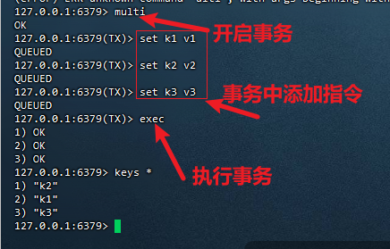
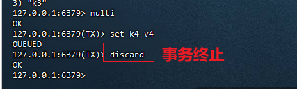
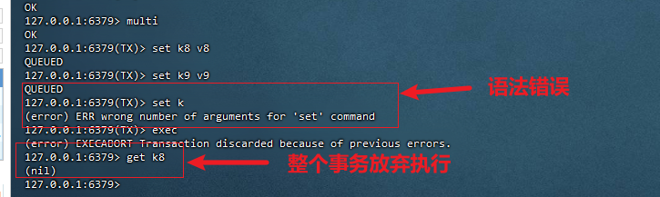
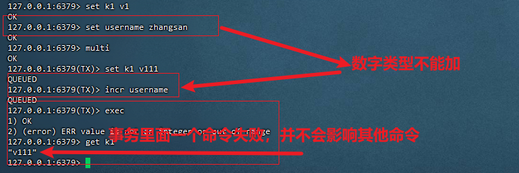
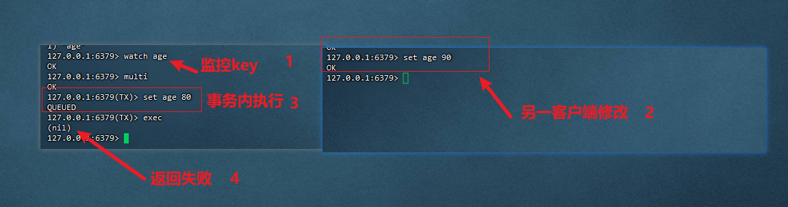
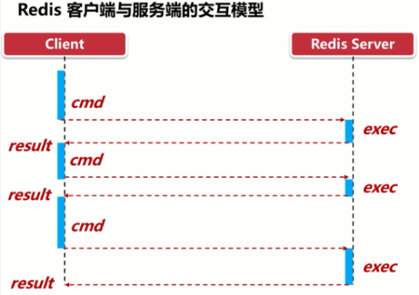
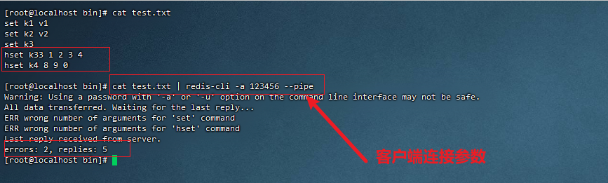
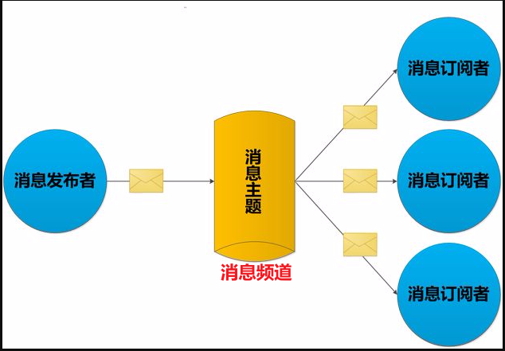

### redis事务

> 可以一次执行多个命令，本质是一组命令的集合。
>
> 一个事务，所有命令都会被序列化，按顺序串行化的执行而不被其他命令加入
>
> 一个队列中，一次性、顺序性、排他性的执行一系列命令（在一个事务中，不允许其他命令插入执行）

#### 事务特性：

1. 隔离性：Redis的事务仅仅是保证事务里的操作会被连续独占的执行，redis命令执行是单线程架构，在执行完事务内所有指令前是不可能再去同时执行其他客户端的请求的
2. 不保证原子性：Redis的事务不保证原子性，也就是不保证所有指令同时成功或同时失败，只有决定是否开始执行全部指令的能力，没有执行到一半进行回滚的能力
3. 排它性：Redis会保证一个事务内的命令依次执行，而不会被其它命令插入

#### 事务命令：

1. 开启事务：multi 

2. 执行事务：exec

3. 放弃事务：discard

   * 案例一（正常执行）：

   

   

   * 案例二（事务队列命令中有明显错误（可检查的），事务无法执行）

     

   * 案例三（一次事务中其他命令的失败，不会影响所有命令，不可检查的错误，只有在执行时才发现时）

     

#### 乐观锁

> 每次去拿数据的时候都认为别人不会修改，所以不会上锁，但是在更新的时候会判断一下在此期间别人有没有去更新这个数据。
>
> 乐观锁策略:提交版本必须  大于  记录当前版本才能执行更新

#### redis乐观锁实现（watch和unwatch）

> watch 命令用于标记要监视的key，以便有条件地执行事务
>
> watch命令可以监控一个或多个键，一旦其中有一个键被修改（或删除），事务就不会执行。
>
> `UNWATCH`命令用于取消**watch** 命令对所有 key 的监视。

* 案例：



* 总结：

  > 一旦执行了exec之前的监控锁都会被取消
  >
  > 当客户端连接丢失，监视也会被取消

### redis管道

> Redis是一种基于**客户端-服务端模型以及请求/响应协议的TCP服务**。一个请求会遵循以下步骤：
>
> 1. 客户端向服务端发送命令分四步(发送命令→命令排队→命令执行→返回结果)，并监听Socket返回，通常以阻塞模式等待服务端响应。
> 2. 服务端处理命令，并将结果返回给客户端。
>
> 数据往返于客户端/服务端的时间，被称为**Round Trip Time(简称RTT）**



问题：

> 如果同时需要执行大量的命令，那么就要等待上一条命令应答后再执行，这中间不仅仅多了RTT（Round Time Trip），而且还频繁调用系统IO，发送网络请求，同时需要redis调用多次read()和write()系统方法，系统方法会将数据从用户态转移到内核态，这样就会对进程上下文有比较大的影响了，性能不太好。

管道的作用：

> pipeline是为了解决RTT往返时间的消耗，仅仅是将命令打包一次性发送，对整个Redis的执行不造成任何影响

案例：

> 往文件里面写五条redis指令，其中两条是错误的（第三条和第五条，**虽然管道在执行的时候出现错误，但并不影响后续指令的执行**）客户端连接通过管道写入



注意事项：

> 1. 管道中缓冲的指令只是会依次执行，并不保证原子性，**如果执行指令出现异常，后续指令继续执行**
> 2. 管道组装的指令个数不能太多，会导致客户端阻塞，同时服务端也被迫回复一个队列答复，占很多内存

管道与事务的对比：

> 事务在某些场景下是原子性的（事务：案例二），管道不是
>
> 管道是一次性发送很多命令到服务端，事务是一条一条的发，只有exec执行后才执行，管道不是

### redis发布与订阅

> 是一种消息通信模式，发送者发送消息，订阅者接收消息，可以实现进程间的消息通信
>
> 场景：发布/订阅其实是一个轻量的队列，只不过**数据不会被持久化**，一般用来处理实时性较高的异步消息



常用命令：

* 订阅频道

  ```sh
  subscribe msg01 # 频道名称msg01
  ```

* 发布消息

  ```sh
   publish msg01  消息通知 #向频道msg01 发送消息：消息通知
  ```

* 按模式订阅消息

  ```sh
  PSUBSCRIBE pattern #按模式订阅客户端 PSUBSCRIBE ms*，订阅以ms开头的频道
  ```

* 查看订阅和发布系统的状态

  ```sh
  PUBSUB CHANNELS #列出当前的活跃频道。
  PUBSUB NUMSUB 频道名称 #返回给定频道的订阅者数量，按模式订阅的客户端不计算在内。
  PUBSUB NUMPAT #，按模式订阅的客户端的数量
  ```

* 取消订阅

  ```sh
  UNSUBSCRIBE 频道名称 # 退订指定名称的频道
  ```

* 退订所有给定模式的频道

  ```sh
  PUNSUBSCRIBE # 命令用于客户端退订所有给定模式。和PSUBSCRIBE是一对
  ```

总结：

> 1. 发布的消息在redis中不能持久化，所以必须先订阅频道，再发布消息，避免消息丢失
> 2. 消息只管发送，不管接收，即发及时，没有应答机制

