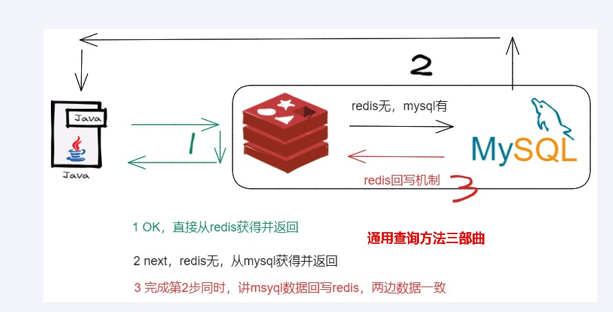
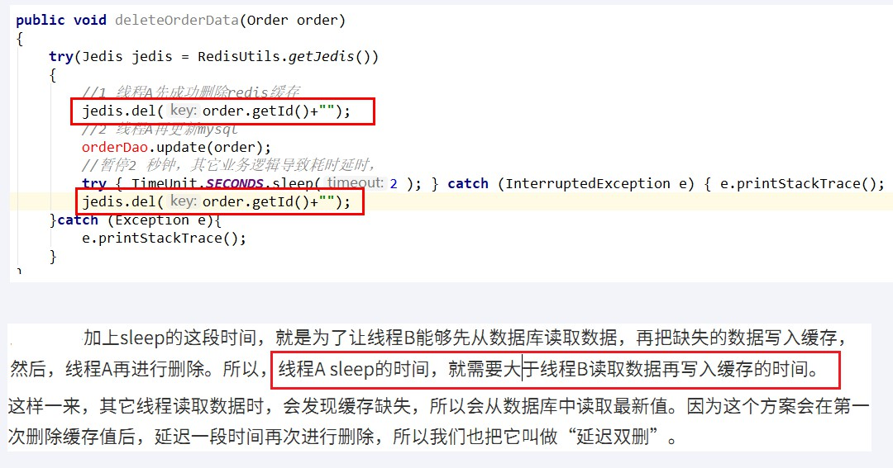
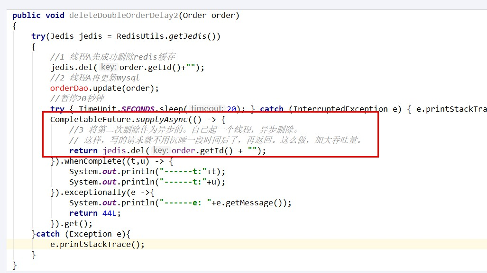
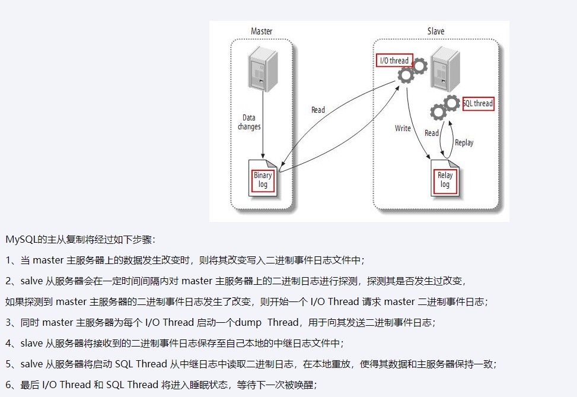
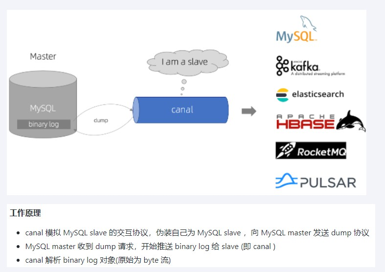
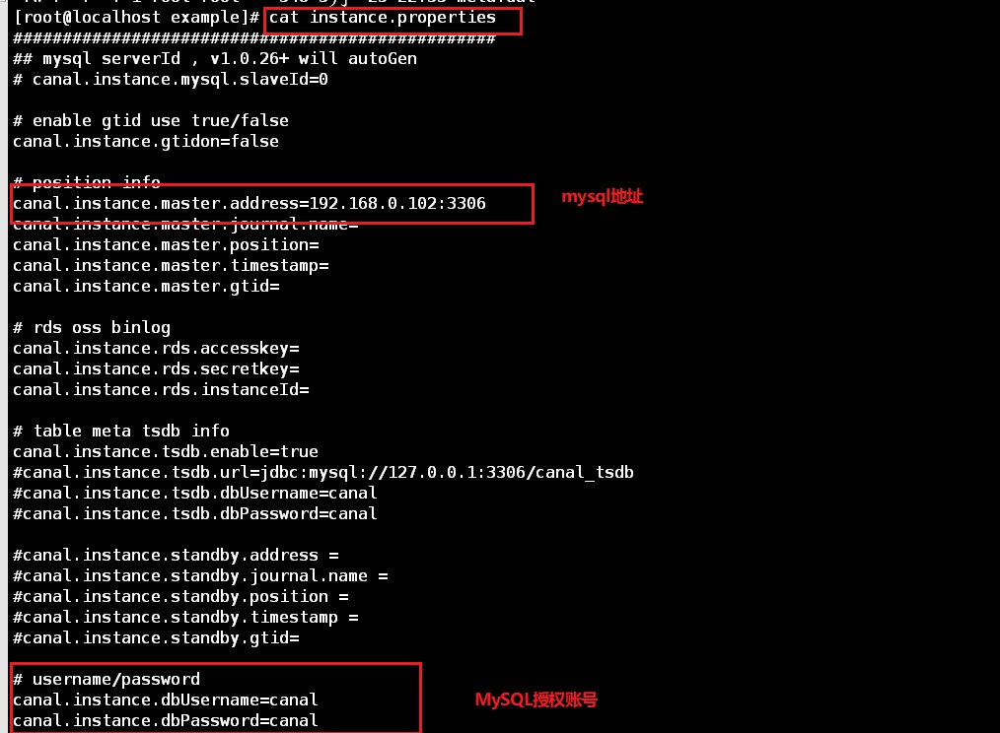
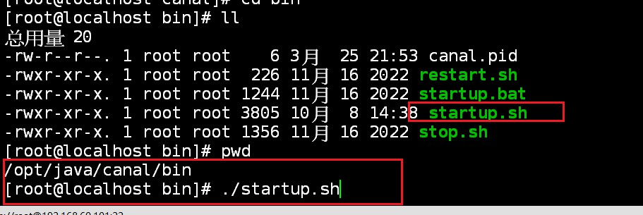
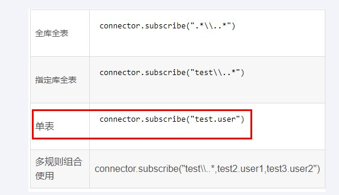

### 双写一致性背景



* 如果redis有数据，则需要和数据库数据保持一致
* redis无数据，则需要将mysql最新值回写进redis
* redis回写策略：
  * 同步直写策略
    * 写数据库后也同步写redis缓存，缓存和数据库中的数据⼀致；
    * 对于读写缓存来说，要想保证缓存和数据库中的数据⼀致，就要采⽤同步直写策略
  * 异步缓写策略
    * 正常业务运行中，mysql数据变动了，但是可以在业务上容许出现一定时间后才作用于redis，比如仓库、物流系统
    * 异常情况出现了，不得不将失败的动作重新修补，有可能需要借助kafka或者RabbitMQ等消息中间件，实现重试重写

* 双检加锁，解决并发场景下，大量请求直接打到数据库的情况，导致数据库被击穿

  > 多个线程同时去查询数据库的这条数据，那么我们可以在第一个查询数据的请求上使用一个 互斥锁来锁住它。
  >
  > 其他的线程走到这一步拿不到锁就等着，等第一个线程查询到了数据，然后做缓存。
  >
  > 后面的线程进来发现已经有缓存了，就直接走缓存。 

  ```java
  /**
       * 加强补充，避免突然key失效了，打爆mysql，做一下预防，尽量不出现击穿的情况。
       * @param id
       * @return
       */
      public User findUserById(Integer id)
      {
          User user = null;
          String key = CACHE_KEY_USER+id;
  
          //1 先从redis里面查询，如果有直接返回结果，如果没有再去查询mysql，
          // 第1次查询redis，加锁前
          user = (User) redisTemplate.opsForValue().get(key);
          if(user == null) {
              //2 大厂用，对于高QPS的优化，进来就先加锁，保证一个请求操作，让外面的redis等待一下，避免击穿mysql
              synchronized (UserService.class){
                  //第2次查询redis，加锁后
                  user = (User) redisTemplate.opsForValue().get(key);
                  //3 二次查redis还是null，可以去查mysql了(mysql默认有数据)
                  if (user == null) {
                      //4 查询mysql拿数据(mysql默认有数据)
                      user = userMapper.selectByPrimaryKey(id);
                      if (user == null) {
                          return null;
                      }else{
                          //5 mysql里面有数据的，需要回写redis，完成数据一致性的同步工作
                          redisTemplate.opsForValue().setIfAbsent(key,user,7L,TimeUnit.DAYS);
                      }
                  }
              }
          }
          return user;
      }
  ```

  

### 数据库和缓存一致性的几种更新策略

> 做到数据库和redis缓存的最终一致性
>
> 我们可以对存入缓存的数据设置过期时间，所有的**写操作以数据库为准**，对缓存操作只是尽最大努力即可。也就是说如果数据库写成功，缓存更新失败，那么只要到达过期时间，则后面的读请求自然会从数据库中读取新值然后回填缓存，达到一致性，切记，要以mysql的数据库写入库为准。

#### 先更新数据库，在更新缓存

* 异常情况：
  * 异常1：

> 1 先更新mysql的某商品的库存，当前商品的库存是100，更新为99个。
>
>  2 先更新mysql修改为99成功，然后更新redis。
>
>  3 此时假设异常出现，**更新redis失败了（主从复制时，redis宕机）**，这导致mysql里面的库存是99而redis里面的还是100
>
>  4 上述发生，会让数据库里面和缓存redis里面数据不一致，读到redis脏数据

* 异常2：

> 【先更新数据库，再更新缓存】，A、B两个线程发起调用
>
> **【正常逻辑】**
>
> 1 A update mysql 100
>
> 2 A update redis 100
>
> 3 B update mysql 80
>
> 4 B update redis 80
>
> =============================
>
> **【异常逻辑】多线程环境下，A、B两个线程有快有慢，有前有后有并行**
>
> 1 A update mysql 100
>
> 3 B update mysql 80
>
> 4 B update redis 80
>
> 2 A update redis 100
>
>  =============================
>
> 最终结果，mysql和redis数据不一致，o(╥﹏╥)o，
>
> mysql80,redis100

#### 先更新缓存在更新数据库

> 【先更新缓存，再更新数据库】，A、B两个线程发起调用
>
> **【正常逻辑】**
>
> 1 A update redis 100
>
> 2 A update mysql 100
>
> 3 B update redis 80
>
> 4 B update mysql 80
>
> ====================================
>
> **【异常逻辑】多线程环境下，A、B两个线程有快有慢有并行**
>
> A update redis  100
>
> B update redis  80
>
> B update mysql 80
>
> A update mysql 100
>
> ----mysql100,redis80

#### 先删除缓存，再更新数据库

##### 具体流程：

> （1）请求A进行写操作，删除redis缓存后，工作正在进行中，更新mysql......A还么有彻底更新完mysql，还没commit
>
> （2）请求B开工查询，查询redis发现缓存不存在(被A从redis中删除了)
>
> （3）请求B继续，去数据库查询得到了mysql中的旧值(A还没有更新完)
>
> （4）请求B将旧值写回redis缓存
>
> （5）请求A将新值写入mysql数据库 
>
> 上述情况就会导致不一致的情形出现。 

| 时间 | 线程A                                                      | 线程B                                                        | 出现的问题                                                   |
| ---- | ---------------------------------------------------------- | ------------------------------------------------------------ | ------------------------------------------------------------ |
| t1   | 请求A进行写操作，删除缓存成功后，工作正在mysql进行中...... |                                                              |                                                              |
| t2   |                                                            | 1 缓存中读取不到，立刻读mysql，由于A还没有对mysql更新完，读到的是旧值 2 还把从mysql读取的旧值，写回了redis | 1 A还没有更新完mysql，导致B读到了旧值 2 线程B遵守回写机制，把旧值写回redis，导致其它请求读取的还是旧值，A白干了。 |
| t3   | A更新完mysql数据库的值，over                               |                                                              | redis是被B写回的旧值，mysql是被A更新的新值。出现了，数据不一致问题。 |

| 先删除缓存，再更新数据库 | 如果数据库更新失败或超时或返回不及时，导致B线程请求访问缓存时发现redis里面没数据，缓存缺失，B再去读取mysql时，从数据库中读取到旧值，还写回redis，导致A白干了，o(╥﹏╥)o |
| ------------------------ | ------------------------------------------------------------ |

##### 这种方法的解决方案

采用延时双删



> 线程A sleep的时间，就需要大于线程B读取数据再写入缓存的时间。
>
> 这个时间怎么确定呢？
>
>  第一种方法：
>
> 在业务程序运行的时候，统计下线程读数据和写缓存的操作时间，自行评估自己的项目的读数据业务逻辑的耗时，
>
> 以此为基础来进行估算。然后写数据的休眠时间则在读数据业务逻辑的耗时基础上加百毫秒即可。
>
> 这么做的目的，就是确保读请求结束，写请求可以删除读请求造成的缓存脏数据。
>
> 这种策略会导致，程序吞吐量的降低，具体解决可，将二次删除作为一个异步操作
>
> 
>
>  第二种方法：
>
> 新启动一个后台监控程序，比如后面要讲解的WatchDog监控程序，会加时

#### 先更新数据库，再删除缓存

先更新数据库，再删除缓存

| 时间 | 线程A                  | 线程B                                   | 出现的问题                                         |
| ---- | ---------------------- | --------------------------------------- | -------------------------------------------------- |
| t1   | 更新数据库中的值...... |                                         |                                                    |
| t2   |                        | 缓存中立刻命中，此时B读取的是缓存旧值。 | A还没有来得及删除缓存的值，导致B缓存命中读到旧值。 |
| t3   | 更新缓存的数据，over   |                                         |                                                    |

| 先更新数据库，再删除缓存 | 假如缓存删除失败或者来不及，导致请求再次访问redis时缓存命中，读取到的是缓存旧值。 |
| ------------------------ | ------------------------------------------------------------ |

 

### 双写一致性落地案例

如果想，mysql有改动了立即同步给redis，需要怎么做？-----------**[canal](https://github.com/alibaba/canal/wiki/)**

> canal [kə'næl]，译意为水道/管道/沟渠，主要用途是基于 MySQL
>
> 数据库增量日志解析，提供增量数据订阅和消费
>
> 案例参考：[[ClientExample · alibaba/canal Wiki · GitHub](https://github.com/alibaba/canal/wiki/ClientExample)](https://github.com/alibaba/canal/wiki/ClientExample)

MySQL主从复制原理：



canal工作原理(**模仿MySQL主从复制原理**)：


#### canal安装的前置准备

> 确保mysql开启binlog日志

* 看是否开启binlog日志，默认关闭

  ```sql
  SHOW VARIABLES LIKE 'log_bin';
  ```

* 开启binlog日志，修改配置文件my.ini

  ```sql
  
  log-bin=mysql-bin #开启 binlog
  binlog-format=ROW #选择 ROW 模式
  server_id=1    #配置MySQL replaction需要定义，不要和canal的 slaveId重复
  ```

* 创建并授权canal连接mysql账号

  ```sql
  DROP USER IF EXISTS 'canal'@'%';
  CREATE USER 'canal'@'%' IDENTIFIED BY 'canal';  
  GRANT ALL PRIVILEGES ON *.* TO 'canal'@'%'  with grant option;  
  FLUSH PRIVILEGES;
  ```

#### canal安装

* 下载：[Release v1.1.7 · alibaba/canal · GitHub](https://github.com/alibaba/canal/releases/tag/canal-1.1.7)

* 解压

* 修改配置文件

  

* 启动

  

#### 案例代码

* sql脚本

  ```sql
  create DATABASE bigData;
  use bigData;
  CREATE TABLE `t_user` (
  
    `id` bigint(20) NOT NULL AUTO_INCREMENT,
  
    `userName` varchar(100) NOT NULL,
  
    PRIMARY KEY (`id`)
  
  ) ENGINE=InnoDB AUTO_INCREMENT=10 DEFAULT CHARSET=utf8mb4
  
  ```

* yaml文件

  ```properties
  server.port=5555
  
  # ========================alibaba.druid=====================
  spring.datasource.type=com.alibaba.druid.pool.DruidDataSource
  spring.datasource.driver-class-name=com.mysql.jdbc.Driver
  spring.datasource.url=jdbc:mysql://localhost:3306/bigdata?useUnicode=true&characterEncoding=utf-8&useSSL=false
  spring.datasource.username=root
  spring.datasource.password=123456
  spring.datasource.druid.test-while-idle=false
  ```

* 业务代码

  ```java
  package cn.hd.redisCanal;
  
  import com.alibaba.fastjson.JSONObject;
  import com.alibaba.otter.canal.client.CanalConnector;
  import com.alibaba.otter.canal.client.CanalConnectors;
  import com.alibaba.otter.canal.protocol.CanalEntry.*;
  import com.alibaba.otter.canal.protocol.Message;
  import org.springframework.data.redis.core.StringRedisTemplate;
  import org.springframework.stereotype.Component;
  
  import javax.annotation.Resource;
  import java.net.InetSocketAddress;
  import java.util.List;
  import java.util.UUID;
  import java.util.concurrent.TimeUnit;
  
  @Component
  public class RedisCanalClientExample {
  
      private static StringRedisTemplate stringRedisTemplate;
  
      @Resource
      public  void setStringRedisTemplate(StringRedisTemplate redisTemplate) {
          stringRedisTemplate = redisTemplate;
      }
  
      public static final Integer _60SECONDS = 60;
      public static final String REDIS_IP_ADDR = "192.168.60.101";
  
      private static void redisInsert(List<Column> columns) {
          JSONObject jsonObject = new JSONObject();
          for (Column column : columns) {
              System.out.println(column.getName() + " : " + column.getValue() + "    update=" + column.getUpdated());
              jsonObject.put(column.getName(), column.getValue());
          }
          if (columns.size() > 0) {
              stringRedisTemplate.opsForValue().set(columns.get(0).getValue(), jsonObject.toJSONString());
          }
      }
  
  
      private static void redisDelete(List<Column> columns) {
          JSONObject jsonObject = new JSONObject();
          for (Column column : columns) {
              jsonObject.put(column.getName(), column.getValue());
          }
          if (columns.size() > 0) {
              stringRedisTemplate.delete(columns.get(0).getValue());
          }
      }
  
      private static void redisUpdate(List<Column> columns) {
          JSONObject jsonObject = new JSONObject();
          for (Column column : columns) {
              System.out.println(column.getName() + " : " + column.getValue() + "    update=" + column.getUpdated());
              jsonObject.put(column.getName(), column.getValue());
          }
          if (columns.size() > 0) {
              stringRedisTemplate.opsForValue().set(columns.get(0).getValue(), jsonObject.toJSONString());
              System.out.println("---------update after: " + stringRedisTemplate.opsForValue().get(columns.get(0).getValue()));
          }
      }
  
      public static void printEntry(List<Entry> entrys) {
          for (Entry entry : entrys) {
              if (entry.getEntryType() == EntryType.TRANSACTIONBEGIN || entry.getEntryType() == EntryType.TRANSACTIONEND) {
                  continue;
              }
  
              RowChange rowChage = null;
              try {
                  //获取变更的row数据
                  rowChage = RowChange.parseFrom(entry.getStoreValue());
              } catch (Exception e) {
                  throw new RuntimeException("ERROR ## parser of eromanga-event has an error,data:" + entry.toString(), e);
              }
              //获取变动类型
              EventType eventType = rowChage.getEventType();
              System.out.println(String.format("================&gt; binlog[%s:%s] , name[%s,%s] , eventType : %s",
                      entry.getHeader().getLogfileName(), entry.getHeader().getLogfileOffset(),
                      entry.getHeader().getSchemaName(), entry.getHeader().getTableName(), eventType));
  
              for (RowData rowData : rowChage.getRowDatasList()) {
                  if (eventType == EventType.INSERT) {
                      redisInsert(rowData.getAfterColumnsList());
                  } else if (eventType == EventType.DELETE) {
                      redisDelete(rowData.getBeforeColumnsList());
                  } else {//EventType.UPDATE
                      redisUpdate(rowData.getAfterColumnsList());
                  }
              }
          }
      }
  
  
      public static void testCanal() {
          System.out.println("---------O(∩_∩)O哈哈~ initCanal() main方法-----------");
  
          //=================================
          // 创建链接canal服务端
          CanalConnector connector = CanalConnectors.newSingleConnector(new InetSocketAddress(REDIS_IP_ADDR,
                  11111), "example", "", "");
          int batchSize = 1000;
          //空闲空转计数器
          int emptyCount = 0;
          System.out.println("---------------------canal init OK，开始监听mysql变化------");
          try {
              connector.connect();
              //connector.subscribe(".*\\..*");
              connector.subscribe("bigdata.t_user");
              connector.rollback();
              int totalEmptyCount = 10 * _60SECONDS;
              while (emptyCount < totalEmptyCount) {
                  System.out.println("我是canal，每秒一次正在监听:" + UUID.randomUUID().toString());
                  Message message = connector.getWithoutAck(batchSize); // 获取指定数量的数据
                  long batchId = message.getId();
                  int size = message.getEntries().size();
                  if (batchId == -1 || size == 0) {
                      emptyCount++;
                      try {
                          TimeUnit.SECONDS.sleep(1);
                      } catch (InterruptedException e) {
                          e.printStackTrace();
                      }
                  } else {
                      //计数器重新置零
                      emptyCount = 0;
                      printEntry(message.getEntries());
                  }
                  connector.ack(batchId); // 提交确认
                  // connector.rollback(batchId); // 处理失败, 回滚数据
              }
              System.out.println("已经监听了" + totalEmptyCount + "秒，无任何消息，请重启重试......");
          } finally {
              connector.disconnect();
          }
      }
  }
  
  ```

  

* 主启动

  ```java
  package cn.hd.redisCanal;
  
  import org.springframework.boot.SpringApplication;
  import org.springframework.boot.autoconfigure.SpringBootApplication;
  
  @SpringBootApplication
  public class RedisCanalApplication {
      public static void main(String[] args) {
          SpringApplication.run(RedisCanalApplication.class,args);
          RedisCanalClientExample.testCanal();
      }
  }
  
  ```

  