### 复制

> 主从复制，主节点以写为主，从节点以读为主
>
> 当master数据变化的时候，自动将数据异步同步到从库

作用：

> 读写分离
>
> 容灾恢复
>
> 数据备份
>
> 水平扩容支持高并发

配置：

* 配置文件实现：
  * replicaof 192.168.117.129 6380 ：配置主节点地址和端口
  * masterauth 123456 ：配置主节点密码

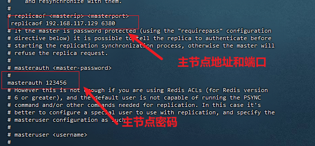

*  命令实现

  * slaveof 主库ip 端口  :命令配置所属的主库

  *  slaveof no one  :停止与其他数据库的同步，转为主数据库

    **注意：slaveof 每次重启之后，都需要重新配置**

常用命令：

```sh
 info replication #可以查看主从关系的复制关系和配置信息
```

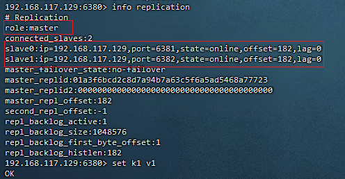

注意：

> 1. 配从库不配主库，也就是所有配置或是命令都是在从库操作
> 2. 实践中，主库只有一个，从库可能有多个的场景，为减轻主库同步数据给从从库的压力，可以采用链式配置（一个主库后面跟一个从库，从库后面再跟其他的从库），但始终有一个原则，从库只有读操作，没有写操作
> 3. 主机宕机，从机并不会变为主机

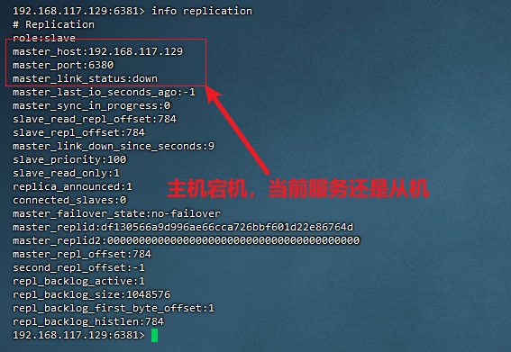

复制原理和流程：

> * slave启动，同步初请
>   * slave启动成功连接到master发送sync命令
>   * slave首次全新连接master,一次完全同步(全量复制)将被自动执行，slave自身原有数据会被master数据覆盖清除
> * 首次连接，全量复制
>   * master节点收到sync命令后会开始在后台保存快照(即RDB持久化，主从复制时会触发RDB),同时收集所有接收到的用于修改数据集命令缓存起来，master节点执行RDB持久化完后，master将rdb快照文件和所有缓存的命令发送到所有slave,以完成一次完全同步
>   * 而slave服务在接收到数据库文件数据后，将其存盘并加载到内存中，从而完成复制初始化
> * 心跳持续，保持通信： repl-ping-replica-period 10（master发出PING包的周期，默认是10秒，用于检查从机是否在线）
> * 进入平稳，增量复制
>   * Master继续将新的所有收集到的修改命令自动依次传给slave,完成同步
> * 从机下线，重连续传
>   * master会检查backlog里面的offset，master和slave都会保存一个复制的offset，还有一masterid，offset是保存在backlog中的。Master只会把已经复制的offset后面的数据复制给Slave，类似断点续传

缺点：

> * 所有的写操作都是先在Master上操作，然后同步更新到Slave上，从Master同步到Slave机器有一定的延迟，当系统很繁忙的时候，延迟问题会更加严重，Slave机器数量的增加也会使这个问题更加严重。
> * master节点挂了，不会有从节点上位，整个写操作就挂了

### 哨兵

> 巡查监控后台master主机是否故障，如果故障，则根据投票数，自动将某个从库转为主库，继续对外服务**（解决复制，主节点挂了，无法对外提供服务的问题）**

作用：

> * 主从监控：监控主从redis是否正常
> * 消息通知：哨兵可以将故障转移的结果发给客户端
> * 故障转移：主从切换
> * 配置中心：客户端可通过哨兵，获取当前redis服务主节点的地址

架构说明：

> 3个哨兵（哨兵一般是单数，避免投票结果不准确）
>
> 一主两从(前置准备：按照上面复制配置好主从架构，此处主要介绍哨兵的配置)

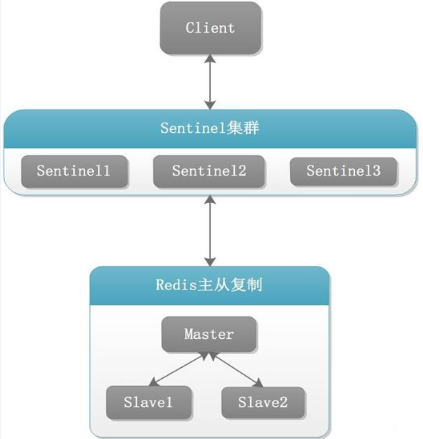

配置：

* 从redis之前的解压目录拷贝一份sentinel.conf文件到当前redis启动目录，例如：解压目录（/usr/local/soft/redis）------> 工作目录（usr/local/redis/conf）
* 修改内容如下：

```sh
bind 0.0.0.0  # 允许任何主机访问
daemonize yes # 后台运行
protected-mode no # 取消保护模式
port 26380 # 运行端口号， 默认26379
logfile "/usr/local/redis/logs/sentinel26380.log" # sentinel日志保存位置
pidfile /var/run/redis-sentinel26380.pid 
dir /redis # 工作目录
sentinel monitor myMaster 192.168.117.129 6380 2（quorum 投票数） # 要监控的主机名称 主机地址 主机的端口号 投票数（只有哨兵投票的数量达到这个数量才会认为，主机下线，去选举新的主机，也就是客观下线，单个哨兵的投票叫主观下线）
sentinel auth-pass mymaster 123456 # 主机的密码
```

* 复制三份分别为：sentinel26380.conf、sentinel26381.conf、sentinel26382.conf，**（tips，只有一台虚拟机，所有的哨兵和从机都在同一台虚拟机上。。。）**

启动：

```sh
redis-sentinel sentinel26382.conf --sentinel
```

注意：

> 在配置复制的主从架构时，需要把三台redis服务的密码配置成一样，并在配置文件里面配置：masterauth 
>
> * 原因：避免配置的主机下线后，作为从机去给哨兵选出的主键进行通信时，因为密码不同而不能连接
>
> 使用哨兵监控后，对于主从机的使用效果和复制时是一样的
>
> 区别在于：
>
> * 主机下线后，哨兵会根据某种算法，从其余的两台从机中选择一台，作为主机，对外提供服务
> * 而且即使之前下线的主机重新上线，也不会被重新识别为主机，而是作为新上位主机的从机而存在，原因：
>   * sentinel配置文件中配置的主机监控地址被修改为了，新上位的主机的地址和端口号
>   * 之前下线的主机redis.conf配置文件中添加了 新主机（**replicaof  新上位的主机地址 新上位的主机地址的端口**）的配置，而且新上位主机里面的**replicaof  配置被删除**
>
> 哨兵也可以监控多台主机

哨兵故障切换时的运行流程和选举原理：

> 1. 先判断主观下线：单个sentinel认为某个主机服务下线（有可能是接收不到订阅，之间的网络不通等等原因），就是说如果服务器在[sentinel down-after-milliseconds]给定的毫秒数之内（默认为30秒）没有回应PING命令或者返回一个错误消息， 那么这个Sentinel会主观的(单方面的)认为这个master不可以用了。
> 2. 判断客观下线：**quorum这个参数是进行客观下线的一个依据**，法定人数/法定票数。至少有quorum个sentinel认为这个master有故障才会对这个master进行下线以及故障转移。因为有的时候，某个sentinel节点可能因为自身网络原因导致无法连接master，而此时master并没有出现故障，所以这就需要多个sentinel都一致认为该master有问题，才可以进行下一步操作，这就保证了公平性和高可用。
> 3. 从三个（此次案例是三个）哨兵中选出一个领导者：当主节点被判断客观下线以后，各个哨兵节点会进行协商先选举出一个领导者哨兵节点(兵王) 并由该领导者节点，也即被选举出的兵王进行failover ((故障迁移)
>    * 从哨兵中选举出一个领导者，采用的算法为：Raft算法（基本思想是先到先得，即：在一轮选举中，哨兵A向B发送成为领导者的申请，如果B没有同意过其他哨兵，则会同意A成为领导者）
> 4. 由被选举出的哨兵，开始进行故障切换以及选出一个新的主机
>    * 选出新的主机的规则：
>      * redis.conf中，优先级slave-priority或者replica-priority最高的节点（数字越小，优先级越高）
>      * 复制偏移量offset最大的从节点（接收到之前主机，数据量最多的节点）
>      * 最小runId的从节点（ascii码值）
>    * 被选举出的哨兵进行的操作：
>      * 执行slaveof no one命令让选出来的从节点成为新的主节点，并通过slaveof命令让其他节点成为其从节点
>      * 将之前已下线的老master设置为新选出的新master的从节点，当老master重新上线后，它会成为新master的从节点

哨兵使用总结：

> * 哨兵节点的数量应为多个，哨兵本身应该集群，保证高可用
> * 哨兵节点的数量应该是奇数
> * 各个哨兵节点的配置应一致
> * 哨兵集群+主从复制，并不能保证数据零丢失

### 集群

> 提供在多个Redis节点间共享数据的程序集。
>
> redis集群可以有多个主节点
>
> 作用：
>
> * 集群自带哨兵的故障转移机制，内置高可用的支持，不再使用哨兵功能
> * 槽位（slot）负责分配到各个物理服务节点，由对应的集群来负责维护节点、插槽和数据之间的关系

集群算法（分片-槽位）

* 槽位：
  * redis集群没有使用一致性hash，而是引入**hash槽**
  * redis集群有**16384**个哈希槽，每个key通过**CRC16**校验后对16384取模，来决定放置哪个槽，集群中的每个节点负责一部分槽
* 分片：
  *  使用Redis集群时我们会将存储的数据分散到多台redis机器上，这称为分片。简言之，集群中的每个Redis实例都被认为是整个数据的一个分片

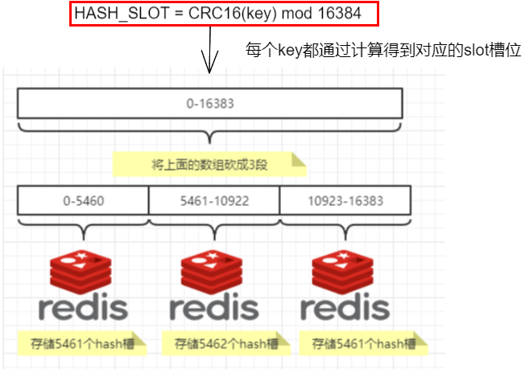

* 槽位映射算法：

  * 哈希取余分区：通过hash（key）/集群主节点数量，来确定key存储在哪台主机上

    * 缺点： 对于集群中主节点数量没有变化的情况下是没有问题的，但是一旦出现集群扩容（原来两台主机-变成三台）或是集群规模缩小（由原来的三台变成两台），原来的取模数就会发生变化，运算结果也会发生变化；某个redis宕机，会导致数据重新洗牌。

    

  * 一致性哈希算法分区：解决哈希取余算法，由于集群主机变化，导致数据重新映射的问题，使用自然取余的方法（取余数变为常数（2^32-1））

    * 一致性哈希环：

      * 节点和哈希环映射：将集群中各个IP节点映射到环上的某一个位置。
      * key的落健规则：首先计算key的hash值，hash(key)，将这个key使用相同的函数Hash计算出哈希值并确定此数据在环上的位置，**从此位置沿环顺时针“行走”**，第一台遇到的服务器就是其应该定位到的服务器，并将该键值对存储在该节点上。

      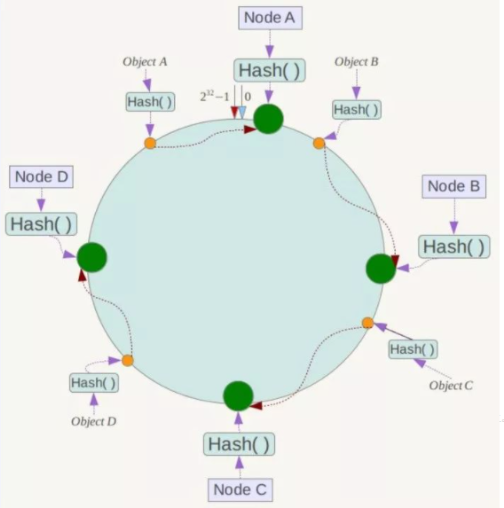

    * 缺点：会导致数据倾斜

  * 哈希槽分区：解决均匀分配的问题，在数据和节点之间又加入了一层，把这层称为哈希槽（slot），用于管理数据和节点之间的关系，现在就相当于节点上放的是槽，槽里放的是数据。

    * redis集群也是采用的此种方法


#### redis集群配置**(构建一个三主三从的集群)**

> 注意：此处是使用一台虚拟机，起六个redis实例

* 六个redis服务端口分别是：6381、6382、6383、6384、6385、6386

* 创建cluster文件夹：mkdir /opt/java/redis/cluster

* 创建配置文件：redisCluster.conf，此处以一个实例为例展示配置文件内容

  ```sh
  bind 0.0.0.0
  daemonize yes
  protected-mode no
  port 6383
  logfile "/opt/java/redis/cluster/cluster6383.log"
  pidfile /opt/java/redis/cluster6383.pid
  dir /opt/java/redis/cluster
  dbfilename dump6383.rdb
  appendonly yes
  appendfilename "appendonly6383.aof"
  requirepass 111111
  masterauth 111111
  
  cluster-enabled yes
  cluster-config-file nodes-6383.conf
  cluster-node-timeout 5000
  ```

* 配置主从关系**（--cluster-replicas 1 表示为每个master创建一个slave节点）**

  ```sh
  redis-cli -a 111111 --cluster create --cluster-replicas 1 192.168.60.101:6381 192.168.60.101:6382 192.168.60.101:6383 192.168.60.101:6384 192.168.60.101:6385 192.168.60.101:6386
  ```

  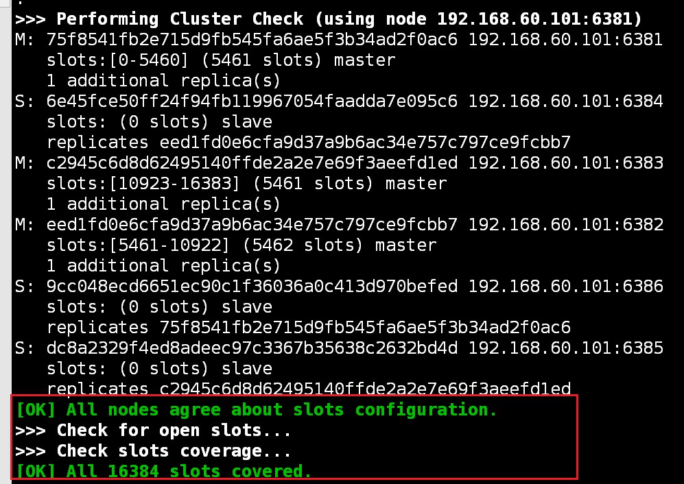

#### 集群状态查看命令

以其中一台redis实例为例，进行连接：**redis-cli -a 111111 -p 6381**

* info replication

  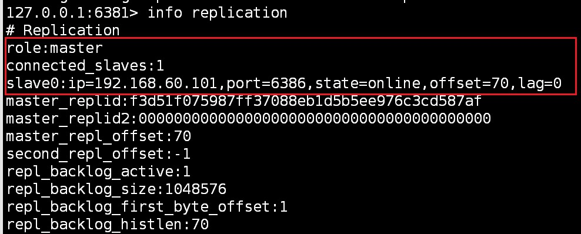

* cluster info

  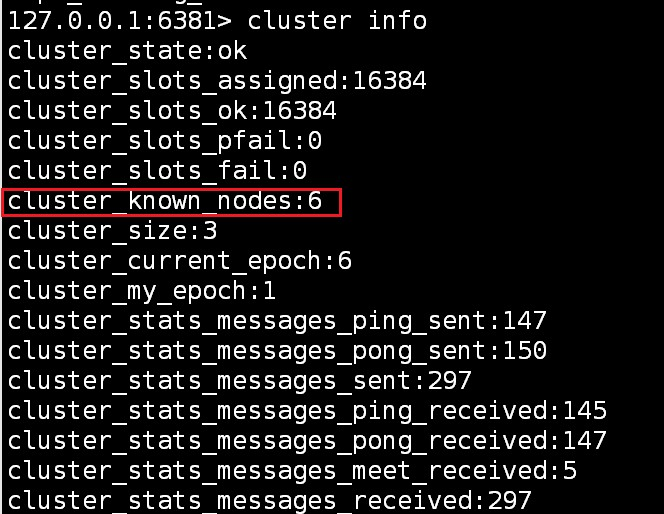

* cluster nodes

  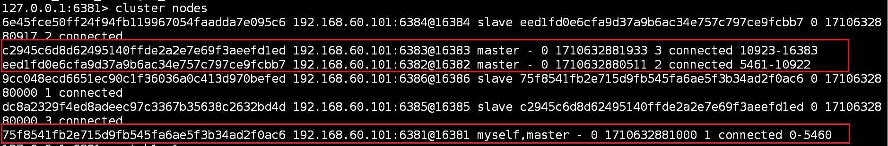

#### 集群读写

以其中一台redis实例为例，进行连接：**redis-cli -a 111111 -p 6381**

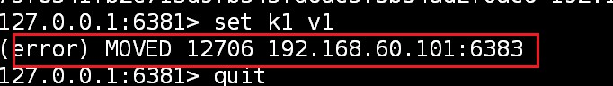

> 因为每个redis实例都有自己的槽位区间，需要路由到位
>
> 推荐使用：redis-cli -a 111111 -p 6381 **-c** 进行连接,**-c 参数用于防止路由失效**

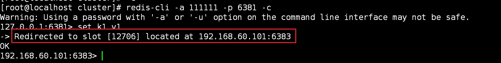

* 查看某个key的对应槽位值：

  ```sh
  cluster keyslot k1
  ```

#### 主从容错迁移

* 集群中的某一主节点掉线后，会让主节点对应的从机上位变成主节点，即使主节点重新恢复，也是成为新上位主节点的从节点存在**（模仿哨兵）**
* redis集群不保证数据的强一致性，一定条件下，会丢掉一些被系统收到的写入请求命令
* 从机变主机：**cluster failover**

#### 主从扩容

> 根据上面的步骤新建两个端口为6387、6388的实例，并启动，此时两个实例都是作为主节点而存在的

* 将新增的6387实例添加进集群

  ```sh
  redis-cli -a 111111  --cluster add-node 192.168.60.101:6387 192.168.60.101:6381
  
  将新增的6387作为master节点加入原有集群
  redis-cli -a 密码 --cluster add-node 自己实际IP地址:6387 自己实际IP地址:6381
  6387 就是将要作为master新增节点
  6381 就是原来集群节点里面的领路人，相当于6387拜拜6381的码头从而找到组织加入集群
  redis-cli -a 111111  --cluster add-node 192.168.111.174:6387 192.168.111.175:6381
  ```

* 检查集群情况

  ```sh
  redis-cli -a 111111 --cluster check 192.168.111.175:6381
  ```

  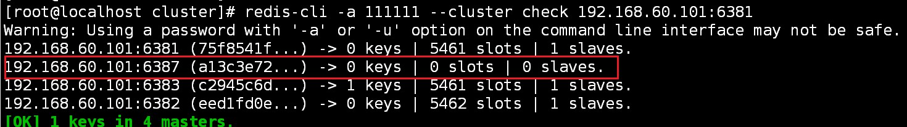

* 重新分派槽位

  ```sh
  redis-cli -a 111111 --cluster reshard 192.168.60.101:6381
  # 为啥是4096个，16384/4(4个主机)
  ```

  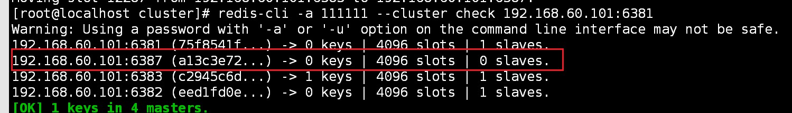

* 为6387节点分派从节点

  ```sh
  redis-cli -a 111111 --cluster add-node 192.168.60.101:6388 192.168.60.101:6387 --cluster-slave --cluster-master-id a13c3e72930ac3d69c2661fa248b6e3a1a32fa12(# 此处id为要给谁分配从节点)
  ```

  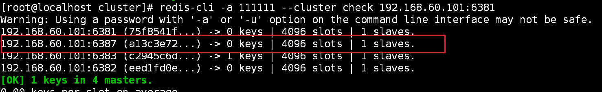

#### 主从缩容

> 将新添加的6387和6388进行移除

* 先将从节点6388移除

  ```sh
  redis-cli -a 111111 --cluster del-node 192.168.60.101:6388 4ea1bfa97c0264d8ddc809cbfe3909a86e960378
  # 命令：redis-cli -a 密码 --cluster del-node ip:从机端口 从机6388节点ID
  ```

  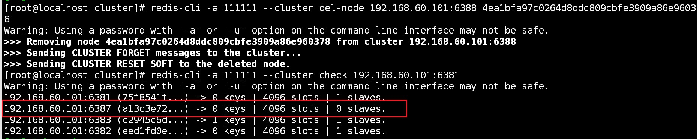

* 槽位重新分配

  ```sh
  redis-cli -a 111111 --cluster reshard 192.168.60.101:6381
  ```

* 将主节点6387移除

```sh
redis-cli -a 111111 --cluster del-node 192.168.60.101:6387 4ea1bfa97c0264d8ddc809cbfe3909a86e960378
# 命令：redis-cli -a 密码 --cluster del-node ip:从机端口 从机6387节点ID
```

#### 总结

* redis集群1638个槽位，每个key通过CRC16校验后，对16384取模决定放哪个槽，集群中的每个节点负责一部分槽

* 常用命令：

  * cluster-require-full-coverage
    * 默认YES，现在集群架构是3主3从的redis cluster由3个master平分16384个slot，每个master的小集群负责1/3的slot，对应一部分数据。cluster-require-full-coverage： 默认值 yes , 即需要集群完整性，方可对外提供服务 通常情况，如果这3个小集群中，任何一个（1主1从）挂了，你这个集群对外可提供的数据只有2/3了， 整个集群是不完整的， redis 默认在这种情况下，是不会对外提供服务的。
    * 如果你的诉求是，集群不完整的话也需要对外提供服务，需要将该参数设置为no ，这样的话你挂了的那个小集群是不行了，但是其他的小集群仍然可以对外提供服务。

  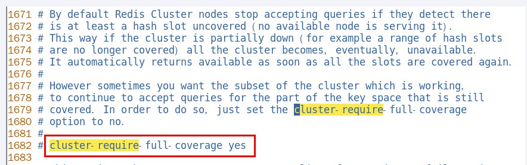

  * cluster countkeysinslot 33 检查槽位有没有被占用

    > 1：占用，0：未占用

  * cluster keyslot 键名 

    > 该键应该在哪个槽位上

### spring boot 集成redis

#### 单机

* 依赖引入

  ```xml
  <?xml version="1.0" encoding="UTF-8"?>
  <project xmlns="http://maven.apache.org/POM/4.0.0"
           xmlns:xsi="http://www.w3.org/2001/XMLSchema-instance"
           xsi:schemaLocation="http://maven.apache.org/POM/4.0.0 http://maven.apache.org/xsd/maven-4.0.0.xsd">
      <modelVersion>4.0.0</modelVersion>
  
      <groupId>cn.hd.redis</groupId>
      <artifactId>redis</artifactId>
      <version>1.0-SNAPSHOT</version>
  
      <parent>
          <groupId>org.springframework.boot</groupId>
          <artifactId>spring-boot-starter-parent</artifactId>
          <version>2.6.10</version>
          <relativePath/>
      </parent>
  
      <properties>
          <project.build.sourceEncoding>UTF-8</project.build.sourceEncoding>
          <maven.compiler.source>1.8</maven.compiler.source>
          <maven.compiler.target>1.8</maven.compiler.target>
      </properties>
  
  
      <dependencies>
          <!--SpringBoot通用依赖模块-->
          <dependency>
              <groupId>org.springframework.boot</groupId>
              <artifactId>spring-boot-starter-web</artifactId>
          </dependency>
          <!--SpringBoot与Redis整合依赖-->
          <dependency>
              <groupId>org.springframework.boot</groupId>
              <artifactId>spring-boot-starter-data-redis</artifactId>
          </dependency>
          <!--swagger2-->
          <dependency>
              <groupId>io.springfox</groupId>
              <artifactId>springfox-swagger2</artifactId>
              <version>2.9.2</version>
          </dependency>
          <dependency>
              <groupId>io.springfox</groupId>
              <artifactId>springfox-swagger-ui</artifactId>
              <version>2.9.2</version>
          </dependency>
      </dependencies>
  
      <build>
          <plugins>
              <plugin>
                  <groupId>org.springframework.boot</groupId>
                  <artifactId>spring-boot-maven-plugin</artifactId>
              </plugin>
          </plugins>
      </build>
  
  </project>
  ```

* 配置文件

  ```properties
  server.port=8081
  
  spring.application.name=redis
  
  # ========================logging=====================
  logging.level.root=info
  logging.level.com.atguigu.redis7=info
  logging.pattern.console=%d{yyyy-MM-dd HH:mm:ss.SSS} [%thread] %-5level %logger- %msg%n 
  
  # ========================swagger=====================
  spring.swagger2.enabled=true
  #在springboot2.6.X结合swagger2.9.X会提示documentationPluginsBootstrapper空指针异常，
  #原因是在springboot2.6.X中将SpringMVC默认路径匹配策略从AntPathMatcher更改为PathPatternParser，
  # 导致出错，解决办法是matching-strategy切换回之前ant_path_matcher
  spring.mvc.pathmatch.matching-strategy=ant_path_matcher
  
  # ========================redis单机=====================
  spring.redis.database=0
  # 修改为自己真实IP
  spring.redis.host=192.168.60.101
  spring.redis.port=6379
  spring.redis.password=123456
  spring.redis.lettuce.pool.max-active=8
  spring.redis.lettuce.pool.max-wait=-1ms
  spring.redis.lettuce.pool.max-idle=8
  spring.redis.lettuce.pool.min-idle=0
  ```

* 配置类

  ```java
  package cn.hd.redis.config;
  import org.springframework.context.annotation.Bean;
  import org.springframework.context.annotation.Configuration;
  import org.springframework.data.redis.connection.lettuce.LettuceConnectionFactory;
  import org.springframework.data.redis.core.RedisTemplate;
  import org.springframework.data.redis.serializer.GenericJackson2JsonRedisSerializer;
  import org.springframework.data.redis.serializer.StringRedisSerializer;
  
  /**
  * redis配置类
   */
  @Configuration
  public class RedisConfig
  {
      /**
       * redis序列化的工具配置类，下面这个请一定开启配置
       * 127.0.0.1:6379> keys *
       * 1) "ord:102"  序列化过
       * 2) "\xac\xed\x00\x05t\x00\aord:102"   原生，没有序列化过
       * this.redisTemplate.opsForValue(); //提供了操作string类型的所有方法
       * this.redisTemplate.opsForList(); // 提供了操作list类型的所有方法
       * this.redisTemplate.opsForSet(); //提供了操作set的所有方法
       * this.redisTemplate.opsForHash(); //提供了操作hash表的所有方法
       * this.redisTemplate.opsForZSet(); //提供了操作zset的所有方法
       * @param lettuceConnectionFactory
       * @return
       */
      @Bean
      public RedisTemplate<String, Object> redisTemplate(LettuceConnectionFactory lettuceConnectionFactory)
      {
          RedisTemplate<String,Object> redisTemplate = new RedisTemplate<>();
  
          redisTemplate.setConnectionFactory(lettuceConnectionFactory);
          //设置key序列化方式string
          redisTemplate.setKeySerializer(new StringRedisSerializer());
          //设置value的序列化方式json，使用GenericJackson2JsonRedisSerializer替换默认序列化
          redisTemplate.setValueSerializer(new GenericJackson2JsonRedisSerializer());
  
          redisTemplate.setHashKeySerializer(new StringRedisSerializer());
          redisTemplate.setHashValueSerializer(new GenericJackson2JsonRedisSerializer());
  
          redisTemplate.afterPropertiesSet();
  
          return redisTemplate;
      }
  }
  ```

  

* 测试类

  ```java
  package cn.hd.redis.service;
  
  import org.slf4j.Logger;
  import org.slf4j.LoggerFactory;
  import org.springframework.data.redis.core.RedisTemplate;
  import org.springframework.stereotype.Service;
  
  import javax.annotation.Resource;
  import java.util.UUID;
  import java.util.concurrent.ThreadLocalRandom;
  
  @Service
  public class OrderService {
  
      private static Logger log = LoggerFactory.getLogger(OrderService.class);
      public static final String ORDER_KEY = "order:";
  
      @Resource
      private RedisTemplate redisTemplate;
  
      public void addOrder()
      {
          int keyId = ThreadLocalRandom.current().nextInt(1000)+1;
          String orderNo = UUID.randomUUID().toString();
          redisTemplate.opsForValue().set(ORDER_KEY+keyId,"京东订单"+ orderNo);
          log.info("=====>编号"+keyId+"的订单流水生成:{}",orderNo);
      }
  
      public String getOrderById(String id)
      {
          return (String)redisTemplate.opsForValue().get(ORDER_KEY + id);
      }
  }
  ```

#### 集群

集群，和单机的区别在于配置文件：

```properties
server.port=8081

spring.application.name=redis

# ========================logging=====================
logging.level.root=info
logging.level.com.atguigu.redis7=info
logging.pattern.console=%d{yyyy-MM-dd HH:mm:ss.SSS} [%thread] %-5level %logger- %msg%n 

# ========================swagger=====================
spring.swagger2.enabled=true
#在springboot2.6.X结合swagger2.9.X会提示documentationPluginsBootstrapper空指针异常，
#原因是在springboot2.6.X中将SpringMVC默认路径匹配策略从AntPathMatcher更改为PathPatternParser，
# 导致出错，解决办法是matching-strategy切换回之前ant_path_matcher
spring.mvc.pathmatch.matching-strategy=ant_path_matcher

# ========================redis单机=====================
#spring.redis.database=0
## 修改为自己真实IP
#spring.redis.host=192.168.60.101
#spring.redis.port=6379
#spring.redis.password=123456
#spring.redis.lettuce.pool.max-active=8
#spring.redis.lettuce.pool.max-wait=-1ms
#spring.redis.lettuce.pool.max-idle=8
#spring.redis.lettuce.pool.min-idle=0


#redis集群
spring.redis.password=111111
# 获取失败 最大重定向次数
spring.redis.cluster.max-redirects=3
spring.redis.lettuce.pool.max-active=8
spring.redis.lettuce.pool.max-wait=-1ms
spring.redis.lettuce.pool.max-idle=8
spring.redis.lettuce.pool.min-idle=0
#支持集群拓扑动态感应刷新,自适应拓扑刷新是否使用所有可用的更新，默认false关闭
spring.redis.lettuce.cluster.refresh.adaptive=true
#定时刷新
spring.redis.lettuce.cluster.refresh.period=2000
spring.redis.cluster.nodes=192.168.60.101:6381,192.168.60.101:6382,192.168.60.101:6383,192.168.60.101:6384,192.168.60.101:6385,192.168.60.101:6386
```

