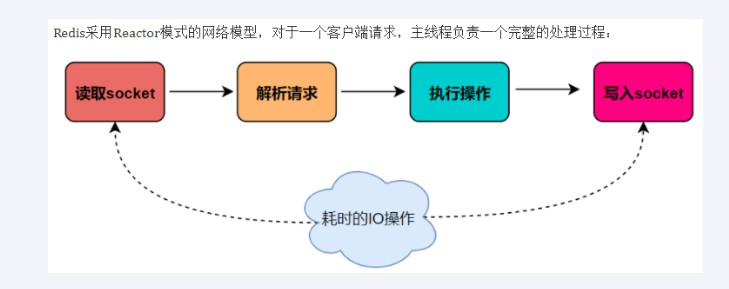
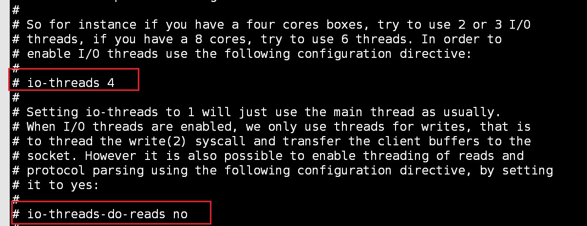
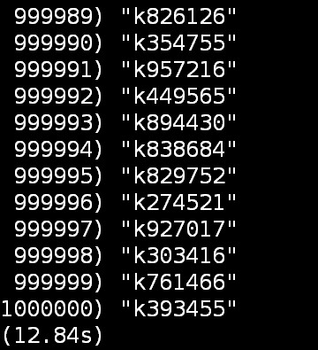
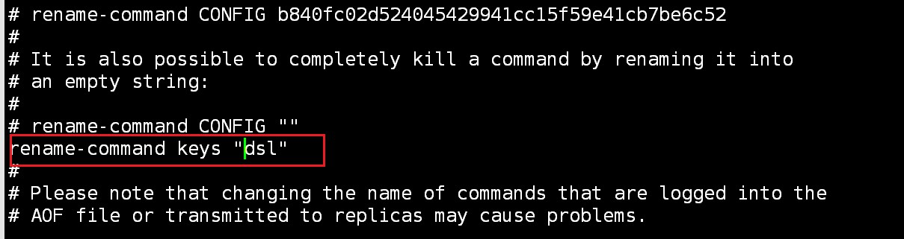
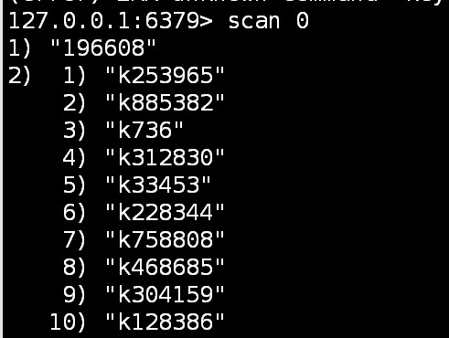
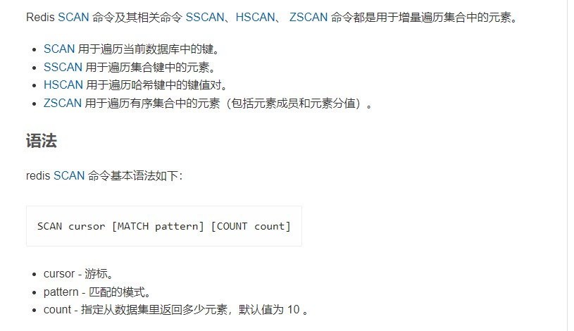
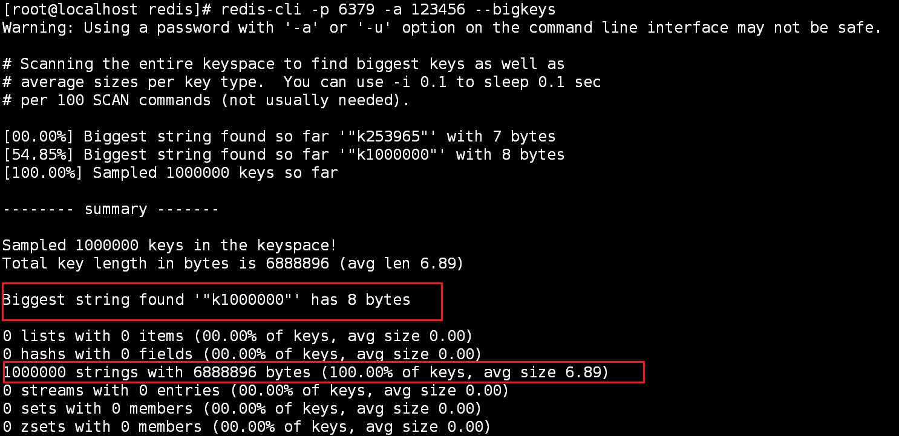
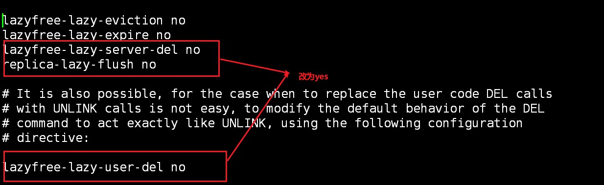

## redis多线程和bigKey的问题

### redis是单线程还是多线程？

> 1. 不限定版本的说，redis是单线程还是多线程，是不严谨的
> 2. 版本3.X之前甚至更早的版本，redis是单线程
> 3. 版本4.X，严格意义上来说，不是单线程，而是负责处理客户端请求的线程是单线程，但是开始加了点多线程的东西**(异步删除)。**
> 4. 版本6.X之后，开始使用多线程来解决问题

### 怎么看待redis的多线程？

> redis的单线程（处理redis客户端连接和读写操作）：
>
> * 主要是指Redis的网络IO和键值对读写是由一个线程来完成的，Redis在处理客户端的请求时包括获取 (socket 读)、解析、执行、内容返回 (socket 写) 等都由一个顺序串行的主线程处理，这就是所谓的“单线程”。这也是Redis对外提供键值存储服务的主要流程。
>
> 
>
> redis的多线程：
>
> * Redis的其他功能，比如持久化RDB、AOF、异步删除、集群数据同步等等，其实是由额外的线程执行的。
>
>   Redis命令工作线程是单线程的，但是，整个Redis来说，是多线程的；

### redis单线程

#### 在redis单线程模型时，为啥也这么快？

* 基于内存操作：redis的所有数据都是在内存中，运算也是内存级别的
* 数据结构简单：简单的数据结构，使其查找和操作的时间大部分复杂度都是O（1）
* 多路复用和非阻塞I/O：Redis使用 I/O多路复用功能来监听多个 socket连接客户端，这样就可以使用一个线程连接来处理多个请求，减少线程切换带来的开销，同时也避免了 I/O 阻塞操作
* 避免上下文的切换：因为是单线程模型，因此就避免了不必要的上下文切换和多线程竞争，这就省去了多线程切换带来的时间和性能上的消耗，而且单线程不会导致死锁问题的发生

#### 之前一直采用单线程的原因

> * 单线程的redis开发和维护比较简单
> * 即使使用单线程模型也并发的处理多客户端的请求，主要使用的是IO多路复用和非阻塞IO；
> * redis基于内存操作，因此它的瓶颈，不在CPU，而是机器的内存和网络带宽
>
> * 既然 CPU 不是瓶颈，那么自然就采用单线程的解决方案了，况且使用多线程比较麻烦。但是在 Redis 4.0 中开始支持多线程了，例如后台删除、备份等功能。

#### 单线程的烦恼

> * 举例： 
>
>   正常情况下使用 del 指令可以很快的删除数据，而当被删除的 key 是一个非常大的对象时，例如时包含了成千上万个元素的 hash 集合时，那么 del 指令就会造成 Redis 主线程卡顿。
>
>   这就是redis3.x单线程时代最经典的故障，大key删除的头疼问题，
>
>   由于redis是单线程的，del bigKey .....
>
>   等待很久这个线程才会释放，类似加了一个synchronized锁，你可以想象高并发下，程序堵成什么样子？
>
> * 解决：
>   版本4.X之后引入引入**多线程（狭义上的多线程）**来实现数据的异步惰性删除功能
>   * unlink key
>   * flushdb async
>   * flushall async

### redis6.X和redis7.X的多线程

> Redis的**多IO线程**只是用来处理网络请求的，对于读写操作命令Redis仍然使用单线程来处理

* I/O多路复用：
  也就是说一个或一组线程处理多个TCP连接,使用单进程就能够实现同时处理多个客户端的连接，无需创建或者维护过多的进程/线程

* **对于之前单线程的redis，虽然也有I/O多路复用，但也只是一个I/O线程去处理客户端连接，而加入多线程支持后，是由多个I/O线程处理客户端的连接的**

* 多线程的开启**(默认是关闭的)**

  

  * io-thread-do-reads配置项为yes，表示启动多线程。
  * 设置线程个数。关于线程数的设置，官方的建议是如果为 4 核的 CPU，建议线程数设置为 2 或 3，如果为 8 核 CPU 建议线程数设置为 6，线程数一定要小于机器核数，线程数并不是越大越好。

### redis bigKey案例

前置准备：

> * 生成100W条redis批量设置kv的语句(key=kn,value=vn)写入到/tmp目录下的redisTest.txt文件中
>
>   ```sh
>   for((i=1;i<=100*10000;i++)); do echo "set k$i v$i" >> /tmp/redisTest.txt ;done;
>   ```
>
> * 使用redis管道命令，将数据，放到redis中
>
>   ```sh
>   cat /tmp/redisTest.txt | redis-cli  -p 6379 -a 123456 --pipe
>   ```

#### 限制redis中危险命令的使用

危险命令：keys * /flushdb /flushall 

数据量大时，keys遍历时间长，会出现网络卡顿



* 重命名redis命令：
  * 若想禁用某一命令，则可将命令重命名为空



* keys禁用或是改名之后，redis中数据的遍历：可使用**scan命令**，具体可参考：https://redis.com.cn/commands/scan.html

  * 返回一个包含两个元素的数组， 第一个元素是用于进行下一次遍历的新游标， 而第二个元素则是一个数组， 这个数组中包含了所有被遍历的元素。当 SCAN命令的游标参数被设置为 `0` 时， 服务器将开始一次新的遍历，而当服务器向用户返回值为 `0` 的游标时， 表示遍历已结束。例如：

    



#### bigKey案例

* 多大key算大？**根据阿里云redis开发规范**

  * string是value，最大512MB但是≥10KB就是bigkey
  * list、hash、set和zset，个数超过5000就是bigkey

* bigkey的危害：

  * 内存不均，集群迁移困难
  * 超时删除，大key删除
  * 网络流量阻塞

* 如何发现bigKey

  * redis-cli -p 6379 -a 123456 --bigkeys（--bigKeys参数）
    * 给出每种数据结构Top 1 bigkey，同时给出每种数据类型的键值个数+平均大小

  

  * memory usage:计算每个键值的字节数,官网参考：https://redis.io/commands/memory-usage/

    

* 如何删除bigKey
  * string类型，则直接用del，或是unlink
  * 其他数据类型可参考：https://developer.aliyun.com/article/1009125#slide-23（基本思想，是先遍历指定区间，再删除）

* redis删除配置优化：

  