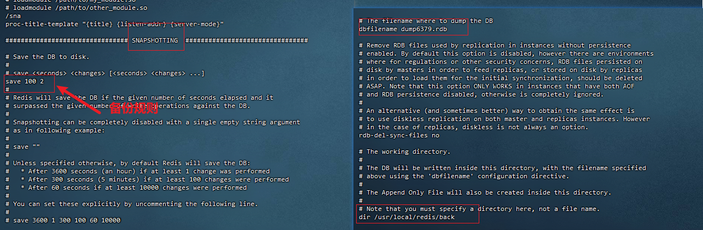
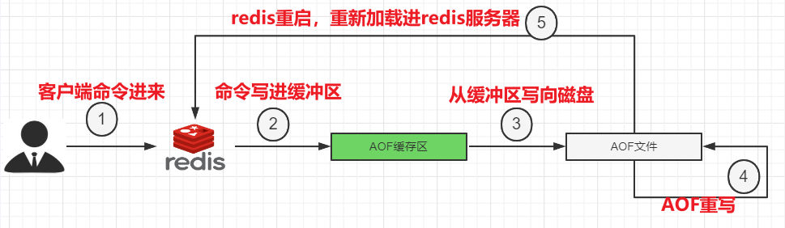
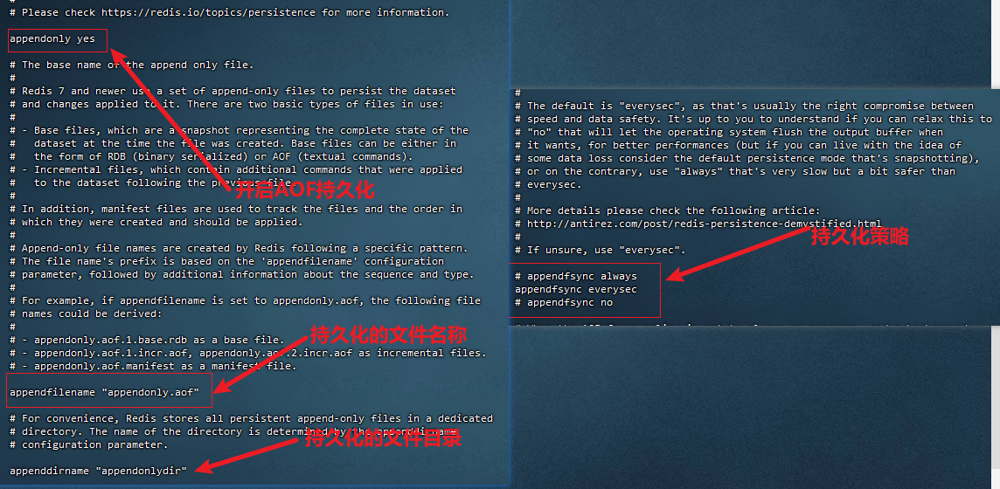
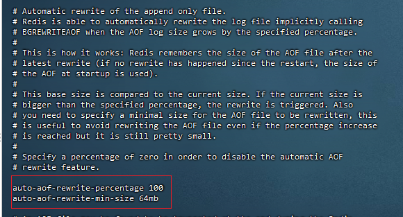
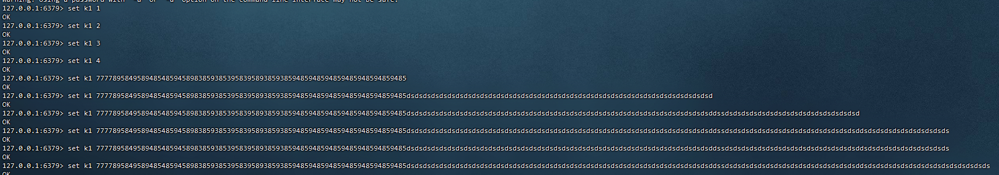
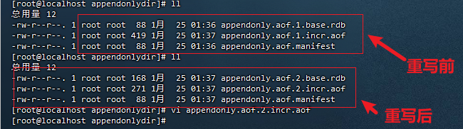
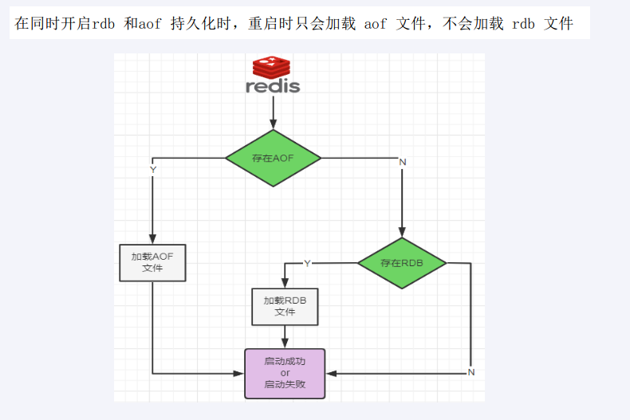

> redis 持久化策略：RDB和AOF

### RDB

> RDB持久化触发分为：自动触发和手动触发
#### 自动触发
> 在指定时间间隔内，redis服务执行指定次数的写操作，会自动触发一次持久化操作。
> 满足限定时间范围内key的变化数量达到指定数量即进行持久化

1. 配置：

   * save参数，配置持久化策略，如果想要禁用RDB持久化，不配置save即可

     > redis6.2之前的配置：
     >
     > * save 900 1   15分钟内改变了一次，触发持久化 策略
     > *  save 300 10  5分钟内改变了10词，触发持久化策略
     > * save 60 10000 1分钟内触发1万次，触发持久化策略
     >
     > redis7之后的配置：
     >
     > * save 3600 1 300 100 60 10000持久化路径（dir）：配置redis RDB持久化文件所在目录，默认是./，也就是redis 的启动目录

   * 持久化路径（dir）：配置redis RDB持久化文件所在目录，默认是./，也就是redis 的启动目录

   * 持久化文件名称（dbfilename）：配置redis RDB持久化数据存储的文件名称

2. 注意：

   > 目前rdb持久化文件，是放在redis 的启动目录，然而在下次启动redis时，要想加载rdb持久化文件，需要切换到上次启动的目录进行启动，或者将备份的rdb文件，拷贝到当前的启动目录。

3. 持久化文件修复：

   > 可使用redis安装目录/bin下的 redis-check-aof工具进行修复

4. 完整示例：

   

#### 手动触发

> bgsave和save进行手动触发数据持久化，两者的区别在于bgsave是异步进行数据持久化。

### AOF

#### 持久化

> 采用操作日志来记录进行每一次写操作，每次redis服务启动时，都会重新执行一遍操作日志中的指令。
>
> redis默认不开启AOF功能。
>
> AOF保存的是".aof"结尾的日志文件

1. 配置：

   > * 开启appendonly设置为yes，默认为no
   >
   > * AOF保存文件位置：
   >
   >   * redis6之前：和RDB一样通过dir配置备份文件保存路径
   >
   >   * redis7之后：添加了appenddirname配置，所以AOF备份文件保存路径最终变为：dir+appenddirname
   >
   > * AOF回写策略
   >
   >   *  appendfsync always：同步回写，每个命令执行完，同步回写
   >   * appendfsync everysec：每秒回写一次，最多丢失一秒数据，默认也是这种方式
   >   * appendfsync no：操作系统控制的回写。每次命令执行完，先把日志写到AOF缓冲区，由操作系统决定何时回写到磁盘
   >
   > * 持久化文件说明：
   >
   >   在配置好以上内容后，会在**dir+appenddirname**文件夹下有三个文件：
   >
   >   *  appendonly.aof.1.base.rdb：基本文件
   >   *  appendonly.aof.1.incr.aof：增量文件
   >   *  appendonly.aof.manifest：清单文件

2. AOF持久化流程

   

   *  命令到达Redis Server 以后并不是直接写入AOF文件，会将其这些命令先放入AOF缓存中进行保存。这里的AOF缓冲区实际上是内存中的一片区域，存在的目的是当这些命令达到一定量以后再写入磁盘，避免频繁的磁盘IO操作。
   * AOF缓冲会根据AOF缓冲区**同步文件的三种写回策略**将命令写入磁盘上的AOF文件。
   * 随着写入AOF内容的增加为避免文件膨胀，会根据规则进行命令的合并(又称***AOF重写)\***，从而起到AOF文件压缩的目的。
   * 当Redis Server 服务器重启的时候会从AOF文件载入数据。

3. 完整示例:

   

4. 修复备份文件

   * redis的bin目录下的redis-check-aof --fix 修复AOF备份文件

#### AOF重写

> 启动AOF文件的内容压缩，只保留可以恢复数据的最小指令集的操作
>
> （随着备份文件越来越多，AOF在满足一定条件后，将备份文件进行压缩，只保留可以恢复数据的最小指令集）

1. 自动触发

   * 配置：

     * auto-aof-rewrite-percentage 100 :根据上次重写后的aof大小，判断当前aof大小是不是增长了1倍

     * auto-aof-rewrite-min-size 64mb:重写时满足的文件大小

       **注意：两个条件同时满足才会触发**

     

   * 效果：

     > 虽然k1被set了许多次，但是，最终备份的是最后一次修改

     

​														

2. 手动触发

   > 客户端向服务器发送bgrewriteaof命令

3. 重写原理：
   * 在重写开始前，redis会创建一个“重写子进程”，这个子进程会读取现有的AOF文件，并将其包含的指令进行分析压缩并写入到一个临时文件中。
   * 与此同时，主进程会将新接收到的写指令一边累积到内存缓冲区中，一边继续写入到原有的AOF文件中，这样做是保证原有的AOF文件的可用性，避免在重写过程中出现意外。
   * 当“重写子进程”完成重写工作后，它会给父进程发一个信号，父进程收到信号后就会将内存中缓存的写指令追加到新AOF文件中
   * 当追加结束后，redis就会用新AOF文件来代替旧AOF文件，之后再有新的写指令，就都会追加到新的AOF文件中
   * 重写aof文件的操作，并没有读取旧的aof文件，而是将整个内存中的数据库内容用命令的方式重写了一个新的aof文件，这点和快照有点类似

### RDB和AOF

> RDB和AOF可共存，具体流程如下：

对比：

> RDB：按照业务定时备份，文件在内存中加载速度快，但会丢失从当前服务故障到上次备份期间的数据
>
> AOF：更好的保证数据不丢失，相同的数据集而言，AOF文件要大，恢复会比较慢，同步效率也会比较慢
