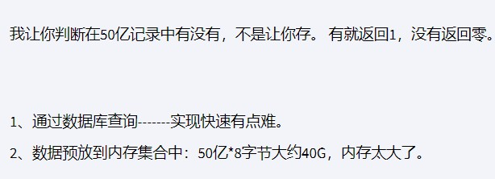
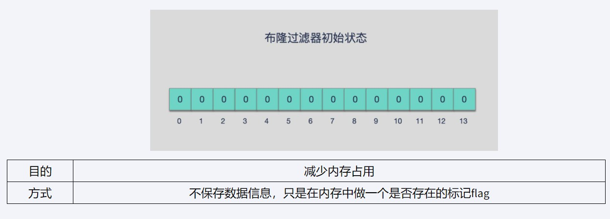
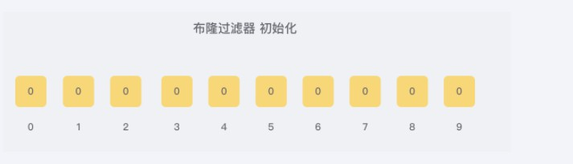
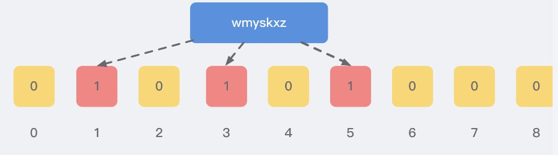
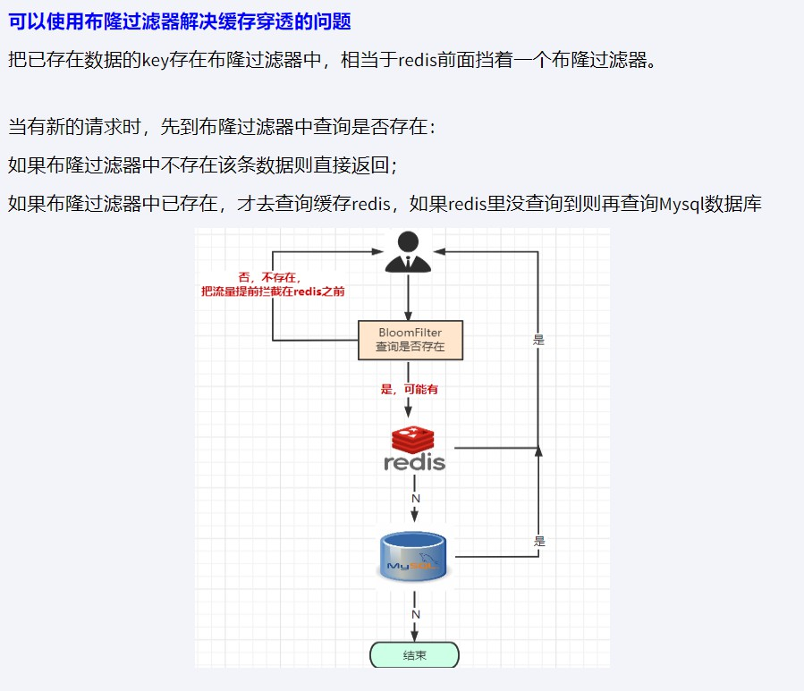
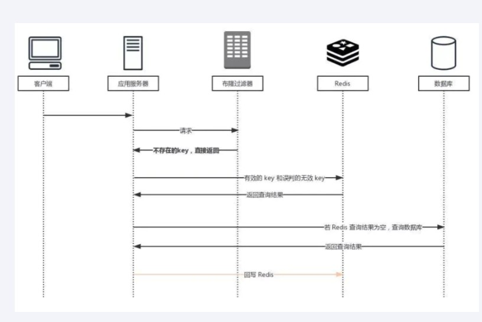
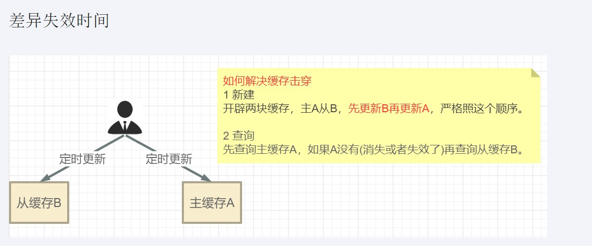

## 布隆过滤器

> 面试题：

1. 现有50亿个电话号码，现有10万个电话号码，如何要快速准确的判断这些电话号码？**只判断数据有没有，而不真正需要数据**

   

2. 安全连接网址，全球数10亿的网址判断

3. 黑名单校验，识别垃圾邮件

   

> 是什么？
>
> 由一个初值都为零的bit数组和多个哈希函数构成，用来快速判断集合中是否存在某个元素
>
> 设计思想？
> 本质就是判断具体数据是否存在于一个大的集合中
>
> 能干吗？
>
> 1. **一个元素如果判断结果：存在时，元素不一定存在，但是判断结果为不存在时，则一定不存在。**
> 2. 布隆过滤器可以添加元素，但不能删除元素，会导致误判率**（因为布隆过滤器底层使用bitMap这种数据结构，存储0或是1，如果不存在时，添加元素意味着，把指定位置置为1，删元素，则把指定位置置为0）**
> 3. 由于涉及hashcode判断依据，删掉元素会导致误判率增加。



### 原理

布隆过滤器 本质上 是由长度为 m 的位向量或位列表（仅包含 0 或 1 位值的列表）组成，最初所有的值均设置为 0



当我们向布隆过滤器中添加数据时，为了尽量地址不冲突，会**使用多个 hash 函数(每次hash得到一个偏移量，确定该偏移量的值是否为1，在验证数据时，只有每次hash得到的偏移量对应的值都为1，才说明可能存在)**对 key 进行运算，算得一个下标索引值，然后对位数组长度进行取模运算得到一个位置，每个 hash 函数都会算得一个不同的位置。再把位数组的这几个位置都置为 1 就完成了 add 操作。

例如，我们添加一个字符串wmyskxz，对字符串进行多次hash(key) → 取模运行→ 得到坑位



向布隆过滤器查询某个key是否存在时，先把这个 key 通过相同的多个 hash 函数进行运算，查看对应的位置是否都为 1，

只要有一个位为零，那么说明布隆过滤器中这个 key 不存在；

如果这几个位置全都是 1，那么说明极有可能存在；

因为这些位置的 1 可能是因为其他的 key 存在导致的，也就是前面说过的hash冲突。。。。。

就比如我们在 add 了字符串wmyskxz数据之后，很明显下面1/3/5 这几个位置的 1 是因为第一次添加的 wmyskxz 而导致的；

此时我们查询一个没添加过的不存在的字符串inexistent-key，它有可能计算后坑位也是1/3/5 ，这就是误判了......笔记见最下面


### 使用场景

* 解决缓存穿透
* 垃圾邮件识别等



### 案例展示

此处以，过滤垃圾用户为实例：事先创建用户表和相关用户操作的类，此处展示核心代码

* pom

  ```xml
  <?xml version="1.0" encoding="UTF-8"?>
  <project xmlns="http://maven.apache.org/POM/4.0.0"
           xmlns:xsi="http://www.w3.org/2001/XMLSchema-instance"
           xsi:schemaLocation="http://maven.apache.org/POM/4.0.0 http://maven.apache.org/xsd/maven-4.0.0.xsd">
      <modelVersion>4.0.0</modelVersion>
  
      <parent>
          <groupId>org.springframework.boot</groupId>
          <artifactId>spring-boot-starter-parent</artifactId>
          <version>2.6.10</version>
          <relativePath/>
      </parent>
      <groupId>cn.hd.redisBloom</groupId>
      <artifactId>redis-bloom</artifactId>
      <version>1.0-SNAPSHOT</version>
      <description>布隆过滤器案例</description>
  
      <properties>
          <maven.compiler.source>8</maven.compiler.source>
          <maven.compiler.target>8</maven.compiler.target>
      </properties>
      <dependencies>
          <!--SpringBoot通用依赖模块-->
          <dependency>
              <groupId>org.springframework.boot</groupId>
              <artifactId>spring-boot-starter-web</artifactId>
          </dependency>
  
  
          <!--SpringBoot与Redis整合依赖-->
          <dependency>
              <groupId>org.springframework.boot</groupId>
              <artifactId>spring-boot-starter-data-redis</artifactId>
          </dependency>
  
          <!--swagger2-->
          <dependency>
              <groupId>io.springfox</groupId>
              <artifactId>springfox-swagger2</artifactId>
              <version>2.9.2</version>
          </dependency>
          <dependency>
              <groupId>io.springfox</groupId>
              <artifactId>springfox-swagger-ui</artifactId>
              <version>2.9.2</version>
          </dependency>
          <!--Mysql数据库驱动-->
          <dependency>
              <groupId>mysql</groupId>
              <artifactId>mysql-connector-java</artifactId>
              <version>8.0.27</version>
          </dependency>
          <!--SpringBoot集成druid连接池-->
          <dependency>
              <groupId>com.alibaba</groupId>
              <artifactId>druid-spring-boot-starter</artifactId>
              <version>1.1.10</version>
          </dependency>
          <dependency>
              <groupId>com.alibaba</groupId>
              <artifactId>druid</artifactId>
              <version>1.1.17</version>
          </dependency>
          <dependency>
              <groupId>com.baomidou</groupId>
              <artifactId>mybatis-plus-boot-starter</artifactId>
              <version>3.4.3.4</version>
          </dependency>
          <dependency>
              <groupId>com.baomidou</groupId>
              <artifactId>mybatis-plus</artifactId>
              <version>3.4.3.4</version>
          </dependency>
          <!--hutool-->
          <dependency>
              <groupId>cn.hutool</groupId>
              <artifactId>hutool-all</artifactId>
              <version>5.2.3</version>
          </dependency>
  
          <dependency>
              <groupId>org.projectlombok</groupId>
              <artifactId>lombok</artifactId>
              <version>1.18.26</version>
              <optional>true</optional>
          </dependency>
      </dependencies>
  
      <build>
          <plugins>
              <plugin>
                  <groupId>org.springframework.boot</groupId>
                  <artifactId>spring-boot-maven-plugin</artifactId>
              </plugin>
          </plugins>
      </build>
  </project>
  ```

* 配置文件

  ```properties
  server.port=7777
  
  spring.application.name=redis7_study
  
  # ========================logging=====================
  logging.level.root=info
  logging.level.com.atguigu.redis7=info
  logging.pattern.console=%d{yyyy-MM-dd HH:mm:ss.SSS} [%thread] %-5level %logger- %msg%n
  
  # ========================swagger=====================
  spring.swagger2.enabled=true
  #在springboot2.6.X结合swagger2.9.X会提示documentationPluginsBootstrapper空指针异常，
  #原因是在springboot2.6.X中将SpringMVC默认路径匹配策略从AntPathMatcher更改为PathPatternParser，
  # 导致出错，解决办法是matching-strategy切换回之前ant_path_matcher
  spring.mvc.pathmatch.matching-strategy=ant_path_matcher
  
  # ========================redis单机=====================
  spring.redis.database=0
  # 修改为自己真实IP
  spring.redis.host=192.168.60.101
  spring.redis.port=6379
  spring.redis.password=123456
  spring.redis.lettuce.pool.max-active=8
  spring.redis.lettuce.pool.max-wait=-1ms
  spring.redis.lettuce.pool.max-idle=8
  spring.redis.lettuce.pool.min-idle=0
  
  # ========================alibaba.druid=====================
  spring.datasource.type=com.alibaba.druid.pool.DruidDataSource
  spring.datasource.driver-class-name=com.mysql.jdbc.Driver
  spring.datasource.url=jdbc:mysql://localhost:3306/bigdata?useUnicode=true&characterEncoding=utf-8&useSSL=false
  spring.datasource.username=root
  spring.datasource.password=123456
  spring.datasource.druid.test-while-idle=false
  
  # ========================mybatis===================
  mybatis.mapper-locations=classpath:mapper/*.xml
  ```

* service服务

  ```java
  package cn.hd.redisBloom.service.impl;
  
  import cn.hd.redisBloom.entity.User;
  import cn.hd.redisBloom.mapper.UserMapper;
  import cn.hd.redisBloom.service.UserService;
  import cn.hd.redisBloom.utils.CheckUtils;
  import com.baomidou.mybatisplus.extension.service.impl.ServiceImpl;
  import lombok.extern.slf4j.Slf4j;
  import org.springframework.beans.factory.annotation.Autowired;
  import org.springframework.data.redis.core.RedisTemplate;
  import org.springframework.stereotype.Service;
  
  @Service
  @Slf4j
  public class UserServiceImpl  extends ServiceImpl implements UserService {
      public static final String CACHE_KEY_USER = "user:";
      @Autowired
      private UserMapper userMapper;
  
      @Autowired
      private RedisTemplate redisTemplate;
  
      @Autowired
      private CheckUtils checkUtils;
  
      @Override
      public User get(int id) {
          //布隆过滤器判断
          if(!checkUtils.checkWithBloomFilter("whitelistCustomer", CACHE_KEY_USER+id))
          {
              log.info("用户信息不存在信息:{}",id);
              return null;
          }
          //双检加锁查询
          //1 查询redis
          User user = (User) redisTemplate.opsForValue().get(CACHE_KEY_USER+id);
          if (user != null){
              return user;
          }
          synchronized (this){
              //二次查询
              user = (User) redisTemplate.opsForValue().get(CACHE_KEY_USER+id);
              if (user != null){
                  return user;
              }
              //数据库查询，并回写redis
              user = userMapper.selectById(id);
              if (user == null){
                  return null;
              }
              redisTemplate.opsForValue().set(CACHE_KEY_USER+id,user);
          }
          return user;
      }
  
      /**
       * 往redis里面初始化用户数据
       */
      @Override
      public void initData(int count) {
          for (int i = 0; i < count; i++) {
              User user = new User("zhangsan" + i, "man", 12+i);
              int result = userMapper.insert(user);
              if(result > 0)
              {
                  //往mysql里面插入成功随后，再插入redis
                  redisTemplate.opsForValue().set(CACHE_KEY_USER+user.getId(),user);
                  //过滤器初始化
                  long hashLocation = checkUtils.getHashLocation(CACHE_KEY_USER + user.getId());
                  log.info(user.getId()+" 对应------坑位index:{}",hashLocation);
                  //3 设置redis里面bitmap对应坑位，该有值设置为1
                  redisTemplate.opsForValue().setBit("whitelistCustomer",hashLocation,true);
              }
          }
  
      }
  }
  
  ```

* 接口调用

  ```java
  package cn.hd.redisBloom.controller;
  
  import cn.hd.redisBloom.entity.User;
  import cn.hd.redisBloom.service.UserService;
  import io.swagger.annotations.ApiOperation;
  import org.springframework.beans.factory.annotation.Autowired;
  import org.springframework.web.bind.annotation.PathVariable;
  import org.springframework.web.bind.annotation.RequestMapping;
  import org.springframework.web.bind.annotation.RequestMethod;
  import org.springframework.web.bind.annotation.RestController;
  
  @RestController
  public class UserController {
  
      @Autowired
      private UserService userService;
  
      @ApiOperation("数据库初始化")
      @RequestMapping(value = "/user/add/{count}", method = RequestMethod.POST)
      public void addCustomer(@PathVariable Integer count) {
         userService.initData(count);
      }
      @ApiOperation("单个用户查询")
      @RequestMapping(value = "/user/{id}", method = RequestMethod.GET)
      public User findCustomerById(@PathVariable int id) {
          return userService.get(id);
      }
  }
  
  ```

* swagger配置类

  ```java
  package cn.hd.redisBloom.config;
  
  import io.swagger.annotations.ApiOperation;
  import org.springframework.context.annotation.Bean;
  import org.springframework.context.annotation.Configuration;
  import springfox.documentation.builders.ApiInfoBuilder;
  import springfox.documentation.builders.PathSelectors;
  import springfox.documentation.builders.RequestHandlerSelectors;
  import springfox.documentation.service.ApiInfo;
  import springfox.documentation.spi.DocumentationType;
  import springfox.documentation.spring.web.plugins.Docket;
  import springfox.documentation.swagger2.annotations.EnableSwagger2;
  
  @Configuration
  @EnableSwagger2
  public class SwaggerConfig {
      @Bean
      public Docket productApi() {
          return new Docket(DocumentationType.SWAGGER_2)
                  .apiInfo(apiInfo())
                  .select()
                  .apis(RequestHandlerSelectors.withMethodAnnotation(ApiOperation.class))  //添加ApiOperiation注解的被扫描
                  .paths(PathSelectors.any())
                  .build();
  
      }
  
      private ApiInfo apiInfo() {
          return new ApiInfoBuilder().title("布隆过滤器").description("布隆过滤器")
                  .version("1.0").build();
      }
  
  }
  
  ```

  

* 工具类

  ```java
  package cn.hd.redisBloom.utils;
  
  import lombok.extern.slf4j.Slf4j;
  import org.springframework.data.redis.core.RedisTemplate;
  import org.springframework.stereotype.Component;
  
  import javax.annotation.Resource;
  
  /**
   * 哈希函数计算
   */
  @Component
  @Slf4j
  public class CheckUtils {
      @Resource
      private RedisTemplate redisTemplate;
  
      public long getHashLocation(String key){
          //1 计算hashcode，由于可能有负数，直接取绝对值
          int hashValue = Math.abs(key.hashCode());
          //2 通过hashValue和2的32次方取余后，获得对应的下标坑位
          long index = (long) (hashValue % Math.pow(2, 32));
          return index;
      }
  
  
      public boolean checkWithBloomFilter(String checkItem,String key)
      {
          long index = getHashLocation(key);
          boolean existOK = redisTemplate.opsForValue().getBit(checkItem,index );
          log.info("----->key:"+key+"\t对应坑位index:"+index+"\t是否存在:"+existOK);
          return existOK;
      }
  }
  
  ```

### 优缺点

优点：占用内存少

缺点：不能删除；存在误判（哈希冲突）

总结：有是可能有，没有是一定没有

## 缓存预热、雪崩、穿透和击穿

### 预热

将数据库中存在的数据，通过定时任务或是程序初始化的方式，预先加载进数据库

### 雪崩

* 产生原因：
  * redis主机挂了
  * redis有大量的key同时过期，大面积的失效
* 解决
  * redis中 的key设置永不过期，或是将key 的过期时间错开
  * redis集群实现，高可用
  * 开启redis的持久化机制，避免redis挂了之后的数据丢失

### 穿透

* 现象

​		请求查询一条记录，redis没有，查询数据库，数据库也没有，两个都查不到这条数据，这就发生了一次缓存穿透

​		但是如果多次请求，每次都打到了数据库导致数据库压力暴增，redis成了摆设

* 产生原因：往往因为恶意攻击导致的，黑客使用系统中不存在的key，去请求系统（**多次请求，每次请求使用的key可能还不一样**）

* 解决

  * 空对象缓存

    > **第一种解决方案，回写增强**
    >
    > 如果发生了缓存穿透，我们可以针对要查询的数据，在Redis里存一个和业务部门商量后确定的缺省值(比如，零、负数、defaultNull等)。
    >
    > 比如，键uid:abcdxxx，值defaultNull作为案例的key和value
    >
    > 先去redis查键uid:abcdxxx没有，再去mysql查没有获得 ，这就发生了一次穿透现象。
    >
    >  
    >
    > but，可以增强回写机制
    >
    >  
    >
    > mysql也查不到的话也让redis存入刚刚查不到的key并保护mysql。
    >
    > 第一次来查询uid:abcdxxx，redis和mysql都没有，返回null给调用者，但是增强回写后第二次来查uid:abcdxxx，此时redis就有值了。
    >
    > 可以直接从Redis中读取default缺省值返回给业务应用程序，避免了把大量请求发送给mysql处理，打爆mysql。
    >
    > **存在缺陷：**
    >
    > 如果使用的是相同的key，第一次会打到数据库，之后请求，因为回写增强，之后请求直接走redis查询
    >
    > 但如果是每次都使用不同的key进行查询，会导致，每次请求还是会打到数据库，不能实质性解决，而且这种方案，也会到导致redis中无关紧要的key越来越多

  * 布隆过滤器

    也可通过上面的布隆过滤器进行解决，预先初始化，系统中存在的数据到布隆过滤器，通过布隆过滤器进行判断，是否真的存在（有是可能有，没有是一定没有）

    * guava

​			


### 击穿

大量的请求同时查询一个key时，此时key刚好过期**（热点key）**，就会导致所有的请求都会打到数据库，**简单来说，就是热点key突然过期或是被删除**

* 击穿和穿透的区别

  * 穿透是，自始至终，无论是redis还是数据库，都没有要查询的key
  * 击穿是，要查询的key之前存在，只是突然过期或是被删除导致的

* 解决

  * 互斥更新，差异失效时间。**（双检加锁进行查询）**

    

  * 热点key更新代码

    ```java
     log.info("启动AB定时器计划任务淘宝聚划算功能模拟.........."+DateUtil.now());
            new Thread(() -> {
                //模拟定时器，定时把数据库的特价商品，刷新到redis中
                while (true){
                    //模拟从数据库读取100件特价商品，用于加载到聚划算的页面中
                    List<Product> list=this.getProductsFromMysql();
                    //先更新B缓存
                    this.redisTemplate.delete(JHS_KEY_B);
                    this.redisTemplate.opsForList().leftPushAll(JHS_KEY_B,list);
                    this.redisTemplate.expire(JHS_KEY_B,20L,TimeUnit.DAYS);
                    //再更新A缓存
                    this.redisTemplate.delete(JHS_KEY_A);
                    this.redisTemplate.opsForList().leftPushAll(JHS_KEY_A,list);
                    this.redisTemplate.expire(JHS_KEY_A,15L,TimeUnit.DAYS);
                    //间隔一分钟 执行一遍
                    try { TimeUnit.MINUTES.sleep(1); } catch (InterruptedException e) { e.printStackTrace(); }
    
                    log.info("runJhs定时刷新双缓存AB两层..............");
                }
            },"t1").start();
        }
    ```

  * 查询代码

    ```java
    			// 双检加锁代码		
    			// 缓存查询，先查询A，再查询B
    			//采用redis list数据结构的lrange命令实现分页查询
                list = this.redisTemplate.opsForList().range(JHS_KEY_A, start, end);
                if (CollectionUtils.isEmpty(list)) {
                    log.info("=========A缓存已经失效了，记得人工修补，B缓存自动延续5天");
                    //用户先查询缓存A(上面的代码)，如果缓存A查询不到（例如，更新缓存的时候删除了），再查询缓存B
                    this.redisTemplate.opsForList().range(JHS_KEY_B, start, end);
                    //TODO 走DB查询
                }
                log.info("查询结果：{}", list);
    ```

    

## 分布锁


