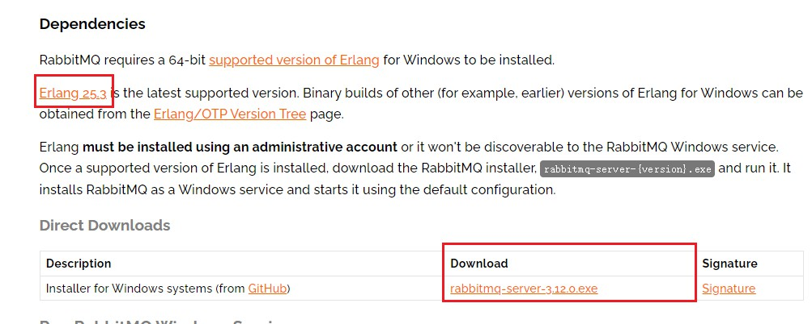
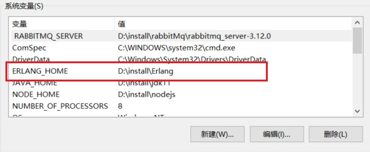

## RabbitMq

### 安装

> 地址：https://rabbitmq.com/install-windows.html

> rabbitMq因为是用erlang语言开发的，所以安装rabbitMq之前需要需要下载erlang

#### erlang环境变量配置

1. 

> 变量名：ERLANG_HOME
>
> 值：erlang的安装位置，例如：D:\install\Erlang

2. Path下追加如下内容：

> %ERLANG_HOME%\bin

#### rabbitMq配置

1. 

> 变量名： RABBITMQ_SERVER
>
> 值：rabbitMq安装位置，例如：D:\install\rabbitMq\rabbitmq_server-3.12.0

2. Path下追加如下内容：

> %RABBITMQ_SERVER%\sbin

3. 进入到rabbitMq的sbin目录，执行如下命令：

> rabbitmq-plugins enable rabbitmq_management

4. 访问：

> http://localhost:15672
>
> 默认账号：guest/guest