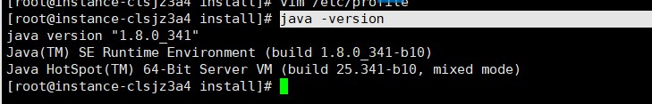

## jdk和maven

### jdk

1. 下载

   > https://www.oracle.com/java/technologies/downloads/#java8

2. 解压

   > 将下载的jdk压缩包上传到服务器，我的上传位置：**/usr/local/install**，然后通过下面的命令进行解压
   >
   > tar -xvf jdk-8u172-linux-x64.tar.gz 
   >
   > mv jdk1.8.0_172 jdk8 -- 修改文件夹名称

3. 环境变量配置

   > a. 编辑**/etc/profile**文件
   >
   > b. 末尾加入：
   >
   > export JAVA_HOME=/usr/local/install/jdk8
   > export PATH=$JAVA_HOME/bin:$PATH
   >
   > c. 保存配置文件，键入：**source /etc/profile**，使配置生效
   >
   > 注意：
   >
   > 其中**/usr/local/install/jdk8**为jdk8的安装位置

4. 测试

   > java -version

### maven

1. maven下载

   > https://maven.apache.org/download.cgi

2. 解压

   > tar -xvf apache-maven-3.8.6-bin.tar.gz

3. 环境变量配置

   > 其中**/usr/local/install/maven**为安装位置
   >
   > export MAVEN_HOME=/usr/local/install/maven
   > export PATH=$MAVEN_HOME/bin:$PATH
   >
   > 保存配置文件，键入：**source /etc/profile**，使配置生效

4. 测试

   > mvn -v，查看maven的版本