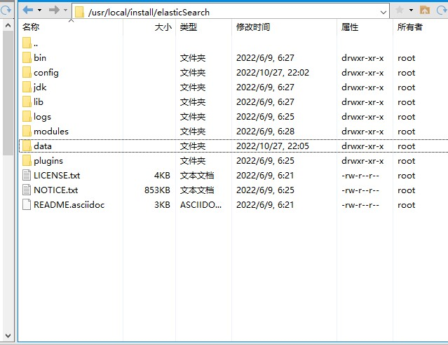
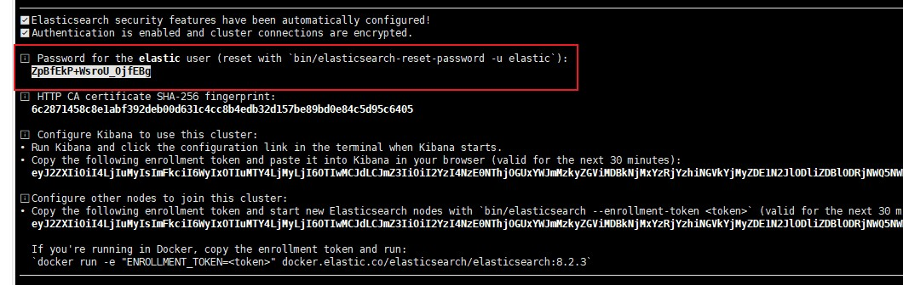

## 数据库配置

### MySQL

1. 查看MySQL是否已安装

   ```bash
   find / -name mysql # 检查MySQL是否已安装
   yum remove mysql mysql-server mysql-libs # 强力卸载
   ```

   

2. yum安装

   ```bash
   yum install mysql-server -y #安装
   ps -ef | grep mysql # 查看MySQL是否安装
   mysqladmin --version # 查看版本
   ```

3. 设置MySQL为开机启动

   ```bash
   systemctl enable mysqld # 设置开机启动
   systemctl status mysqld # 查看MySQL是否运行
   systemctl start mysqld # 启动MySQL服务
   ```

4. 重置密码

   ```mysql
   #  选择数据库
   use mysql;
   # 修改密码,备注：mysql8.0修改用户密码命令（新的修改方式）
   alter user 'root'@'localhost' identified by 'root';
   # 刷新权限表
   flush privileges;
   ```

5. 允许远程访问

   ```mysql
   #  选择数据库
   use mysql;
   # 修改host
   update user set host='%' where user='root';
   # 刷新权限
   flush privileges;
   # 修改权限
   GRANT ALL PRIVILEGES ON *.* TO 'root'@'%' WITH GRANT OPTION;
   # 刷新权限
   flush privileges;
   ```


### redis

1. 下载前准备

   > ```bash
   > gcc --version # 查看gcc是否安装
   > dnf install gcc # gcc安装
   > ```

2. 下载

   ```bash
   wget http://download.redis.io/releases/redis-6.0.1.tar.gz # 下载‘
   tar -zxvf redis-6.0.1.tar.gz  #解压
   ```

3. 安装

   ```bash
   cd redis # 进入redis目录
   make PREFIX=/usr/local/redis install # 安装redis在指定目录
   ```

4. 生成配置文件

   ```bash
   mkdir /usr/local/redis/conf # 创建配置文件目录
   cp redis.conf /usr/local/redis/conf/ # 拷贝配置文件
   ```

5. 生成运行目录

   ```bash
   mkdir logs # redis日志目录
   mkdir data # redis数据目录
   注意： /usr/local/redis下创建
   ```

6. 修改配置文件

   ```bash
   bind 127.0.0.1 # 绑定访问的ip，这个注掉
   daemonize yes # 使以daemon方式运行
   requirepass "123456" # 修改密码
   ```

7. 配置redis为服务

   ```bash
   vi /lib/systemd/system/redis.service # 生成供systemd使用的service文件
   内容如下：
   [Unit]
   Description=Redis
   After=network.target
   
   [Service]
   Type=forking
   PIDFile=/var/run/redis_6379.pid
   ExecStart=/usr/local/redis/bin/redis-server /usr/local/redis/conf/redis.conf
   ExecReload=/bin/kill -s HUP $MAINPID
   ExecStop=/bin/kill -s QUIT $MAINPID
   PrivateTmp=true
   
   [Install]
   WantedBy=multi-user.target
   ```

8. 重新加载redis服务

   ```bash
   systemctl daemon-reload 
   ```

9. 启动和关闭

   ```bash
   systemctl start redis
   systemctl stop redis
   ```

### elasticSearch安装

1. 下载

   > 下载地址：https://www.elastic.co/cn/downloads/past-releases/elasticsearch-8-2-3

2. 配置

   * 将下载好的压缩包，上传到服务器

   * 解压：tar -zxvf elasticsearch-8.2.3-linux-x86_64.tar.gz

   * es模块介绍：

     

     > * bin：可执行文件在里面，运行es的命令就在这个里面，包含了一些脚本文件等
     > * config：配置文件目录
     > * JDK：java环境
     > * lib：依赖的jar，类库
     > * logs：日志文件
     > * modules：es相关的模块
     > * plugins：可以自己开发的插件
     > * data：这个目录没有，自己新建一下，后面要用 mkdir data，这个作为索引目录

   * 编辑config文件下的elasticsearch.yml ，在文件最后添加

     ```
     cluster.name: es-sassycoder   #配置elasticsearch的集群名称，默认是my-application。建议修改成一个有意义的名称。
     node.name: es-node-230       #节点名，通常一台物理服务器就是一个节点，es会默认随机指定一个名字，建议指定一个有意义的名称，方便管理
     network.host: 0.0.0.0      #绑定ip地址
     http.port: 9200  	       #暴露的http端口
     transport.profiles.default.port: 9300    #内部通信端口
     path.data: /usr/local/install/elasticSearch/data   #索引目录
     path.logs: /usr/local/install/elasticSearch/logs   #日志目录
     # 允许通配符删除索引
     action.destructive_requires_name: true
     # 配置集群初始时，作为master的主机，单节点时配置本节点名称（node.name）
     # 必须使用完整的 node.name
     # 重新启动集群或向现有集群添加新节点时，不要使用此设置
     cluster.initial_master_nodes: ["es-node-230"]
     # 配置启动时要发现的master列表（IP 或 可解析的域名），端口默认为9300
     # 单节点时不用配置或配置为本节点IP
     discovery.seed_hosts: ["192.168.100.230:9300"]
     #使用head等插件监控集群信息，需要打开以下配置项
     http.cors.enabled: true
     http.cors.allow-origin: "*"
     http.cors.allow-headers: Authorization,X-Requested-With,Content-Length,Content-Type
     xpack.security.enabled: true
     
     xpack.security.enrollment.enabled: true
     
     # Enable encryption for HTTP API client connections, such as Kibana, Logstash, and Agents
     xpack.security.http.ssl:
       enabled: false # 关闭ssl加密
       keystore.path: certs/http.p12
     # Enable encryption and mutual authentication between cluster nodes
     xpack.security.transport.ssl:
       enabled: true
       verification_mode: certificate
       keystore.path: certs/transport.p12
       truststore.path: certs/transport.p12
     ingest.geoip.downloader.enabled: false
     ```

3. 创建用户，ES不允许使用root操作es，需要添加用户，操作如下：

   ```bash
   useradd es # 创建账号
   chown -R es:es /usr/local/install/elasticSearch
   su esuser # 切换账号
   ```

4. 启动，进入到bin目录

   ```bash
   ./elasticsearch
   ./elasticsearch -d # 后台启动
   ```

5. 注意事项：

   * 启动后出现以下错误：

   ```java
   ERROR: [3] bootstrap checks failed
   [1]: max file descriptors [4096] for elasticsearch process is too low, increase to at least [65535]
   [2]: max number of threads [3795] for user [esuser] is too low, increase to at least [4096]
   [3]: max virtual memory areas vm.max_map_count [65530] is too low, increase to at least [262144]
   或者：
   [2022-07-04T05:26:15,845][INFO ][o.e.x.m.p.NativeController] [es-node-231] Native controller process has stopped - no new native processes can be started
   ERROR: [1] bootstrap checks failed. You must address the points described in the following [1] lines before starting Elasticsearch.
   ```

   > 解决方案：
   >
   > 1. 切换到root账户
   >
   > 2. 修改 /etc/security/limits.conf 文件 添加以下内容：
   >
   >    ```bash
   >    * soft nofile 65536
   >    * hard nofile 131072
   >    * soft nproc 4096
   >    * hard nproc 4096
   >    ```
   >
   > 3. 修改 /etc/sysctl.conf 增加 vm.max_map_count=262145
   >
   > 4. 然后执行sysctl -p 刷新一下
   >
   > 5. 再次切换到es账户，重启，会得到es的默认密码
   >
   >    
   >
   > 6. 启动后重新编辑elasticsearch.yml文件，末尾添加如下内容：
   >
   >    ```yaml
   >    ingest.geoip.downloader.enabled: false #首次配置建议改成false
   >    ```
   >
   > 7. 切换为root账户，执行bin/elasticsearch-reset-password --username elastic -i命令修改es登陆密码

6. 访问：https://服务器公网ip:9200/
