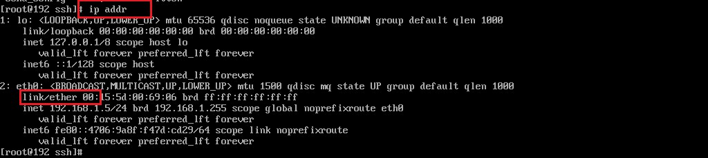
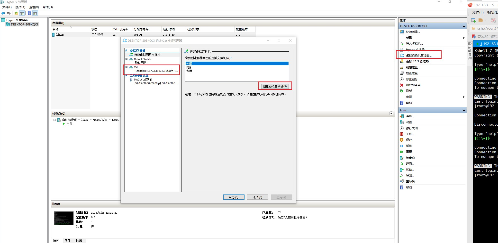
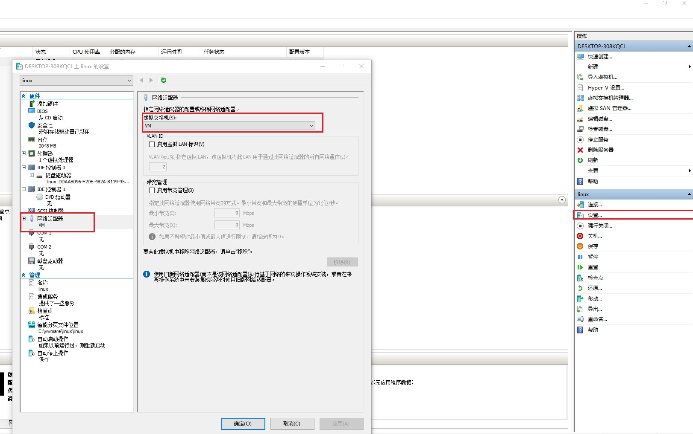
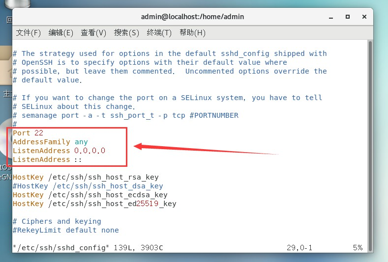

### 虚拟机网络配置

1. 根据命令IP addr查看当前虚拟机的IP

   

> 得到网卡名称为ether 00

2. 修改ip获取方式为静态ip，避免每次重启电脑ip发生变化

   ```sh
   命令为：vi /etc/sysconfig/network-scripts/ifcfg-eth0
   
   将ONBOOT=no改为yes，将BOOTPROTO=dhcp改为BOOTPROTO=static,并在后面增加几行内容：
   IPADDR=192.168.127.128 （根据自己电脑本机确定）
   NETMASK=255.255.255.0
   GATEWAY=192.168.127.2（根据自己电脑本机确定）
   DNS1=119.29.29.29
   ```

3.  创建网络交换机

   


4. 选择创建的虚拟交换机

5. 测试

   ```sh
   ping www.baidu.com
   ```

### 配置远程连接

1. 安装ssh服务

   ```sh
     yum list installed | grep openssh-server
   ```

2. 修改配置文件

   ```sh
   vi   /etc/ssh/sshd_config
   ```

   

3. 设置开机自启

```
 sudo service sshd start -- 启动服务
 systemctl enable sshd.service -- 设置开机自启
```

