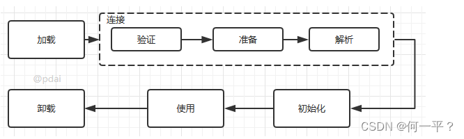
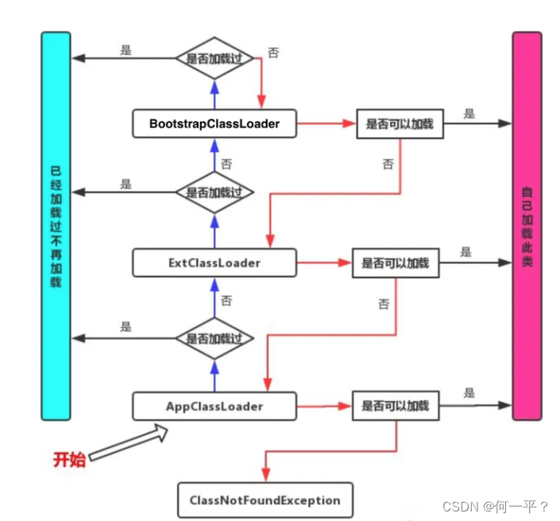
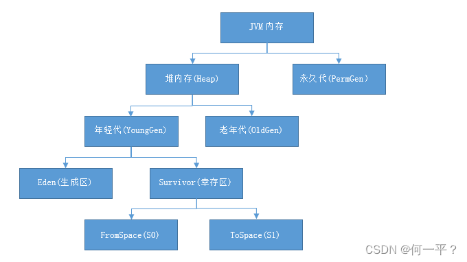

### 类加载机制

*  虚拟机将class文件加载到内存，并对数据进行校验、解析、转换和初始化，最终形成虚拟机可以识别的Java类型

*  过程：

   * 加载：查找并加载类的二进制文件

   * 验证：确保被加载类的正确性

   * 准备：为类的静态变量分配内存，并对其进行初始化为默认值

   * 解析：将类的符号引用转换为直接引用

   * 初始化：为类的静态变量赋予正确的初始值

   

   **需要注意的是：解析不一定在初始化之前，也有可能在初始化之后，为Java运行时绑定做准备**

### 双亲委派机制

* 当一个calss文件要被加载时（**此处排除自定义加载器**），首先看应用加载器是否加载过，此class文件，没有加载过，则向上找父类加载器，直到BootsrapClassLoader加载器之前都是在验证自己是否加载过，加载过则返回；到BootsrapClassLoader之后，才会验证自己是否能加载，可以的化则直接返回，否则让子类加载器去加载，如果到底层加载器，都无法加载，则会抛出异常（当前class不存在）。

### JVM内存结构

* 线程私有的：程序计数器、虚拟机栈和本地方法栈
* 线程共享的：方法区和堆内存
* 内存结构：
  * 程序计数器：线程私有且只读的内存区域，**用于保存JVM下一条将要执行指令的地址**
  * Java虚拟机栈：是每个线程运行私有的内存空间，每个方法执行的同时，都会创建一个栈帧，**存储局部变量表、操作数栈、动态链接和方法出入口等**，当方法执行完毕，会从虚拟机栈中弹出，变量的作用域也会结束，数据从此失效
  * 本地方法栈：是一些带有native关键字的方法，用于调用本地的C或C++方法
  * 堆内存：是所有线程共享的一片区域，**虚拟机启动时创建**，存储对象实例，通过new关键字创建的对象，都会使用堆内存，也是垃圾回收的重点区域
  * 方法区：用于存储已被虚拟机加载的类信息、常量、静态变量和即时编译的代码

### Java堆内存是如何进行分代的？

* Java的堆内存，根据不同的存活时期，分为新生代和老年代，新生代和老年代存放的位置不同，有助于提升垃圾回收的效率。
* 新生代一般存放新分配的对象，由一个伊甸区和两个幸存区组成（8：2），当伊甸区内存不够时，**会触发一次GC（minitor Roots，轻GC），通过复制算法进行回收**，GC后存活的对象会被转移到幸存区，当幸存区也满了之后，会移到老年代
* 老年代用来存储长期存活或是大对象的内存空间，由单一内存区域组成，年轻代，经过多轮GC仍然存活的对象，或是刚创建的大对象会被移动到老年代，老年代中大部分对象都会存活很久，**一般采用标记整理算法进行垃圾回收**

### 年轻代里面的对象什么时候进入老年代？

### 判断是否可进行垃圾回收的算法？

* 引用计数器：
  * 当对象增加引用时，计数器加一，减少引用时，计数器减一，直到计数器为0，则可回收
  * 缺点是，会出现循环引用的情况，两个对象相互引用，Java虚拟机不再采用此方法
* 可达性分析
  * 通过GcRoots为起点进行搜索，能够到达的对象就是存活的，否则可以回收
  * 可作为GCRoots的对象？
    * 虚拟机栈中引用的对象
    * 本地方法栈引用的对象
    * 方法区中类静态属性或常量引用的对象

### 垃圾回收算法

* 标记清除算法：
  * 将存活的对象进行标记，然后清理掉未被标记的对象
  * 缺点是：会产生大量不连续的内存碎片，导致无法给大对象分配内存
* 标记整理算法：
  * 先采用标记清除确定可回收的对象，然后整理剩余对象，将可用对象移动到一起，使内存紧凑
  * **优点是：内存利用率高，缺点是速度慢**
* 复制算法：
  * 将内存分为两个等大小的区域**from和to（to中为空）**，将GcRoots引用的对象，从from移动到to，再回收from中不再引用的对象，此时交换from和to两片区域
  * **优点是，不会产生碎片，缺点是，只能利用一半的内存空间**
* 分代收集：
  * 根据对象的存活周期，将内存划分为几块，不同块采用不同的算法
  * 一般分为新生代（年轻代）和老年代
  * 新生代：每次都会有大量的对象被回收**（复制算法）**
    * 伊甸区（Eden）：新产生的对象会在这里
    * 幸存区（Survivor）：经过一次，minitor Roots之后会进入幸存区
  * 老年代：每次回收只有少量对象被回收**（标记清除或标记整理）**

